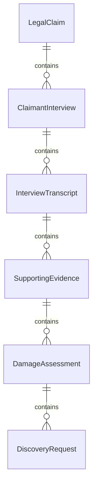
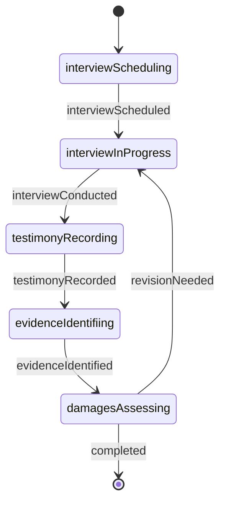
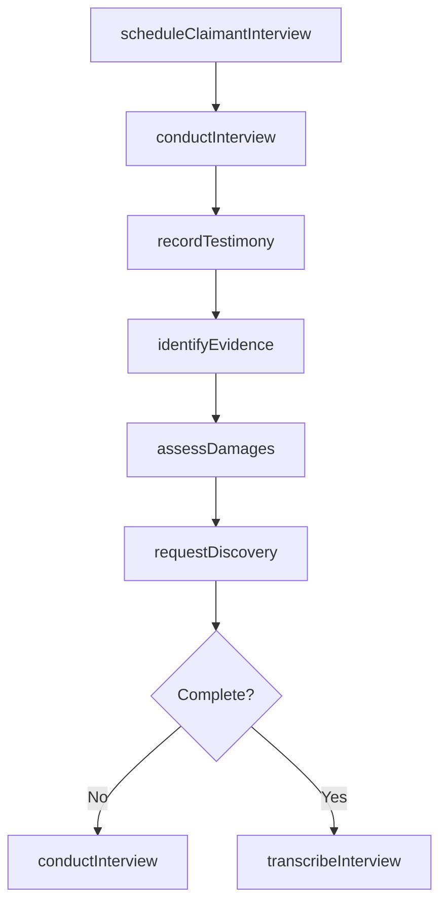
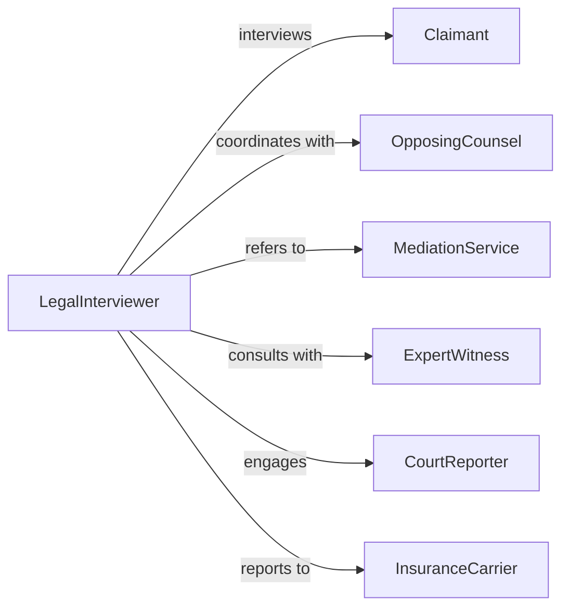

# Interview Claimants Get Information Related

> Business-as-Code definition for interviewing claimants to gather information for legal proceedings. Models structured interview processes for litigation support, claims investigation, and legal discovery.

## Overview

Interviewing claimants for legal proceedings involves conducting formal conversations to gather facts, testimony, and evidence related to legal claims, lawsuits, administrative hearings, or dispute resolution. This definition supports attorneys, investigators, and claims professionals in documenting claimant narratives, identifying supporting evidence, assessing claim validity, and preparing materials for litigation, arbitration, or settlement negotiations.

## Actors

| Actor | Description |
|-------|-------------|
| Claimant | Individual or entity filing a legal claim or lawsuit |
| OpposingCounsel | Attorney representing the party against whom the claim is made |
| MediationService | Third-party facilitating dispute resolution discussions |
| ExpertWitness | Specialist providing technical or professional opinions on claims |
| CourtReporter | Creates official transcripts of legal interviews and depositions |
| InsuranceCarrier | Entity potentially liable for claim damages or defense costs |

## Roles

| Role | Description |
|------|-------------|
| LegalInterviewer | Attorney or investigator conducting the claimant interview |
| CaseManager | Coordinates interview scheduling and evidence collection |
| LegalAssistant | Supports interview preparation and document organization |
| ClaimsAnalyst | Evaluates claimant information for coverage and liability |

## Entities

| Entity | Description |
|--------|-------------|
| LegalClaim | Formal assertion of rights or demand for remedy |
| ClaimantInterview | Recorded conversation with the individual filing the claim |
| InterviewTranscript | Verbatim written record of the interview |
| SupportingEvidence | Documents, records, or materials substantiating the claim |
| DamageAssessment | Evaluation of claimed losses or injuries |
| DiscoveryRequest | Formal demand for information or evidence from claimant |

## Actions

| Action | Description |
|--------|-------------|
| scheduleClaimantInterview | Arrange time and location for legal interview |
| conductInterview | Perform structured interview to gather claim details |
| recordTestimony | Document claimant's statements and responses |
| identifyEvidence | Determine what materials support the claimant's assertions |
| assessDamages | Evaluate claimed losses, injuries, or harm |
| requestDiscovery | Formally ask claimant to produce specific documents or information |
| transcribeInterview | Create verbatim written record from recorded interview |

## Events

| Event | Description |
|-------|-------------|
| interviewScheduled | Claimant interview has been arranged |
| interviewConducted | Interview session has been completed |
| testimonyRecorded | Claimant statements have been documented |
| evidenceIdentified | Supporting materials have been located |
| damagesAssessed | Claimed losses have been evaluated |
| discoveryRequested | Formal request for information has been issued |
| interviewTranscribed | Verbatim transcript has been prepared |

## Searches

| Search | Description |
|--------|-------------|
| findClaims | List legal claims by claimant, type, or filing date |
| getInterviews | Retrieve claimant interviews by case or date |
| getEvidence | Find supporting materials by claim or evidence type |
| getTranscripts | Search interview transcripts by case or keyword |

## Entity Relationships



## State Diagram



## Workflow



## Actor Relationships



## Usage

### Calling Actions

```typescript
import { interviewClaimantsGetInformationRelated } from '@headlessly/interview-claimants-get-information-related'

const claimantInterviews = interviewClaimantsGetInformationRelated()

// Schedule interview with claimant
const interview = await claimantInterviews.scheduleClaimantInterview({
  claimId: 'CLAIM-2026-8942',
  claimantId: 'CLM-5623',
  scheduledDate: '2026-02-12T10:00:00Z',
  location: 'Law Office Conference Room',
  attendees: ['attorney', 'paralegal', 'court-reporter']
})

// Conduct the interview with structured questions
await claimantInterviews.conductInterview({
  interviewId: interview.id,
  method: 'in-person',
  recordingType: 'audio-video',
  topics: ['incident-circumstances', 'injury-details', 'damages-claimed', 'prior-incidents']
})

// Record claimant testimony
const testimony = await claimantInterviews.recordTestimony({
  interviewId: interview.id,
  narrative: 'Claimant states they were injured on January 15, 2026 when...',
  keyStatements: [
    'I notified my supervisor immediately',
    'I sought medical treatment the same day',
    'I have been unable to work since the incident'
  ]
})

// Identify supporting evidence from interview
await claimantInterviews.identifyEvidence({
  interviewId: interview.id,
  evidenceTypes: ['medical-records', 'incident-report', 'witness-list', 'wage-statements']
})

// Request formal discovery from claimant
await claimantInterviews.requestDiscovery({
  claimId: 'CLAIM-2026-8942',
  requestedItems: [
    { type: 'medical-records', dateRange: '2026-01-15 to present' },
    { type: 'employment-records', description: 'all W-2 forms for 2024-2025' }
  ]
})
```

### Event-Driven Automation

```typescript
// Request transcript after interview is complete
claimantInterviews.interviewConducted(async ({ interviewId }) => {
  await claimantInterviews.transcribeInterview({ interviewId })
})

// Alert claims analyst when damages are assessed
claimantInterviews.damagesAssessed(async ({ claimId, assessment }) => {
  if (assessment.totalAmount > 50000) {
    await notify({
      to: 'claims-analyst',
      message: `High-value claim damages assessed: $${assessment.totalAmount.toLocaleString()} for claim ${claimId}`
    })
  }
})

// Trigger discovery request when evidence gaps are identified
claimantInterviews.evidenceIdentified(async ({ claimId, identifiedEvidence, missingEvidence }) => {
  if (missingEvidence.length > 0) {
    await claimantInterviews.requestDiscovery({
      claimId,
      requestedItems: missingEvidence
    })
  }
})
```
