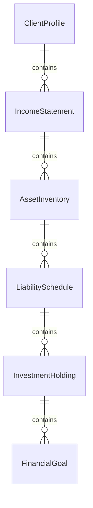
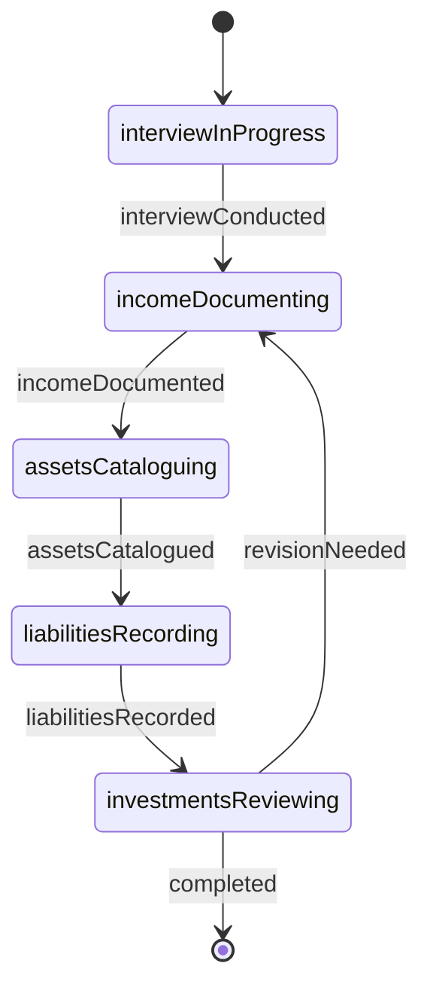
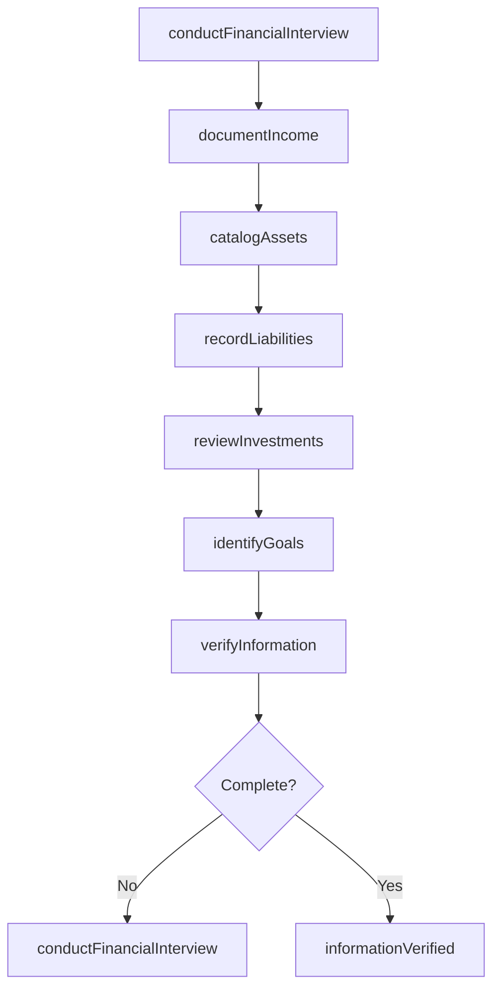
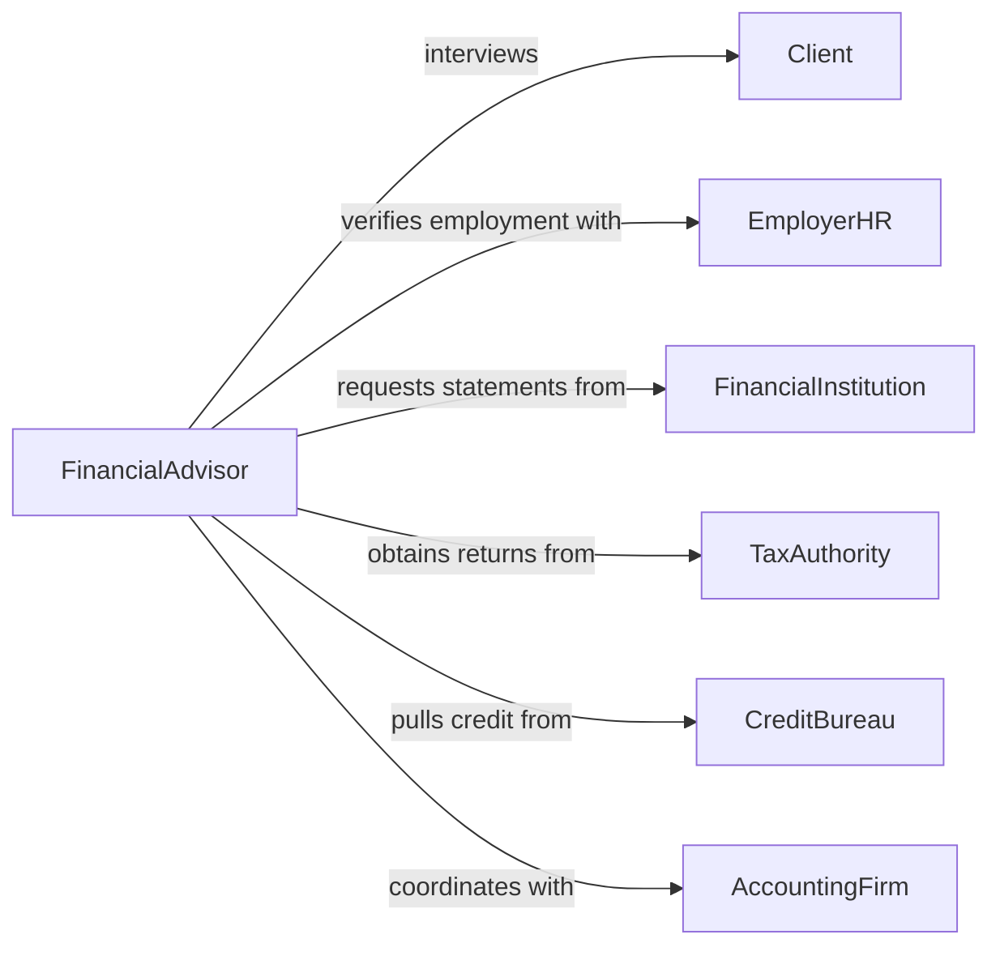

# Interview Clients Gather Financial Information

> Business-as-Code definition for interviewing clients to gather financial information. Models comprehensive financial data collection for planning, lending, tax preparation, and advisory services.

## Overview

Interviewing clients to gather financial information involves conducting structured conversations to obtain income details, asset inventories, liability summaries, investment holdings, tax situations, and financial goals. This definition enables financial advisors, loan officers, accountants, and wealth managers to collect accurate financial data, assess client situations, identify planning opportunities, and document financial profiles for analysis, recommendations, and regulatory compliance.

## Actors

| Actor | Description |
|-------|-------------|
| Client | Individual or business seeking financial services or advice |
| EmployerHR | Provides verification of income and employment details |
| FinancialInstitution | Holds client accounts and provides balance confirmations |
| TaxAuthority | Maintains tax return records and assessment information |
| CreditBureau | Supplies credit reports and score information |
| AccountingFirm | Prepares financial statements and tax filings |

## Roles

| Role | Description |
|------|-------------|
| FinancialAdvisor | Conducts client interviews to develop financial plans |
| LoanOfficer | Gathers income and asset data for lending decisions |
| TaxPreparer | Collects information for tax return preparation |
| WealthManager | Obtains comprehensive financial profile for portfolio management |

## Entities

| Entity | Description |
|--------|-------------|
| ClientProfile | Comprehensive record of client financial situation |
| IncomeStatement | Documented sources and amounts of client income |
| AssetInventory | Complete listing of client assets and their values |
| LiabilitySchedule | Record of debts, loans, and financial obligations |
| InvestmentHolding | Details of securities, funds, and investment accounts |
| FinancialGoal | Client objective with target amount and timeframe |

## Actions

| Action | Description |
|--------|-------------|
| conductFinancialInterview | Perform structured interview to collect financial data |
| documentIncome | Record all sources and amounts of client income |
| catalogAssets | Create comprehensive inventory of client assets |
| recordLiabilities | Document debts, loans, and obligations |
| reviewInvestments | Gather details on existing investment holdings |
| identifyGoals | Determine client financial objectives and timelines |
| verifyInformation | Confirm accuracy of client-provided financial data |

## Events

| Event | Description |
|-------|-------------|
| interviewConducted | Financial interview session has been completed |
| incomeDocumented | Income sources and amounts have been recorded |
| assetsCatalogued | Complete asset inventory has been created |
| liabilitiesRecorded | Debt and obligation details have been documented |
| investmentsReviewed | Investment holding information has been gathered |
| goalsIdentified | Client financial objectives have been determined |
| informationVerified | Financial data accuracy has been confirmed |

## Searches

| Search | Description |
|--------|-------------|
| findClientProfiles | List client profiles by advisor, date, or status |
| getIncome | Retrieve income information by client or source type |
| getAssets | Find asset holdings by client, type, or value |
| getLiabilities | Search debt obligations by client or creditor |

## Entity Relationships



## State Diagram



## Workflow



## Actor Relationships



## Usage

### Calling Actions

```typescript
import { interviewClientsGatherFinancialInformation } from '@headlessly/interview-clients-gather-financial-information'

const financialInterviews = interviewClientsGatherFinancialInformation()

// Conduct comprehensive financial interview
const interview = await financialInterviews.conductFinancialInterview({
  clientId: 'CLT-9823',
  interviewDate: '2026-02-05T13:00:00Z',
  purpose: 'retirement-planning',
  topics: ['income', 'assets', 'liabilities', 'retirement-goals']
})

// Document client income sources
await financialInterviews.documentIncome({
  clientId: 'CLT-9823',
  incomeSources: [
    { type: 'salary', employer: 'Tech Corp', amount: 145000, frequency: 'annual' },
    { type: 'rental-income', property: '123 Oak St', amount: 2400, frequency: 'monthly' },
    { type: 'investment-dividends', source: 'brokerage-account', amount: 8200, frequency: 'annual' }
  ]
})

// Catalog client assets
await financialInterviews.catalogAssets({
  clientId: 'CLT-9823',
  assets: [
    { type: 'primary-residence', value: 675000, location: '456 Maple Ave' },
    { type: 'investment-account', institution: 'Brokerage Inc', value: 423000 },
    { type: '401k', employer: 'Tech Corp', value: 284000 },
    { type: 'savings-account', institution: 'Local Bank', value: 45000 }
  ]
})

// Record liabilities
await financialInterviews.recordLiabilities({
  clientId: 'CLT-9823',
  liabilities: [
    { type: 'mortgage', lender: 'National Bank', balance: 425000, payment: 2850, rate: 3.5 },
    { type: 'auto-loan', lender: 'Credit Union', balance: 18500, payment: 425, rate: 4.2 }
  ]
})

// Identify financial goals
await financialInterviews.identifyGoals({
  clientId: 'CLT-9823',
  goals: [
    { type: 'retirement', targetAge: 65, targetAmount: 2000000, priority: 'high' },
    { type: 'education', beneficiary: 'daughter', targetAmount: 150000, timeframe: '8 years' }
  ]
})
```

### Event-Driven Automation

```typescript
// Verify income when documented
financialInterviews.incomeDocumented(async ({ clientId, incomeSources }) => {
  for (const source of incomeSources) {
    if (source.type === 'salary') {
      await financialInterviews.verifyInformation({
        clientId,
        verificationType: 'employment',
        provider: source.employer
      })
    }
  }
})

// Alert when high-value assets require additional documentation
financialInterviews.assetsCatalogued(async ({ clientId, assets }) => {
  const highValueAssets = assets.filter(a => a.value > 500000)
  if (highValueAssets.length > 0) {
    await notify({
      to: 'compliance-team',
      message: `Client ${clientId} has ${highValueAssets.length} assets valued over $500k - additional documentation required`
    })
  }
})

// Trigger goal analysis when all information is verified
financialInterviews.informationVerified(async ({ clientId }) => {
  await analyze({
    clientId,
    analysisType: 'goal-feasibility',
    deliverable: 'financial-plan-draft'
  })
})
```
