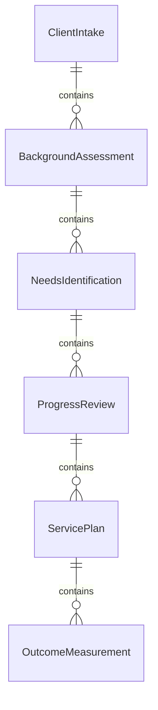
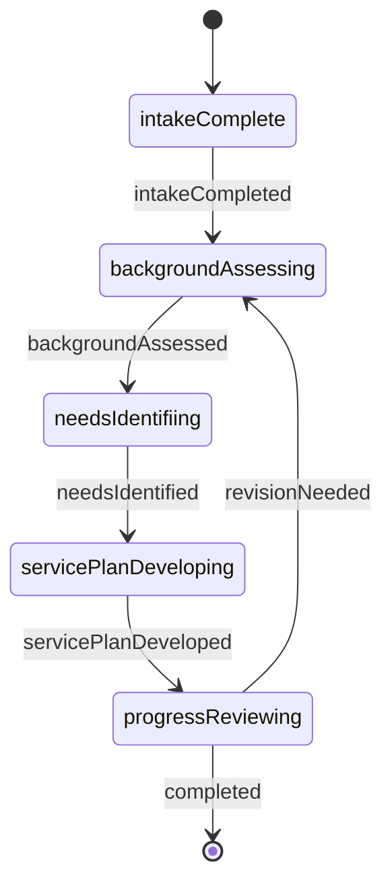
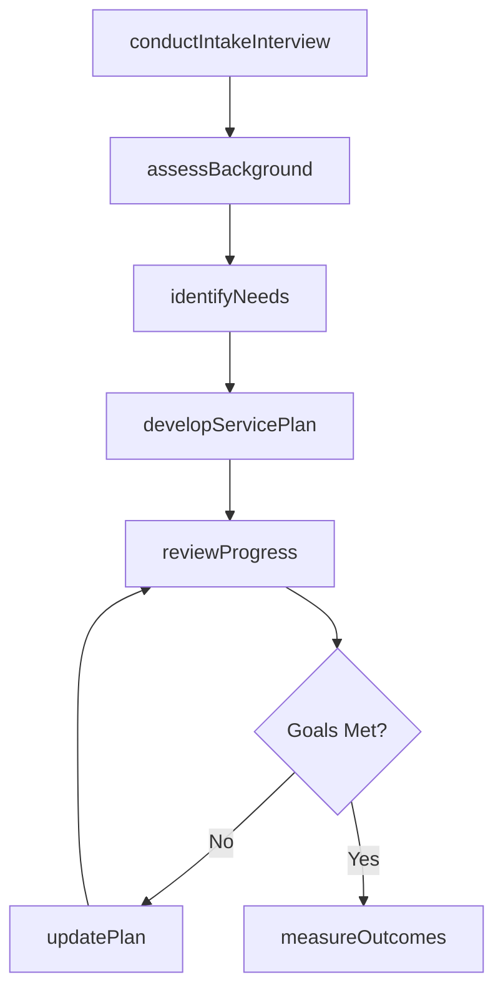
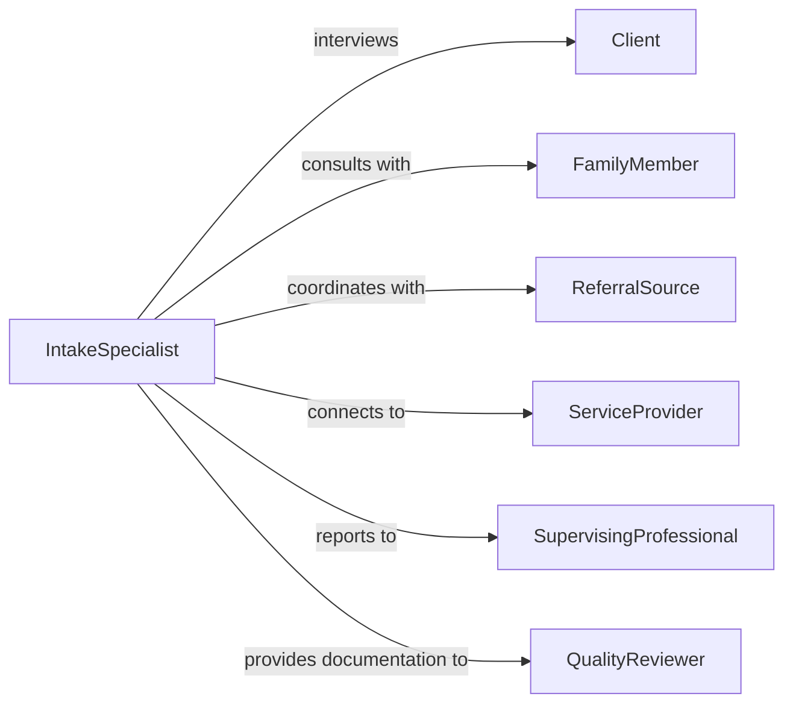

# Interview Clients Gather Information About

> Business-as-Code definition for interviewing clients to gather information about backgrounds, needs, and progress. Models comprehensive intake, assessment, and ongoing tracking across professional services.

## Overview

Interviewing clients about their backgrounds, needs, or progress involves conducting structured conversations to understand client histories, identify service requirements, assess current situations, track goal achievement, and adjust service plans. This definition supports social workers, counselors, consultants, therapists, and service providers in documenting client profiles, identifying intervention needs, monitoring outcomes, and maintaining ongoing client relationships across helping professions and advisory services.

## Actors

| Actor | Description |
|-------|-------------|
| Client | Individual or organization receiving services or support |
| FamilyMember | Relative providing collateral information about client |
| ReferralSource | Organization or individual who directed client to services |
| ServiceProvider | External organization delivering complementary services |
| SupervisingProfessional | Licensed practitioner overseeing client care |
| QualityReviewer | Auditor assessing service documentation and outcomes |

## Roles

| Role | Description |
|------|-------------|
| IntakeSpecialist | Conducts initial client interviews and assessments |
| CaseManager | Monitors client progress and coordinates services |
| Counselor | Provides therapeutic interviews and interventions |
| ProgramCoordinator | Oversees client service delivery and outcomes |

## Entities

| Entity | Description |
|--------|-------------|
| ClientIntake | Initial interview documenting background and service needs |
| BackgroundAssessment | Comprehensive profile of client history and circumstances |
| NeedsIdentification | Documented service requirements and intervention areas |
| ProgressReview | Periodic evaluation of goal achievement and status |
| ServicePlan | Coordinated plan for addressing client needs |
| OutcomeMeasurement | Quantified results of service interventions |

## Actions

| Action | Description |
|--------|-------------|
| conductIntakeInterview | Perform initial interview to gather client background |
| assessBackground | Evaluate client history, circumstances, and context |
| identifyNeeds | Determine specific services or interventions required |
| developServicePlan | Create coordinated plan to address identified needs |
| reviewProgress | Evaluate client advancement toward goals |
| updatePlan | Modify service approach based on progress review |
| measureOutcomes | Quantify results and effectiveness of interventions |

## Events

| Event | Description |
|-------|-------------|
| intakeCompleted | Initial client interview has been documented |
| backgroundAssessed | Client history and context have been evaluated |
| needsIdentified | Required services and interventions have been determined |
| servicePlanDeveloped | Coordinated plan for services has been created |
| progressReviewed | Client advancement has been evaluated |
| planUpdated | Service approach has been modified |
| outcomesMeasured | Results and effectiveness have been quantified |

## Searches

| Search | Description |
|--------|-------------|
| findClients | List clients by status, service type, or intake date |
| getAssessments | Retrieve background evaluations by client or date |
| getServicePlans | Find active service plans by client or coordinator |
| getProgressReviews | Search progress evaluations by client or review period |

## Entity Relationships



## State Diagram



## Workflow



## Actor Relationships



## Usage

### Calling Actions

```typescript
import { interviewClientsGatherInformationAbout } from '@headlessly/interview-clients-gather-information-about'

const clientInterviews = interviewClientsGatherInformationAbout()

// Conduct intake interview for new client
const intake = await clientInterviews.conductIntakeInterview({
  clientId: 'CLT-6734',
  interviewDate: '2026-02-05T10:00:00Z',
  referralSource: 'Community Health Center',
  presentingConcerns: ['housing-instability', 'unemployment', 'substance-use-history']
})

// Assess client background
const background = await clientInterviews.assessBackground({
  clientId: 'CLT-6734',
  areas: ['education', 'employment-history', 'family-situation', 'health-status', 'legal-history'],
  collateralSources: ['family-member', 'prior-counselor']
})

// Identify specific service needs
const needs = await clientInterviews.identifyNeeds({
  clientId: 'CLT-6734',
  assessmentId: background.id,
  priorityAreas: [
    { need: 'emergency-housing', urgency: 'immediate', duration: '30-days' },
    { need: 'job-training', urgency: 'high', duration: '6-months' },
    { need: 'substance-use-counseling', urgency: 'high', duration: 'ongoing' }
  ]
})

// Develop coordinated service plan
await clientInterviews.developServicePlan({
  clientId: 'CLT-6734',
  needsId: needs.id,
  services: [
    { provider: 'emergency-shelter-program', service: 'temporary-housing', startDate: '2026-02-06' },
    { provider: 'workforce-development-center', service: 'job-readiness-training', startDate: '2026-02-15' },
    { provider: 'outpatient-treatment', service: 'group-counseling', frequency: 'weekly' }
  ],
  goals: ['secure-permanent-housing', 'obtain-employment', 'maintain-sobriety'],
  reviewSchedule: 'monthly'
})

// Review client progress after 30 days
await clientInterviews.reviewProgress({
  clientId: 'CLT-6734',
  reviewDate: '2026-03-05T14:00:00Z',
  achievedMilestones: ['enrolled-in-job-training', 'attending-counseling-regularly'],
  barriers: ['still-in-temporary-housing', 'limited-transportation']
})
```

### Event-Driven Automation

```typescript
// Develop service plan immediately after needs are identified
clientInterviews.needsIdentified(async ({ clientId, needsId }) => {
  await clientInterviews.developServicePlan({ clientId, needsId })
})

// Schedule progress review when service plan is created
clientInterviews.servicePlanDeveloped(async ({ clientId, reviewSchedule }) => {
  await scheduleReview({
    clientId,
    frequency: reviewSchedule,
    firstReview: addDays(new Date(), 30)
  })
})

// Update plan when progress review identifies barriers
clientInterviews.progressReviewed(async ({ clientId, barriers }) => {
  if (barriers.length > 0) {
    await clientInterviews.updatePlan({
      clientId,
      modifications: barriers.map(b => ({ barrier: b, intervention: 'to-be-determined' }))
    })
  }
})

// Alert supervisor when high-urgency needs are identified
clientInterviews.needsIdentified(async ({ clientId, priorityAreas }) => {
  const urgent = priorityAreas.filter(a => a.urgency === 'immediate')
  if (urgent.length > 0) {
    await notify({
      to: 'supervising-professional',
      message: `Client ${clientId} has ${urgent.length} immediate needs requiring attention: ${urgent.map(u => u.need).join(', ')}`
    })
  }
})
