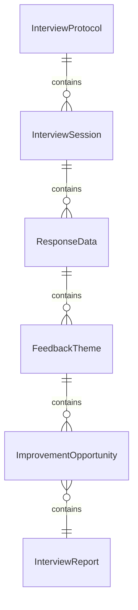
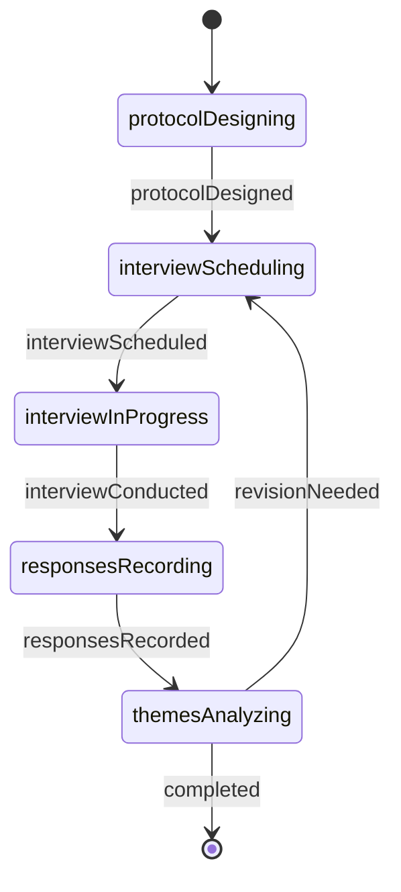
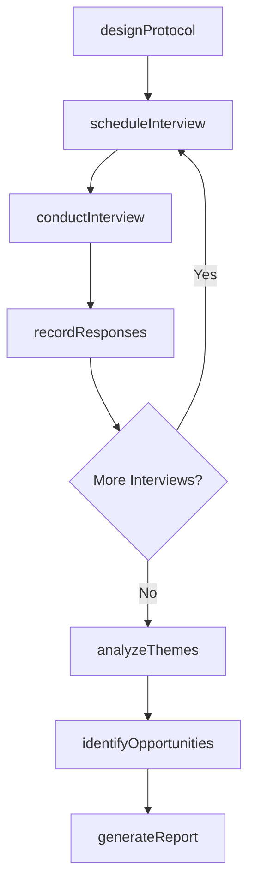
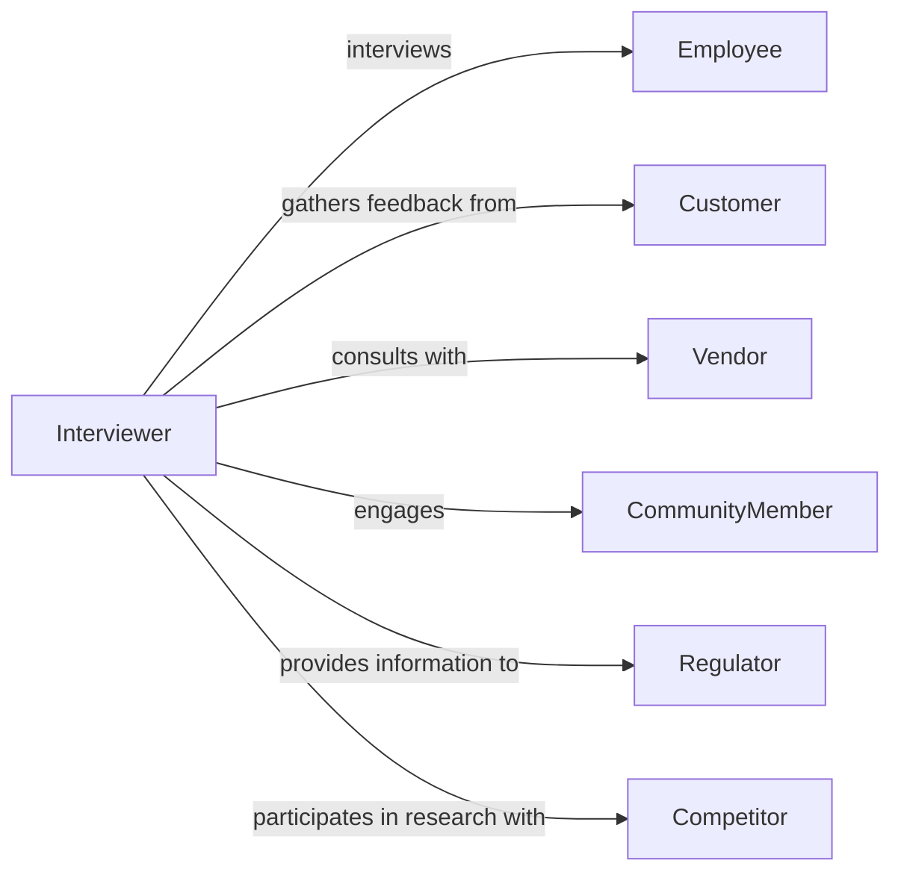

# Interview Employees Customers Others Collect

> Business-as-Code definition for interviewing employees, customers, and other stakeholders to collect information. Models systematic data gathering for research, investigations, quality improvement, and organizational intelligence.

## Overview

Interviewing employees, customers, and other stakeholders involves conducting structured conversations to gather feedback, understand experiences, investigate issues, assess satisfaction, collect requirements, and obtain insights for organizational decision-making. This definition supports HR professionals, researchers, quality managers, product teams, and investigators in collecting qualitative and quantitative data through surveys, focus groups, one-on-one interviews, and exit conversations across diverse stakeholder groups.

## Actors

| Actor | Description |
|-------|-------------|
| Employee | Current or former staff member providing workplace information |
| Customer | Client or patron sharing product or service experiences |
| Vendor | Supplier offering insights on business relationships |
| CommunityMember | Local resident providing input on organizational impact |
| Regulator | Government official gathering compliance information |
| Competitor | Rival organization participating in industry research |

## Roles

| Role | Description |
|------|-------------|
| Interviewer | Conducts structured conversations to collect information |
| Researcher | Designs interview protocols and analyzes findings |
| QualityAnalyst | Gathers feedback to identify improvement opportunities |
| HRSpecialist | Conducts employment-related interviews and exit conversations |

## Entities

| Entity | Description |
|--------|-------------|
| InterviewProtocol | Structured guide for conducting stakeholder interviews |
| InterviewSession | Scheduled conversation with employee, customer, or stakeholder |
| ResponseData | Information collected during interview |
| FeedbackTheme | Pattern or trend identified across multiple interviews |
| ImprovementOpportunity | Actionable insight derived from interview data |
| InterviewReport | Summary of findings from interview sessions |

## Actions

| Action | Description |
|--------|-------------|
| designProtocol | Create structured interview guide with questions and topics |
| scheduleInterview | Arrange time and method for stakeholder conversation |
| conductInterview | Perform structured interview to collect information |
| recordResponses | Document answers, feedback, and observations |
| analyzeThemes | Identify patterns and trends across interview data |
| identifyOpportunities | Determine actionable insights from findings |
| generateReport | Create summary of interview results and recommendations |

## Events

| Event | Description |
|-------|-------------|
| protocolDesigned | Interview structure and questions have been created |
| interviewScheduled | Stakeholder conversation has been arranged |
| interviewConducted | Interview session has been completed |
| responsesRecorded | Stakeholder feedback has been documented |
| themesAnalyzed | Patterns across interviews have been identified |
| opportunitiesIdentified | Actionable insights have been determined |
| reportGenerated | Interview findings summary has been created |

## Searches

| Search | Description |
|--------|-------------|
| findInterviews | List interview sessions by type, stakeholder, or date |
| getResponses | Retrieve recorded feedback by question or theme |
| getThemes | Find identified patterns by topic or frequency |
| getOpportunities | Search improvement insights by priority or area |

## Entity Relationships



## State Diagram



## Workflow



## Actor Relationships



## Usage

### Calling Actions

```typescript
import { interviewEmployeesCustomersOthersCollect } from '@headlessly/interview-employees-customers-others-collect'

const stakeholderInterviews = interviewEmployeesCustomersOthersCollect()

// Design interview protocol for employee engagement study
const protocol = await stakeholderInterviews.designProtocol({
  purpose: 'employee-engagement-assessment',
  stakeholderType: 'employee',
  topics: ['work-environment', 'management-communication', 'career-development', 'compensation-benefits'],
  questionTypes: ['open-ended', 'rating-scale'],
  duration: 30
})

// Schedule interviews with employees
const employeeInterview = await stakeholderInterviews.scheduleInterview({
  protocolId: protocol.id,
  stakeholderId: 'EMP-4523',
  stakeholderType: 'employee',
  scheduledDate: '2026-02-10T15:00:00Z',
  method: 'video-conference'
})

const customerInterview = await stakeholderInterviews.scheduleInterview({
  protocolId: protocol.id,
  stakeholderId: 'CUST-8921',
  stakeholderType: 'customer',
  scheduledDate: '2026-02-11T10:00:00Z',
  method: 'phone'
})

// Conduct interview and record responses
await stakeholderInterviews.conductInterview({
  interviewId: employeeInterview.id,
  recordingMethod: 'notes',
  consentObtained: true
})

await stakeholderInterviews.recordResponses({
  interviewId: employeeInterview.id,
  responses: [
    { question: 'How would you rate communication from management?', answer: '6/10', notes: 'Would like more frequent updates' },
    { question: 'What would improve your work environment?', answer: 'More flexible work-from-home options' }
  ]
})

// Analyze themes after completing multiple interviews
const themes = await stakeholderInterviews.analyzeThemes({
  protocolId: protocol.id,
  minFrequency: 3
})

// Identify improvement opportunities
await stakeholderInterviews.identifyOpportunities({
  themeIds: themes.map(t => t.id),
  prioritizationCriteria: ['frequency', 'impact', 'feasibility']
})
```

### Event-Driven Automation

```typescript
// Record responses immediately after interview is conducted
stakeholderInterviews.interviewConducted(async ({ interviewId }) => {
  await stakeholderInterviews.recordResponses({ interviewId })
})

// Trigger analysis when target interview count is reached
stakeholderInterviews.responsesRecorded(async ({ protocolId }) => {
  const completed = await stakeholderInterviews.findInterviews({
    protocolId,
    status: 'completed'
  })

  if (completed.length >= 20) {
    await stakeholderInterviews.analyzeThemes({ protocolId })
  }
})

// Generate report when opportunities are identified
stakeholderInterviews.opportunitiesIdentified(async ({ protocolId }) => {
  await stakeholderInterviews.generateReport({ protocolId })
})

// Alert leadership when high-priority opportunities are found
stakeholderInterviews.opportunitiesIdentified(async ({ opportunities }) => {
  const urgent = opportunities.filter(o => o.priority === 'high' && o.impact === 'significant')
  if (urgent.length > 0) {
    await notify({
      to: 'executive-team',
      message: `Interview findings reveal ${urgent.length} high-priority improvement opportunities: ${urgent.map(o => o.title).join(', ')}`
    })
  }
})
