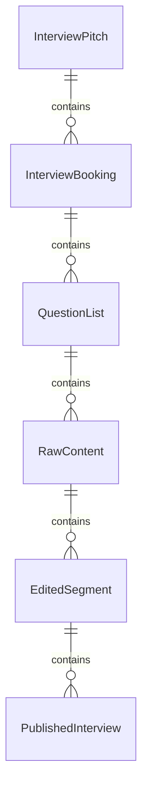
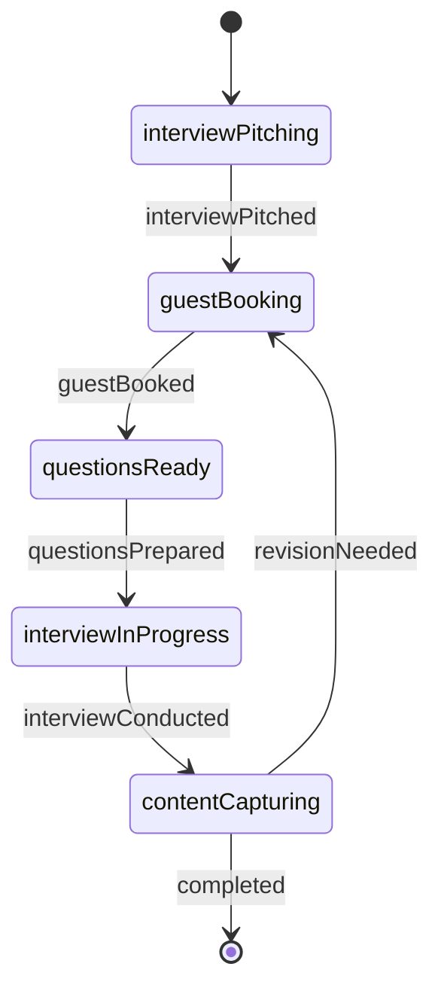
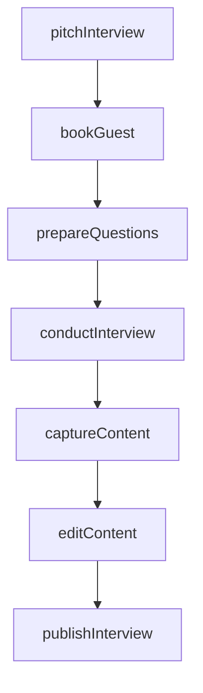
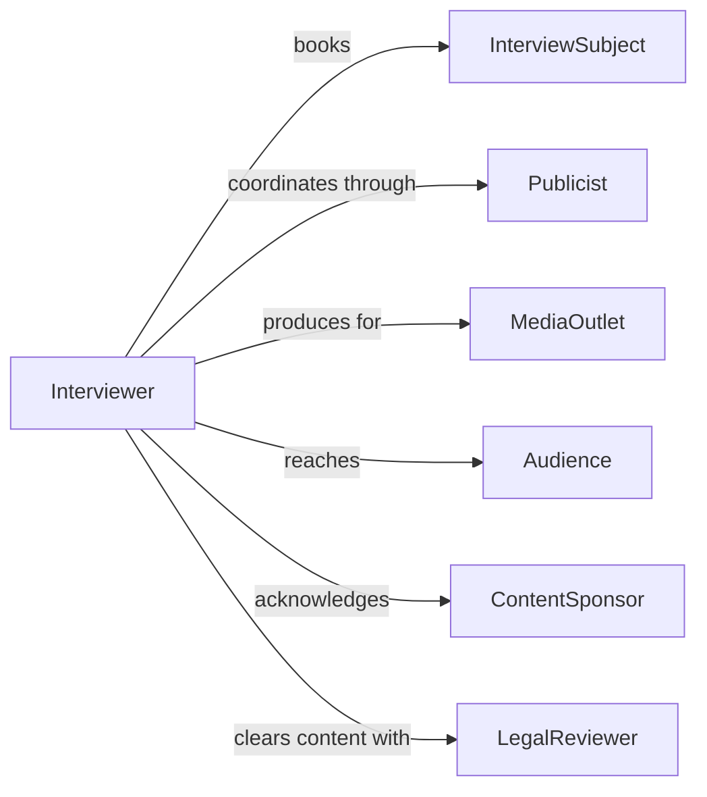

# Interview Others News Entertainment Purposes

> Business-as-Code definition for interviewing people for news and entertainment purposes. Models the complete interview lifecycle from subject identification through content production and publication.

## Overview

Interviewing individuals for news and entertainment purposes involves identifying compelling subjects, arranging interviews, conducting engaging conversations, capturing content, editing for publication, and distributing across media channels. This definition supports journalists, podcasters, documentary producers, talk show hosts, and content creators in managing interview-based content production for broadcast, print, digital, and streaming platforms across news reporting, human interest features, and entertainment programming.

## Actors

| Actor | Description |
|-------|-------------|
| InterviewSubject | Individual being interviewed for news or entertainment content |
| Publicist | Representative managing subject availability and messaging |
| MediaOutlet | Organization publishing or broadcasting the interview content |
| Audience | Consumers of the interview content across platforms |
| ContentSponsor | Advertiser or underwriter supporting interview production |
| LegalReviewer | Attorney reviewing content for defamation or rights issues |

## Roles

| Role | Description |
|------|-------------|
| Interviewer | Conducts conversations and extracts compelling narratives |
| Producer | Manages logistics, scheduling, and production elements |
| Editor | Refines raw interview content for publication or broadcast |
| TechnicalDirector | Operates recording equipment and manages audio/video quality |

## Entities

| Entity | Description |
|--------|-------------|
| InterviewPitch | Proposal for interview subject and story angle |
| InterviewBooking | Confirmed arrangement for interview session |
| QuestionList | Prepared topics and questions for interview |
| RawContent | Unedited audio, video, or transcript from interview |
| EditedSegment | Refined content ready for publication or broadcast |
| PublishedInterview | Final interview content distributed to audience |

## Actions

| Action | Description |
|--------|-------------|
| pitchInterview | Propose interview subject and angle to producers |
| bookGuest | Arrange interview with subject and confirm logistics |
| prepareQuestions | Research subject and develop interview topics |
| conductInterview | Perform recorded conversation with subject |
| captureContent | Record audio, video, or notes during interview |
| editContent | Refine raw material into publishable segments |
| publishInterview | Distribute final content across media channels |

## Events

| Event | Description |
|-------|-------------|
| interviewPitched | Interview subject and angle have been proposed |
| guestBooked | Interview arrangement has been confirmed |
| questionsPrepared | Interview topics and questions have been developed |
| interviewConducted | Recorded conversation has been completed |
| contentCaptured | Audio, video, or transcript has been recorded |
| contentEdited | Publishable segments have been created |
| interviewPublished | Final content has been distributed to audience |

## Searches

| Search | Description |
|--------|-------------|
| findPitches | List interview proposals by status, subject, or outlet |
| getBookings | Retrieve scheduled interviews by date or interviewer |
| getContent | Find raw or edited interview material by subject or date |
| getPublished | Search published interviews by platform or publication date |

## Entity Relationships



## State Diagram



## Workflow



## Actor Relationships



## Usage

### Calling Actions

```typescript
import { interviewOthersNewsEntertainmentPurposes } from '@headlessly/interview-others-news-entertainment-purposes'

const mediaInterviews = interviewOthersNewsEntertainmentPurposes()

// Pitch interview concept to producers
const pitch = await mediaInterviews.pitchInterview({
  subject: 'Dr. Sarah Chen, Climate Scientist',
  angle: 'Recent breakthrough in carbon capture technology',
  format: 'podcast-episode',
  targetOutlet: 'Science & Innovation Podcast',
  estimatedDuration: 45
})

// Book guest for interview
const booking = await mediaInterviews.bookGuest({
  pitchId: pitch.id,
  subjectId: 'SUBJ-7821',
  scheduledDate: '2026-02-15T14:00:00Z',
  location: 'remote-recording',
  technicalRequirements: ['high-quality-microphone', 'quiet-environment']
})

// Prepare interview questions
await mediaInterviews.prepareQuestions({
  bookingId: booking.id,
  researchSources: ['published-papers', 'prior-interviews', 'news-articles'],
  topics: [
    'breakthrough-discovery-details',
    'real-world-applications',
    'industry-impact',
    'future-research-directions',
    'personal-journey-to-science'
  ]
})

// Conduct interview and capture content
await mediaInterviews.conductInterview({
  bookingId: booking.id,
  format: 'audio-recording',
  duration: 48,
  technicalQuality: 'excellent'
})

const content = await mediaInterviews.captureContent({
  bookingId: booking.id,
  contentTypes: ['audio-file', 'transcript', 'show-notes'],
  storageLocation: 's3://media-archive/interviews/2026-02-15/'
})

// Edit content for publication
const edited = await mediaInterviews.editContent({
  contentId: content.id,
  editActions: ['remove-technical-issues', 'add-intro-outro', 'insert-sponsor-messages'],
  targetLength: 42
})

// Publish interview
await mediaInterviews.publishInterview({
  editedContentId: edited.id,
  platforms: ['podcast-rss', 'youtube', 'website'],
  publishDate: '2026-02-20T06:00:00Z',
  promotionalAssets: ['social-media-clips', 'episode-artwork', 'show-notes']
})
```

### Event-Driven Automation

```typescript
// Prepare questions when guest is booked
mediaInterviews.guestBooked(async ({ bookingId, subjectId }) => {
  await mediaInterviews.prepareQuestions({ bookingId, subjectId })
})

// Capture content immediately after interview
mediaInterviews.interviewConducted(async ({ bookingId }) => {
  await mediaInterviews.captureContent({ bookingId })
})

// Send for editing when content is captured
mediaInterviews.contentCaptured(async ({ contentId }) => {
  await mediaInterviews.editContent({ contentId })
})

// Alert team when interview is published
mediaInterviews.interviewPublished(async ({ editedContentId, platforms, publishDate }) => {
  await notify({
    to: 'marketing-team',
    message: `New interview published on ${platforms.join(', ')} - ready for promotion`
  })

  await schedulePromotion({
    contentId: editedContentId,
    channels: ['social-media', 'newsletter', 'website-feature'],
    startDate: publishDate
  })
})
```
