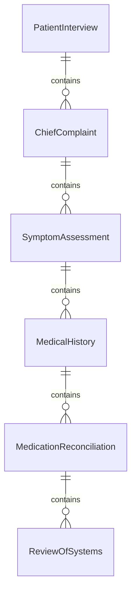
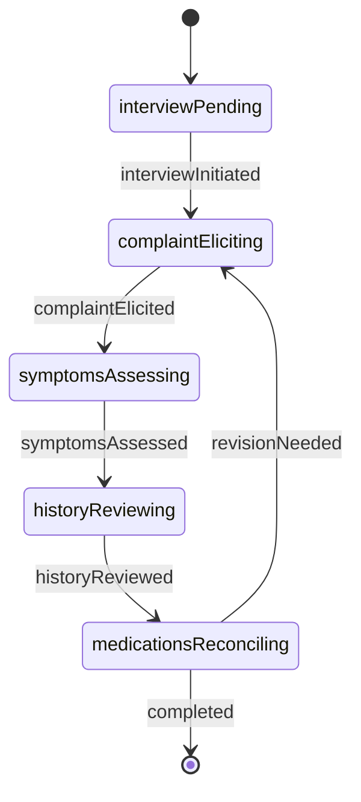
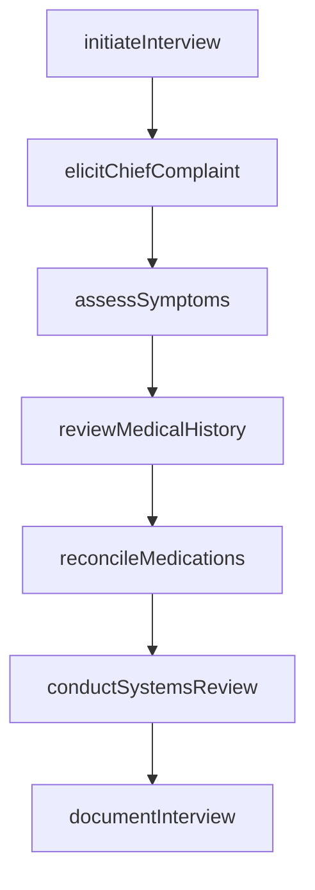
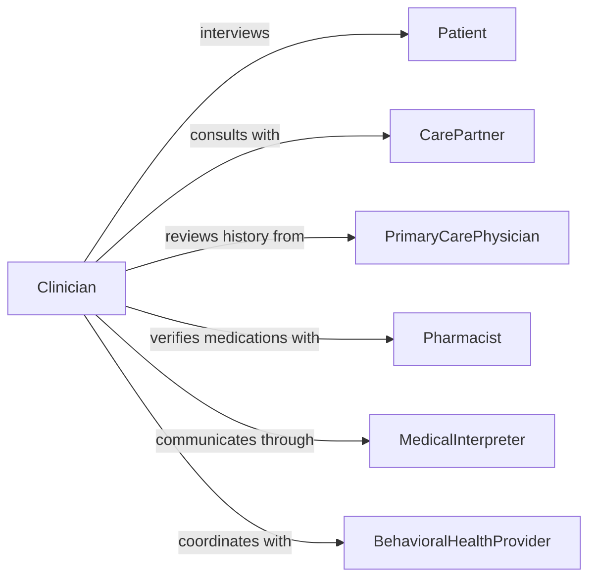

# Interview Patients Gather Medical Information

> Business-as-Code definition for interviewing patients to gather medical information. Models patient-clinician communication for clinical assessment, diagnosis support, and treatment planning.

## Overview

Interviewing patients to gather medical information involves conducting structured clinical interviews to elicit symptoms, medical history, medication use, lifestyle factors, and health concerns. This definition enables healthcare providers to systematically collect patient-reported data, perform symptom assessments, conduct review of systems, document social determinants of health, and establish therapeutic rapport to support accurate diagnosis, appropriate treatment, and patient-centered care delivery.

## Actors

| Actor | Description |
|-------|-------------|
| Patient | Individual receiving medical care and providing health information |
| CarePartner | Family member or caregiver assisting with patient information |
| PrimaryCarePhysician | Regular doctor providing contextual health background |
| Pharmacist | Medication expert verifying drug history and interactions |
| MedicalInterpreter | Language professional facilitating patient-provider communication |
| BehavioralHealthProvider | Mental health specialist providing psychological context |

## Roles

| Role | Description |
|------|-------------|
| Clinician | Healthcare provider conducting patient interview |
| MedicalAssistant | Support staff collecting initial patient information |
| NurseNavigator | Coordinator facilitating comprehensive information gathering |
| SpecialistConsultant | Expert physician reviewing specific clinical concerns |

## Entities

| Entity | Description |
|--------|-------------|
| PatientInterview | Structured clinical conversation with patient |
| ChiefComplaint | Primary reason for patient seeking medical care |
| SymptomAssessment | Detailed evaluation of patient-reported symptoms |
| MedicalHistory | Documented past illnesses, surgeries, and treatments |
| MedicationReconciliation | Verified list of current medications and dosages |
| ReviewOfSystems | Systematic inquiry across body systems |

## Actions

| Action | Description |
|--------|-------------|
| initiateInterview | Begin structured clinical conversation with patient |
| elicitChiefComplaint | Identify primary reason for patient visit |
| assessSymptoms | Gather detailed information about symptoms using OPQRST method |
| reviewMedicalHistory | Document past health conditions and treatments |
| reconcileMedications | Verify current medication use and adherence |
| conductSystemsReview | Systematically inquire about symptoms across body systems |
| documentInterview | Record patient information in medical record |

## Events

| Event | Description |
|-------|-------------|
| interviewInitiated | Clinical conversation with patient has begun |
| complaintElicited | Primary health concern has been identified |
| symptomsAssessed | Detailed symptom information has been gathered |
| historyReviewed | Past medical conditions have been documented |
| medicationsReconciled | Current medication list has been verified |
| systemsReviewed | Body systems inquiry has been completed |
| interviewDocumented | Patient information has been recorded in chart |

## Searches

| Search | Description |
|--------|-------------|
| findInterviews | List patient interviews by clinician, date, or chief complaint |
| getSymptoms | Retrieve symptom assessments by patient or condition |
| getMedications | Find medication lists by patient or drug name |
| getHistories | Search documented medical histories by patient or condition |

## Entity Relationships



## State Diagram



## Workflow



## Actor Relationships



## Usage

### Calling Actions

```typescript
import { interviewPatientsGatherMedicalInformation } from '@headlessly/interview-patients-gather-medical-information'

const patientInterviews = interviewPatientsGatherMedicalInformation()

// Initiate patient interview
const interview = await patientInterviews.initiateInterview({
  patientId: 'PT-5829',
  clinicianId: 'DR-3401',
  visitType: 'new-patient',
  interviewDate: '2026-02-05T09:00:00Z'
})

// Elicit chief complaint
const complaint = await patientInterviews.elicitChiefComplaint({
  interviewId: interview.id,
  patientStatement: 'I have been having severe headaches for the past two weeks',
  onset: '2-weeks-ago',
  context: 'started-after-work-stress-increased'
})

// Assess symptoms using OPQRST method
await patientInterviews.assessSymptoms({
  interviewId: interview.id,
  symptom: 'headache',
  assessment: {
    onset: 'gradual over 2 weeks',
    provocation: 'worse with computer work',
    quality: 'throbbing, bilateral frontal',
    radiation: 'none',
    severity: 7,
    timing: 'daily, worse in afternoon'
  }
})

// Review medical history
await patientInterviews.reviewMedicalHistory({
  interviewId: interview.id,
  conditions: [
    { condition: 'hypertension', diagnosedDate: '2020-03-15', status: 'controlled' },
    { condition: 'migraines', diagnosedDate: '2018-06-20', status: 'intermittent' }
  ],
  surgeries: [
    { procedure: 'appendectomy', date: '2015-11-10', complications: 'none' }
  ]
})

// Reconcile medications
await patientInterviews.reconcileMedications({
  interviewId: interview.id,
  medications: [
    { name: 'lisinopril', dose: '10mg', frequency: 'daily', adherence: 'good' },
    { name: 'sumatriptan', dose: '50mg', frequency: 'as-needed', lastUsed: '2026-01-28' }
  ]
})

// Conduct review of systems
await patientInterviews.conductSystemsReview({
  interviewId: interview.id,
  systems: {
    neurological: 'headaches as noted, no vision changes or weakness',
    cardiovascular: 'no chest pain or palpitations',
    respiratory: 'no shortness of breath',
    gastrointestinal: 'no nausea or vomiting'
  }
})
```

### Event-Driven Automation

```typescript
// Assess symptoms when chief complaint is documented
patientInterviews.complaintElicited(async ({ interviewId, complaint }) => {
  await patientInterviews.assessSymptoms({
    interviewId,
    symptom: complaint.primarySymptom
  })
})

// Reconcile medications after history is reviewed
patientInterviews.historyReviewed(async ({ interviewId }) => {
  await patientInterviews.reconcileMedications({ interviewId })
})

// Document interview when all sections are complete
patientInterviews.systemsReviewed(async ({ interviewId }) => {
  await patientInterviews.documentInterview({ interviewId })
})

// Alert for critical symptoms during assessment
patientInterviews.symptomsAssessed(async ({ interviewId, patientId, assessment }) => {
  const criticalSymptoms = ['chest-pain', 'severe-headache-sudden-onset', 'difficulty-breathing']
  if (criticalSymptoms.some(s => assessment.includes(s))) {
    await notify({
      to: 'supervising-physician',
      message: `Patient ${patientId} presents with critical symptoms requiring immediate evaluation`,
      urgency: 'high'
    })
  }
})
