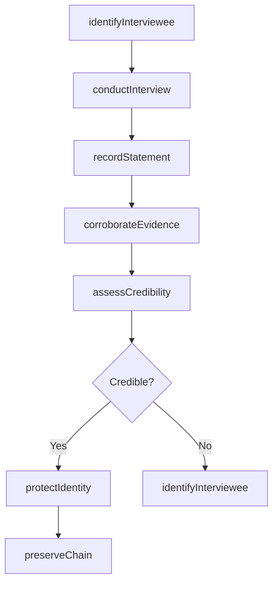
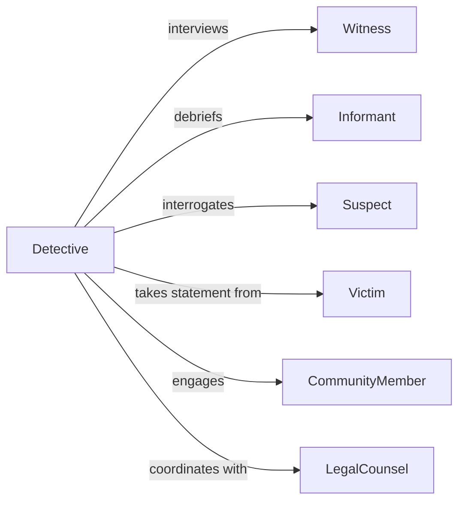

# Interview People Gather Information About

> Business-as-Code definition for interviewing people to gather information about criminal activities. Models law enforcement intelligence gathering, criminal investigation interviews, and evidence collection.

## Overview

Interviewing people to gather information about criminal activities involves conducting investigative conversations with witnesses, informants, suspects, and community members to collect intelligence, establish timelines, identify perpetrators, and build criminal cases. This definition supports detectives, investigators, intelligence analysts, and law enforcement officers in documenting statements, cross-referencing accounts, preserving evidence chains, and advancing criminal investigations while protecting witness safety and maintaining legal admissibility.

## Actors

| Actor | Description |
|-------|-------------|
| Witness | Individual who observed criminal activity or related events |
| Informant | Person providing intelligence about criminal operations |
| Suspect | Individual under investigation for criminal involvement |
| Victim | Person harmed by criminal activity providing account |
| CommunityMember | Resident offering neighborhood intelligence or context |
| LegalCounsel | Attorney advising on interview protocols and rights |

## Roles

| Role | Description |
|------|-------------|
| Detective | Lead investigator conducting criminal interviews |
| IntelligenceAnalyst | Analyst correlating information across multiple sources |
| InterviewSpecialist | Expert trained in investigative interviewing techniques |
| EvidenceOfficer | Custodian preserving recorded statements and chain of custody |

## Entities

| Entity | Description |
|--------|-------------|
| CriminalInvestigation | Active case file for criminal activity under investigation |
| InvestigativeInterview | Recorded conversation to gather criminal intelligence |
| WitnessAccount | Statement from person who observed criminal activity |
| InformantIntelligence | Information provided by confidential source |
| SuspectStatement | Recorded account from person under investigation |
| EvidenceCorroboration | Cross-reference between interview data and physical evidence |

## Actions

| Action | Description |
|--------|-------------|
| identifyInterviewee | Determine person with relevant criminal intelligence |
| conductInterview | Perform investigative conversation to gather information |
| recordStatement | Document account of criminal activity or observations |
| corroborateEvidence | Cross-check statement against other evidence sources |
| assessCredibility | Evaluate reliability of information provided |
| protectIdentity | Safeguard witness or informant safety and anonymity |
| preserveChain | Maintain legal chain of custody for recorded statements |

## Events

| Event | Description |
|-------|-------------|
| intervieweeIdentified | Person with relevant intelligence has been located |
| interviewConducted | Investigative conversation has been completed |
| statementRecorded | Account of criminal activity has been documented |
| evidenceCorroborated | Statement has been verified against other sources |
| credibilityAssessed | Information reliability has been evaluated |
| identityProtected | Witness or informant safety measures have been implemented |
| chainPreserved | Legal custody of statement has been maintained |

## Searches

| Search | Description |
|--------|-------------|
| findInvestigations | List criminal cases by type, status, or investigator |
| getInterviews | Retrieve investigative interviews by case or interviewee |
| getStatements | Find recorded accounts by witness type or content |
| getCorroborations | Search evidence cross-references by investigation |

## Workflow



## Actor Relationships



## Usage

### Calling Actions

```typescript
import { interviewPeopleGatherInformationAbout } from '@headlessly/interview-people-gather-information-about'

const criminalInterviews = interviewPeopleGatherInformationAbout()

// Identify witness with relevant information
const interviewee = await criminalInterviews.identifyInterviewee({
  investigationId: 'INV-2026-3421',
  personType: 'witness',
  relevance: 'observed-suspect-fleeing-scene',
  contactMethod: 'community-canvass'
})

// Conduct investigative interview
const interview = await criminalInterviews.conductInterview({
  investigationId: 'INV-2026-3421',
  intervieweeId: interviewee.id,
  location: 'police-station',
  method: 'recorded-video',
  mirandaRequired: false,
  advisementGiven: true
})

// Record witness statement
const statement = await criminalInterviews.recordStatement({
  interviewId: interview.id,
  narrative: 'Witness observed male subject approximately 6 feet tall running from alley at 2:30 AM carrying dark bag',
  keyDetails: [
    'suspect-description: tall, dark-clothing, approximately-30-years-old',
    'direction-of-travel: north-on-main-street',
    'time: 2:30-AM-approximately',
    'carried: dark-colored-backpack'
  ]
})

// Corroborate with other evidence
await criminalInterviews.corroborateEvidence({
  statementId: statement.id,
  evidenceSources: [
    { type: 'surveillance-video', location: 'main-street-camera-3', timestamp: '02:31:15' },
    { type: 'physical-evidence', item: 'backpack-recovered', location: 'dumpster-400-block-main' }
  ]
})

// Assess credibility of witness account
const credibility = await criminalInterviews.assessCredibility({
  statementId: statement.id,
  factors: {
    consistency: 'high',
    specificity: 'detailed',
    demeanor: 'cooperative',
    corroboration: 'strong'
  }
})

// Protect witness identity if needed
if (credibility.reliable) {
  await criminalInterviews.protectIdentity({
    intervieweeId: interviewee.id,
    protectionLevel: 'confidential-witness',
    measures: ['redact-from-public-reports', 'assign-identifier-code']
  })
}

// Preserve chain of custody
await criminalInterviews.preserveChain({
  statementId: statement.id,
  custodyLog: [
    { officer: 'detective-martinez', action: 'recorded-statement', timestamp: '2026-02-05T03:15:00Z' },
    { officer: 'evidence-officer-chen', action: 'transferred-to-evidence', timestamp: '2026-02-05T04:00:00Z' }
  ]
})
```

### Event-Driven Automation

```typescript
// Record statement immediately after interview
criminalInterviews.interviewConducted(async ({ interviewId }) => {
  await criminalInterviews.recordStatement({ interviewId })
})

// Corroborate evidence when statement is recorded
criminalInterviews.statementRecorded(async ({ statementId, investigationId }) => {
  await criminalInterviews.corroborateEvidence({
    statementId,
    investigationId
  })
})

// Assess credibility after corroboration
criminalInterviews.evidenceCorroborated(async ({ statementId }) => {
  await criminalInterviews.assessCredibility({ statementId })
})

// Alert supervisor when high-value intelligence is obtained
criminalInterviews.credibilityAssessed(async ({ statementId, investigationId, credibility }) => {
  if (credibility.level === 'high' && credibility.intelligence === 'critical') {
    await notify({
      to: 'investigation-supervisor',
      message: `High-credibility critical intelligence obtained in case ${investigationId} - statement ${statementId}`,
      urgency: 'immediate'
    })
  }
})

// Protect identity for informants automatically
criminalInterviews.interviewConducted(async ({ intervieweeType, intervieweeId }) => {
  if (intervieweeType === 'informant') {
    await criminalInterviews.protectIdentity({
      intervieweeId,
      protectionLevel: 'confidential-informant',
      measures: ['assign-ci-number', 'redact-all-identifying-information']
    })
  }
})
