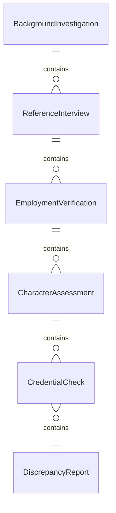
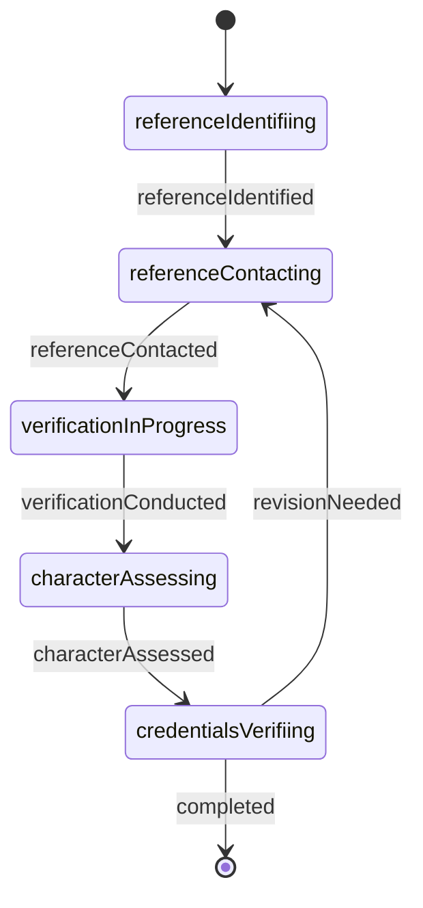
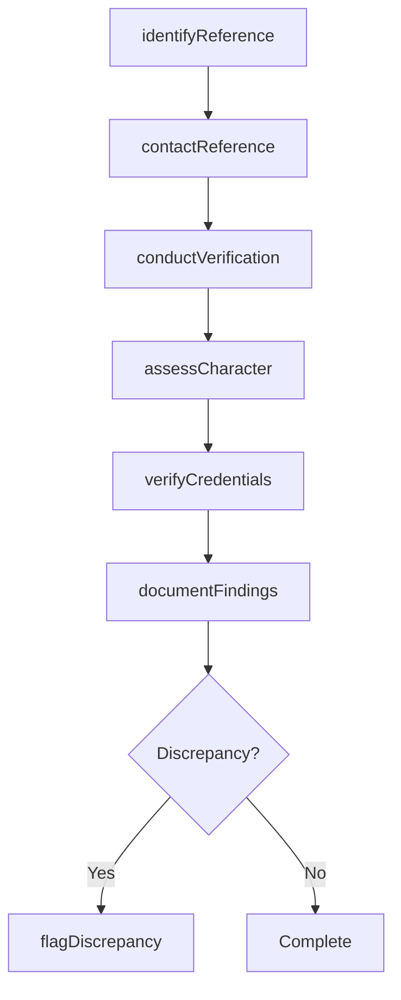
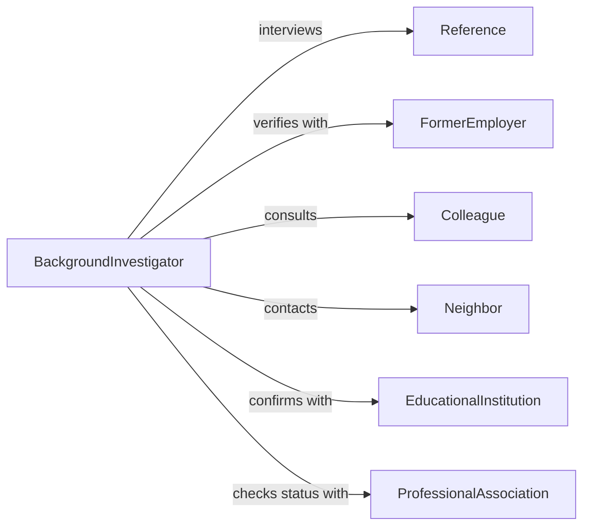

# Interview People Obtain Information About

> Business-as-Code definition for interviewing people to obtain information about actions or status of individuals. Models reference checks, background investigations, and verification interviews.

## Overview

Interviewing people to obtain information about the actions or status of individuals involves conducting verification conversations with references, colleagues, supervisors, and associates to validate backgrounds, assess character, confirm employment history, and gather intelligence about specific persons. This definition supports HR professionals, investigators, security clearance officers, and background screeners in collecting third-party accounts, verifying claims, assessing reliability, and documenting findings for hiring, licensing, security clearances, and investigative purposes.

## Actors

| Actor | Description |
|-------|-------------|
| Reference | Person providing information about subject's character or performance |
| FormerEmployer | Past supervisor or HR representative verifying employment |
| Colleague | Current or former coworker offering professional observations |
| Neighbor | Community member providing residential or behavioral information |
| EducationalInstitution | School or university verifying academic credentials |
| ProfessionalAssociation | Licensing board or membership organization confirming status |

## Roles

| Role | Description |
|------|-------------|
| BackgroundInvestigator | Conducts comprehensive background verification interviews |
| ReferenceChecker | Performs employment or character reference checks |
| SecurityClearanceOfficer | Gathers information for government clearance adjudication |
| ComplianceAnalyst | Verifies regulatory or professional credentials |

## Entities

| Entity | Description |
|--------|-------------|
| BackgroundInvestigation | Comprehensive inquiry into individual's history and status |
| ReferenceInterview | Conversation with person providing information about subject |
| EmploymentVerification | Confirmation of job history, dates, and performance |
| CharacterAssessment | Evaluation of subject's reliability, integrity, and conduct |
| CredentialCheck | Verification of education, licenses, or certifications |
| DiscrepancyReport | Documented inconsistency between claimed and verified information |

## Actions

| Action | Description |
|--------|-------------|
| identifyReference | Locate person with relevant knowledge of subject |
| contactReference | Reach out to reference for interview |
| conductVerification | Perform structured interview to confirm information |
| assessCharacter | Evaluate subject's reliability and integrity based on input |
| verifyCredentials | Confirm educational or professional qualifications |
| documentFindings | Record information obtained from reference |
| flagDiscrepancy | Note inconsistency between claimed and verified data |

## Events

| Event | Description |
|-------|-------------|
| referenceIdentified | Person with subject knowledge has been located |
| referenceContacted | Outreach to reference has been made |
| verificationConducted | Confirmation interview has been completed |
| characterAssessed | Reliability evaluation has been performed |
| credentialsVerified | Qualifications have been confirmed or refuted |
| findingsDocumented | Reference information has been recorded |
| discrepancyFlagged | Inconsistency has been identified and noted |

## Searches

| Search | Description |
|--------|-------------|
| findInvestigations | List background checks by subject, status, or date |
| getReferences | Retrieve reference interviews by subject or reference type |
| getVerifications | Find employment or credential confirmations by subject |
| getDiscrepancies | Search flagged inconsistencies by subject or severity |

## Entity Relationships



## State Diagram



## Workflow



## Actor Relationships



## Usage

### Calling Actions

```typescript
import { interviewPeopleObtainInformationAbout } from '@headlessly/interview-people-obtain-information-about'

const verificationInterviews = interviewPeopleObtainInformationAbout()

// Identify references for employment verification
const references = await verificationInterviews.identifyReference({
  subjectId: 'SUBJ-8421',
  investigationType: 'employment-background',
  referenceTypes: ['supervisor', 'hr-representative', 'colleague'],
  minimumReferences: 3
})

// Contact former employer reference
await verificationInterviews.contactReference({
  referenceId: references[0].id,
  contactMethod: 'phone',
  purpose: 'employment-verification',
  consentObtained: true
})

// Conduct verification interview
const verification = await verificationInterviews.conductVerification({
  referenceId: references[0].id,
  subjectId: 'SUBJ-8421',
  verificationAreas: ['employment-dates', 'job-title', 'responsibilities', 'performance', 'reason-for-leaving'],
  recordingMethod: 'notes'
})

// Assess character based on reference input
const assessment = await verificationInterviews.assessCharacter({
  subjectId: 'SUBJ-8421',
  referenceId: references[0].id,
  assessmentCriteria: {
    reliability: 'consistently-met-deadlines',
    integrity: 'trustworthy-with-confidential-information',
    teamwork: 'collaborative-and-supportive',
    judgement: 'made-sound-decisions-under-pressure'
  },
  overallRating: 'highly-favorable'
})

// Verify educational credentials
await verificationInterviews.verifyCredentials({
  subjectId: 'SUBJ-8421',
  institution: 'State University',
  credentialType: 'bachelors-degree',
  claimedDegree: 'BS Computer Science',
  claimedGraduationDate: '2018-05-15'
})

// Document findings
const findings = await verificationInterviews.documentFindings({
  subjectId: 'SUBJ-8421',
  investigationType: 'employment-background',
  summary: 'Subject employment and credentials verified. Positive character references from multiple sources.',
  recommendedAction: 'approve-for-hire'
})

// Flag discrepancy if found
const discrepancy = await verificationInterviews.flagDiscrepancy({
  subjectId: 'SUBJ-8421',
  discrepancyType: 'employment-dates',
  claimed: 'January 2020 - December 2023',
  verified: 'March 2020 - November 2023',
  severity: 'minor',
  explanation: 'dates-rounded-on-resume'
})
```

### Event-Driven Automation

```typescript
// Conduct verification when reference is contacted
verificationInterviews.referenceContacted(async ({ referenceId, subjectId }) => {
  await verificationInterviews.conductVerification({ referenceId, subjectId })
})

// Assess character after verification is complete
verificationInterviews.verificationConducted(async ({ subjectId, referenceId }) => {
  await verificationInterviews.assessCharacter({ subjectId, referenceId })
})

// Document findings after all verifications are complete
verificationInterviews.credentialsVerified(async ({ subjectId }) => {
  const allVerifications = await verificationInterviews.getVerifications({ subjectId })
  if (allVerifications.every(v => v.status === 'complete')) {
    await verificationInterviews.documentFindings({ subjectId })
  }
})

// Alert hiring manager when discrepancy is flagged
verificationInterviews.discrepancyFlagged(async ({ subjectId, discrepancyType, severity }) => {
  if (severity === 'major' || severity === 'critical') {
    await notify({
      to: 'hiring-manager',
      message: `${severity} discrepancy found for candidate ${subjectId}: ${discrepancyType}`,
      urgency: 'high'
    })
  }
})

// Request additional references when unfavorable assessment
verificationInterviews.characterAssessed(async ({ subjectId, overallRating }) => {
  if (overallRating === 'unfavorable' || overallRating === 'concerns-raised') {
    await verificationInterviews.identifyReference({
      subjectId,
      additionalReferences: 2,
      purpose: 'verify-concerns'
    })
  }
})
```
