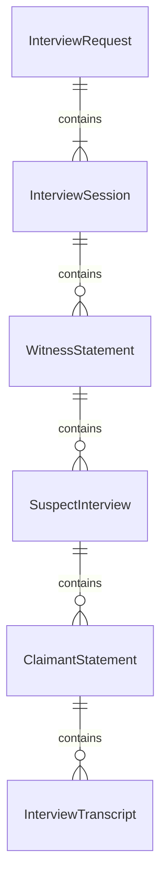
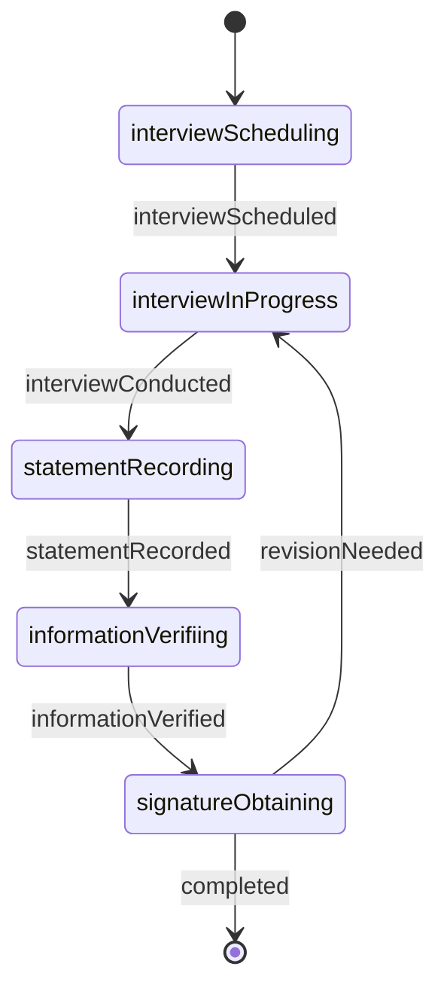
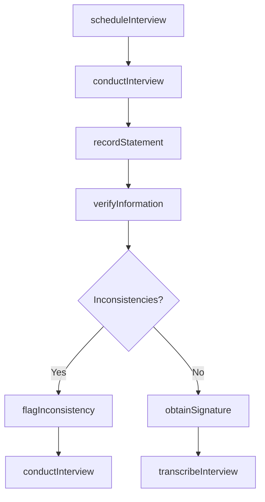
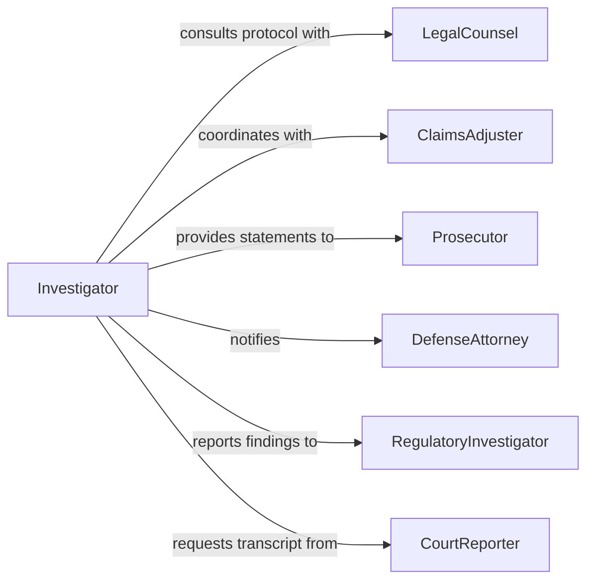

# Interview Witnesses Suspects Claimants

> Business-as-Code definition for interviewing witnesses, suspects, and claimants. Models the systematic process of conducting formal interviews to collect testimony, statements, and evidence during investigations or claims processing.

## Overview

Interviewing witnesses, suspects, and claimants involves conducting structured conversations to gather facts, testimony, and accounts related to incidents, crimes, claims, or disputes. Interviewers establish rapport, ask targeted questions, document responses, verify information, and preserve statements for legal or administrative proceedings. This definition supports criminal investigations, insurance claims, workplace incidents, legal discovery, and regulatory inquiries.

## Actors

| Actor | Description |
|-------|-------------|
| LegalCounsel | Provides guidance on interview protocols and admissibility of statements |
| ClaimsAdjuster | Evaluates claimant statements for insurance coverage decisions |
| Prosecutor | Reviews witness statements for criminal case prosecution |
| DefenseAttorney | Represents suspects during interviews and advises on rights |
| RegulatoryInvestigator | Conducts interviews as part of compliance or enforcement actions |
| CourtReporter | Creates verbatim transcripts of formal interview sessions |

## Roles

| Role | Description |
|------|-------------|
| Investigator | Conducts interviews and collects statements from all parties |
| InterviewCoordinator | Schedules interview sessions and manages logistics |
| StatementAnalyst | Reviews recorded statements for consistency and credibility |
| EvidenceOfficer | Preserves recorded statements and maintains chain of custody |

## Entities

| Entity | Description |
|--------|-------------|
| InterviewRequest | A formal request to interview a witness, suspect, or claimant |
| InterviewSession | A scheduled meeting to conduct the interview |
| WitnessStatement | A recorded account from a person who observed an event |
| SuspectInterview | A formal conversation with a person under investigation |
| ClaimantStatement | Testimony from someone filing a claim or seeking remedy |
| InterviewTranscript | A written record of the interview conversation |

## Actions

| Action | Description |
|--------|-------------|
| scheduleInterview | Arrange a time and location to conduct the interview |
| conductInterview | Perform the interview session using structured questioning |
| recordStatement | Document the interviewee's responses and testimony |
| verifyInformation | Cross-check statements against other evidence or records |
| obtainSignature | Secure the interviewee's signature on formal statements |
| flagInconsistency | Mark contradictions or discrepancies in the account |
| transcribeInterview | Create a verbatim written record from audio or video |

## Events

| Event | Description |
|-------|-------------|
| interviewScheduled | An interview session has been arranged with the party |
| interviewConducted | The interview session has been completed |
| statementRecorded | The interviewee's testimony has been documented |
| informationVerified | Statements have been checked against corroborating evidence |
| signatureObtained | The interviewee has signed the formal statement |
| inconsistencyFlagged | Discrepancies in the account have been identified |
| interviewTranscribed | A verbatim transcript has been prepared |

## Searches

| Search | Description |
|--------|-------------|
| findInterviews | List interviews by case, date, interviewee, or type |
| getStatements | Retrieve recorded statements by witness, suspect, or claimant |
| getInconsistencies | Find flagged discrepancies by case or interviewee |
| getTranscripts | Locate verbatim transcripts by case or session |

## Entity Relationships



## State Diagram



## Workflow



## Actor Relationships



## Usage

### Calling Actions

```typescript
import { interviewWitnessesSuspectsClaimants } from '@headlessly/interview-witnesses-suspects-claimants'

const interviews = interviewWitnessesSuspectsClaimants()

// Schedule an interview with a witness
const session = await interviews.scheduleInterview({
  caseId: 'incident-2026-1423',
  intervieweeType: 'witness',
  intervieweeName: 'Sarah Martinez',
  scheduledDate: '2026-02-15T14:00:00Z',
  location: 'Field Office Conference Room B'
})

// Conduct the interview and record statement
await interviews.conductInterview({
  sessionId: session.id,
  method: 'structured',
  recordingType: 'audio-video',
  mirandaWarning: false
})

const statement = await interviews.recordStatement({
  sessionId: session.id,
  narrative: 'Witness observed forklift collision at approximately 10:15 AM...',
  keyPoints: ['heard loud crash', 'saw operator slumped over wheel', 'called emergency line']
})

// Verify information and obtain signature
await interviews.verifyInformation({
  statementId: statement.id,
  verifiedAgainst: ['incident-log', 'video-surveillance', 'emergency-call-records']
})

await interviews.obtainSignature({
  statementId: statement.id,
  signatureMethod: 'electronic'
})
```

### Event-Driven Automation

```typescript
// Alert legal counsel when a suspect interview is scheduled
interviews.interviewScheduled(async ({ sessionId, intervieweeType }) => {
  if (intervieweeType === 'suspect') {
    await notify({
      to: 'legal-counsel',
      message: `Suspect interview scheduled: ${sessionId} - review Miranda requirements`
    })
  }
})

// Request transcript when interview is complete
interviews.interviewConducted(async ({ sessionId }) => {
  await interviews.transcribeInterview({ sessionId })
})

// Flag case for review when inconsistencies are found
interviews.inconsistencyFlagged(async ({ caseId, statementId }) => {
  await assign({
    task: `Review flagged inconsistencies in statement ${statementId}`,
    to: 'lead-investigator',
    priority: 'high'
  })
})
```
