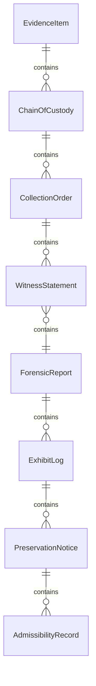
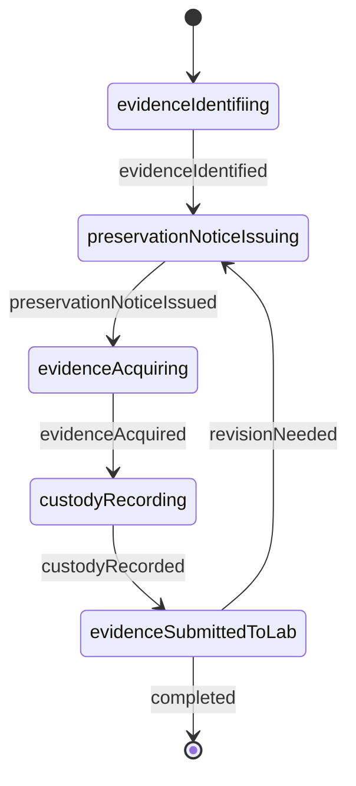
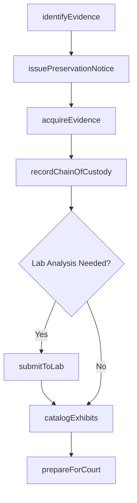
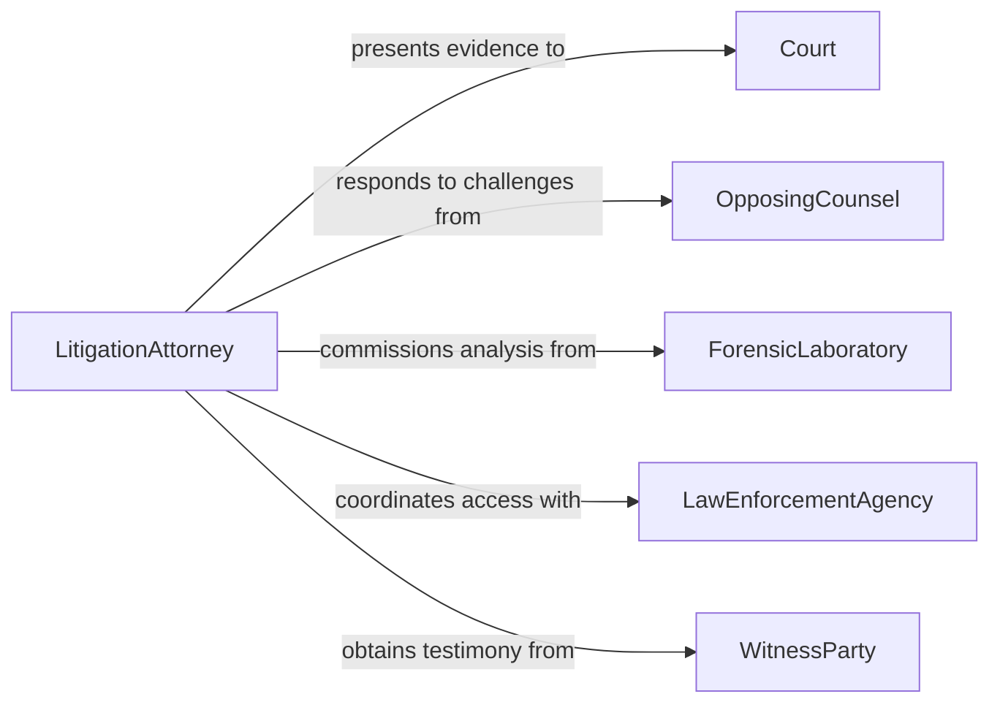

# Collect Evidence for Legal Proceedings

> Business-as-Code definition for collecting evidence for legal proceedings. Models the workflow from evidence identification through acquisition, chain-of-custody management, and courtroom preparation.

## Overview

Collecting evidence for legal proceedings involves identifying, acquiring, preserving, and documenting physical exhibits, digital records, witness statements, and forensic samples that may be presented in court or administrative hearings. Maintaining an unbroken chain of custody and ensuring admissibility under applicable rules of evidence are central to this process. This definition exposes actions for evidence collection, events for custody tracking, and searches for retrieving case evidence.

## Actors

| Actor | Description |
|-------|-------------|
| Court | Adjudicates the matter and sets rules for evidence admissibility |
| OpposingCounsel | Challenges the authenticity or relevance of collected evidence |
| ForensicLaboratory | Analyzes physical or digital evidence for expert findings |
| LawEnforcementAgency | Provides investigative support and evidence access |
| WitnessParty | Offers testimony or documentary evidence relevant to the case |
| RecordsCustodian | Maintains official records that may serve as evidence |

## Roles

| Role | Description |
|------|-------------|
| LitigationAttorney | Directs the evidence collection strategy for the case |
| Paralegal | Gathers, organizes, and catalogs collected evidence |
| ForensicExaminer | Collects and preserves physical or digital evidence |
| EvidenceCustodian | Maintains chain-of-custody records and secure storage |

## Entities

| Entity | Description |
|--------|-------------|
| EvidenceItem | A physical, digital, or documentary exhibit collected for the case |
| ChainOfCustody | A chronological record of who handled an evidence item |
| CollectionOrder | A legal directive authorizing evidence acquisition |
| WitnessStatement | A sworn or recorded account from a person with relevant knowledge |
| ForensicReport | An expert analysis of collected evidence |
| ExhibitLog | A master index of all evidence items associated with a case |
| PreservationNotice | A directive requiring parties to retain relevant materials |
| AdmissibilityRecord | Documentation supporting the legal admissibility of evidence |

## Actions

| Action | Description |
|--------|-------------|
| identifyEvidence | Determine what materials are relevant and potentially admissible |
| issuePreservationNotice | Direct parties to retain materials that may constitute evidence |
| acquireEvidence | Obtain physical, digital, or documentary exhibits |
| recordChainOfCustody | Log each transfer or access event for an evidence item |
| submitToLab | Send evidence to a forensic laboratory for expert analysis |
| catalogExhibits | Index all collected evidence items in the case exhibit log |
| prepareForCourt | Package evidence with supporting documentation for presentation |

## Events

| Event | Description |
|-------|-------------|
| evidenceIdentified | Relevant materials have been determined for the case |
| preservationNoticeIssued | A retention directive has been sent to relevant parties |
| evidenceAcquired | A physical, digital, or documentary exhibit has been obtained |
| custodyRecorded | A chain-of-custody event has been logged for an evidence item |
| evidenceSubmittedToLab | An exhibit has been sent for forensic analysis |
| exhibitsCataloged | Evidence items have been indexed in the case exhibit log |
| evidencePreparedForCourt | Exhibits and documentation are ready for courtroom presentation |

## Searches

| Search | Description |
|--------|-------------|
| findEvidenceItems | Search evidence by case, type, custodian, or collection date |
| getCustodyHistory | Retrieve the chain-of-custody log for a specific evidence item |
| getForensicReports | Find lab analysis reports by evidence item or examiner |
| getExhibitLog | List all exhibits cataloged for a case |
| searchWitnessStatements | Locate witness statements by keyword, date, or witness name |

## Entity Relationships



## State Diagram



## Workflow



## Actor Relationships



## Usage

### Calling Actions

```typescript
import { collectEvidenceLegalProceedings } from '@headlessly/collect-evidence-legal-proceedings'

const evidence = collectEvidenceLegalProceedings()

// Identify relevant evidence for a contract dispute
const items = await evidence.identifyEvidence({
  caseId: 'civil-2026-0442',
  categories: ['contracts', 'correspondence', 'financialRecords'],
  dateRange: { from: '2024-01-01', to: '2026-06-30' }
})

// Acquire a specific documentary exhibit
const exhibit = await evidence.acquireEvidence({
  caseId: 'civil-2026-0442',
  source: 'opposing-party',
  description: 'Original signed contract dated 2024-03-15',
  method: 'subpoena'
})

// Record chain of custody
await evidence.recordChainOfCustody({
  evidenceId: exhibit.id,
  action: 'received',
  handler: 'paralegal-jones',
  location: 'firm-evidence-room',
  timestamp: new Date().toISOString()
})
```

### Event-Driven Automation

```typescript
// Notify the litigation attorney when evidence is acquired
evidence.evidenceAcquired(async ({ caseId, evidenceId, description }) => {
  await notify({
    to: 'litigation-attorney',
    message: `Evidence acquired for case ${caseId}: ${description}`
  })
})

// Auto-catalog exhibits after forensic reports are received
evidence.evidenceSubmittedToLab(async ({ evidenceId, caseId }) => {
  await evidence.catalogExhibits({ caseId, evidenceIds: [evidenceId] })
})
```
