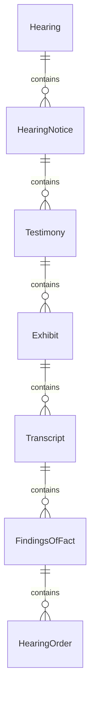
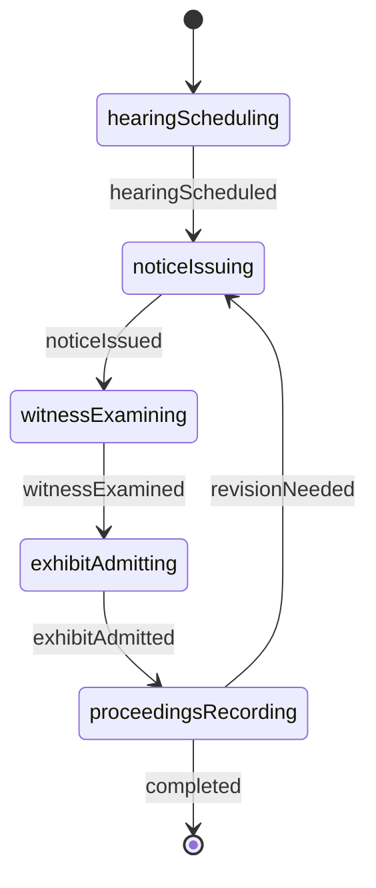
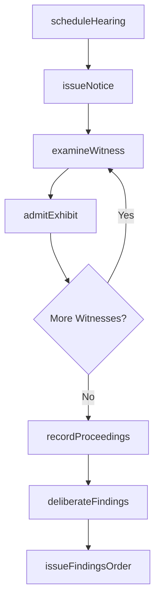
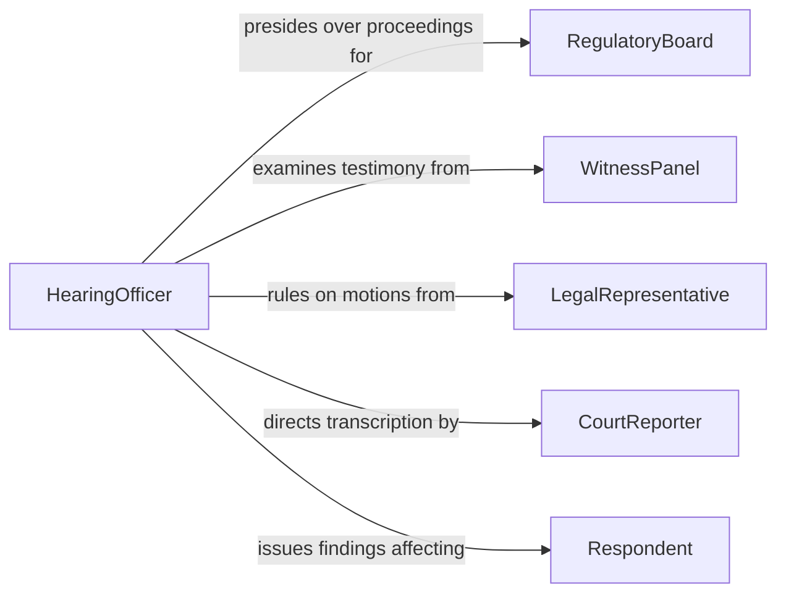

# Conduct Hearings to Investigate Legal Issues

> Business-as-Code definition for conducting hearings to investigate legal issues. Models the workflow from hearing scheduling through witness examination, evidence presentation, deliberation, and findings issuance.

## Overview

Conducting hearings to investigate legal issues involves convening formal or quasi-judicial proceedings where testimony is taken, evidence is presented, and questions of law or fact are examined. This includes administrative hearings, congressional inquiries, disciplinary proceedings, and regulatory investigations. This definition exposes actions for hearing management, events for proceeding milestones, and searches for retrieving hearing records and findings.

## Actors

| Actor | Description |
|-------|-------------|
| Respondent | The party whose conduct or situation is under investigation |
| WitnessPanel | Individuals called to provide testimony during the hearing |
| LegalRepresentative | Counsel appearing on behalf of parties in the hearing |
| CourtReporter | Records and transcribes the proceedings |
| RegulatoryBoard | The body with authority to conduct the hearing and issue findings |
| PublicObserver | Members of the public attending open hearings |

## Roles

| Role | Description |
|------|-------------|
| HearingOfficer | Presides over the hearing and rules on procedural matters |
| InvestigatingCounsel | Presents evidence and examines witnesses on behalf of the investigating body |
| HearingClerk | Manages scheduling, exhibits, and administrative functions |
| Panelist | A member of a multi-person hearing body who deliberates on findings |

## Entities

| Entity | Description |
|--------|-------------|
| Hearing | A formal proceeding convened to investigate a legal issue |
| HearingNotice | A document scheduling the hearing and informing parties |
| Testimony | A sworn statement given by a witness during the hearing |
| Exhibit | A document or object presented as evidence during the hearing |
| Transcript | A verbatim record of the hearing proceedings |
| FindingsOfFact | Determinations made by the hearing body based on evidence |
| HearingOrder | A directive issued by the presiding officer during or after the hearing |

## Actions

| Action | Description |
|--------|-------------|
| scheduleHearing | Set the date, time, and location for the hearing |
| issueNotice | Send formal notification to parties and witnesses |
| examineWitness | Question a witness under oath during the hearing |
| admitExhibit | Accept a document or object into the hearing record |
| recordProceedings | Capture a verbatim transcript of the hearing |
| deliberateFindings | Review evidence and testimony to reach conclusions |
| issueFindingsOrder | Publish the hearing body's findings and any resulting orders |

## Events

| Event | Description |
|-------|-------------|
| hearingScheduled | The hearing date and location have been set |
| noticeIssued | Formal notification has been sent to all parties |
| witnessExamined | A witness has provided testimony under oath |
| exhibitAdmitted | A document or object has been accepted into the record |
| proceedingsRecorded | A transcript of the hearing has been captured |
| findingsDeliberated | Evidence and testimony have been reviewed for conclusions |
| findingsOrderIssued | The hearing body's findings and orders have been published |

## Searches

| Search | Description |
|--------|-------------|
| findHearings | Search hearings by case, date, or presiding officer |
| getTestimony | Retrieve witness testimony by hearing, witness, or topic |
| getExhibits | List exhibits admitted during a hearing |
| getTranscripts | Find hearing transcripts by date or case number |
| getFindingsOrders | Locate findings and orders by hearing or subject matter |

## Entity Relationships



## State Diagram



## Workflow



## Actor Relationships



## Usage

### Calling Actions

```typescript
import { conductHearingsInvestigateLegalIssues } from '@headlessly/conduct-hearings-investigate-legal-issues'

const hearings = conductHearingsInvestigateLegalIssues()

// Schedule a regulatory hearing
const hearing = await hearings.scheduleHearing({
  caseId: 'enforcement-2026-0074',
  subject: 'Alleged violations of environmental discharge limits',
  date: '2026-04-15',
  location: 'Administrative Hearing Room B',
  presidingOfficer: 'judge-martinez'
})

// Issue notice to all parties
await hearings.issueNotice({
  hearingId: hearing.id,
  recipients: ['respondent-corp', 'investigating-counsel', 'witness-panel'],
  deadline: '2026-03-25'
})

// Examine a witness during the hearing
await hearings.examineWitness({
  hearingId: hearing.id,
  witness: 'plant-manager-davis',
  topics: ['dischargeMonitoring', 'complianceRecords', 'incidentTimeline']
})
```

### Event-Driven Automation

```typescript
// Notify all parties when findings are issued
hearings.findingsOrderIssued(async ({ hearingId, caseId, findings }) => {
  await notify({
    to: 'all-parties',
    message: `Findings and order issued for case ${caseId}`
  })
})

// Auto-record proceedings when witness examination begins
hearings.witnessExamined(async ({ hearingId, witness }) => {
  await hearings.recordProceedings({ hearingId, segment: witness })
})
```
