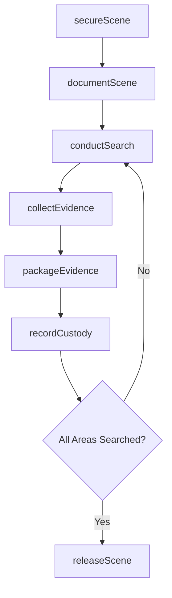
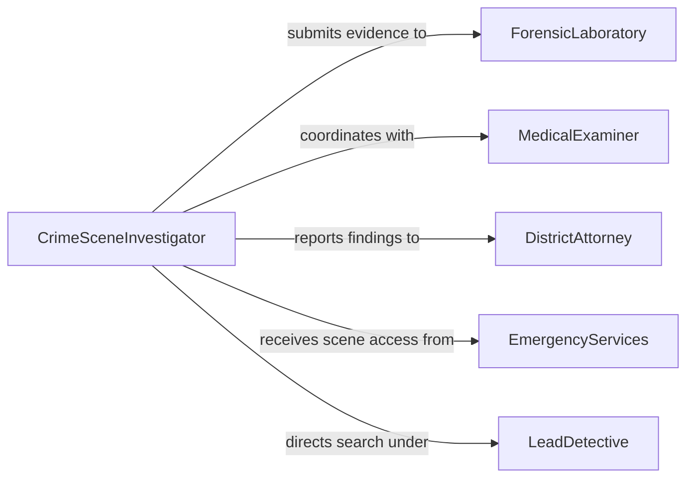

# Examine Crime Scenes to Obtain Evidence

> Business-as-Code definition for examining crime scenes to obtain evidence. Models the workflow from scene securing through systematic search, evidence collection, forensic documentation, and scene release.

## Overview

Examining crime scenes to obtain evidence involves securing the location, conducting a systematic search pattern, identifying and collecting physical evidence such as fingerprints, biological samples, trace materials, and ballistic fragments, and documenting the scene through photography, sketches, and measurements. Proper scene examination preserves the integrity of evidence for laboratory analysis and courtroom presentation. This definition exposes actions for scene examination procedures, events for evidence discovery tracking, and searches for retrieving scene and evidence data.

## Actors

| Actor | Description |
|-------|-------------|
| DistrictAttorney | Prosecutes cases using evidence obtained from crime scenes |
| ForensicLaboratory | Processes and analyzes collected physical evidence |
| MedicalExaminer | Determines cause and manner of death at scenes involving fatalities |
| DefenseAttorney | Challenges the methods and findings of scene examinations |
| EmergencyServices | First responders who initially secure the scene |
| PropertyOwner | Grants or is compelled to provide access to the scene location |

## Roles

| Role | Description |
|------|-------------|
| CrimeSceneInvestigator | Leads the physical examination and evidence collection at the scene |
| EvidenceTechnician | Collects, packages, and labels physical evidence items |
| ForensicPhotographer | Documents the scene through photography and videography |
| LeadDetective | Directs the investigative priorities at the scene |

## Entities

| Entity | Description |
|--------|-------------|
| CrimeScene | A geographic location where a crime is believed to have occurred |
| EvidenceItem | A physical object or sample collected from the scene |
| ScenePhotograph | A documented image of the scene or evidence in situ |
| SceneSketch | A measured diagram showing the layout and evidence locations |
| ChainOfCustody | A log tracking each handler of a collected evidence item |
| SearchPattern | A systematic method for traversing the scene such as grid or spiral |
| LatentPrint | A fingerprint or palm print recovered from a surface |
| BiologicalSample | A DNA-bearing specimen such as blood, saliva, or hair |

## Actions

| Action | Description |
|--------|-------------|
| secureScene | Establish a perimeter and restrict access to the crime scene |
| documentScene | Photograph, sketch, and measure the scene before evidence collection |
| conductSearch | Systematically traverse the scene using a defined search pattern |
| collectEvidence | Recover physical items, prints, and samples from the scene |
| packageEvidence | Seal and label collected items for transport and storage |
| recordCustody | Log each transfer of evidence from scene to storage or lab |
| releaseScene | Formally return the location to its owner after examination is complete |

## Events

| Event | Description |
|-------|-------------|
| sceneSecured | The crime scene perimeter has been established |
| sceneDocumented | Photography, sketches, and measurements have been completed |
| searchConducted | A systematic search of the scene has been performed |
| evidenceCollected | Physical items, prints, or samples have been recovered |
| evidencePackaged | Collected items have been sealed and labeled |
| custodyRecorded | An evidence transfer event has been logged |
| sceneReleased | The location has been returned to its owner |

## Searches

| Search | Description |
|--------|-------------|
| findCrimeScenes | Search scenes by case number, date, or location |
| getEvidenceItems | List evidence collected from a specific scene |
| getScenePhotographs | Retrieve photographs by scene, area, or evidence marker |
| getCustodyLogs | Find chain-of-custody entries by evidence item or handler |
| searchLatentPrints | Locate recovered prints by scene, surface type, or match status |

## Workflow



## Actor Relationships



## Usage

### Calling Actions

```typescript
import { examineCrimeScenesObtainEvidence } from '@headlessly/examine-crime-scenes-obtain-evidence'

const scene = examineCrimeScenesObtainEvidence()

// Secure the crime scene
const secured = await scene.secureScene({
  caseId: 'homicide-2026-0118',
  location: { address: '1420 Elm Street', coordinates: { lat: 34.0522, lng: -118.2437 } },
  perimeterRadius: 50
})

// Document the scene
await scene.documentScene({
  sceneId: secured.id,
  methods: ['photography', 'sketch', 'measurement'],
  photographer: 'tech-ramirez'
})

// Collect evidence from a specific area
const evidence = await scene.collectEvidence({
  sceneId: secured.id,
  area: 'living-room',
  items: [
    { type: 'latentPrint', location: 'doorknob', marker: 'A-1' },
    { type: 'biologicalSample', location: 'carpet-stain', marker: 'B-1' }
  ]
})
```

### Event-Driven Automation

```typescript
// Notify the forensic lab when evidence is packaged
scene.evidencePackaged(async ({ caseId, evidenceId, type }) => {
  await notify({
    to: 'forensic-lab',
    message: `${type} evidence ready for transport from case ${caseId}`
  })
})

// Alert the lead detective when scene documentation is complete
scene.sceneDocumented(async ({ sceneId, caseId }) => {
  await notify({
    to: 'lead-detective',
    message: `Scene documentation complete for case ${caseId}`
  })
})
```
