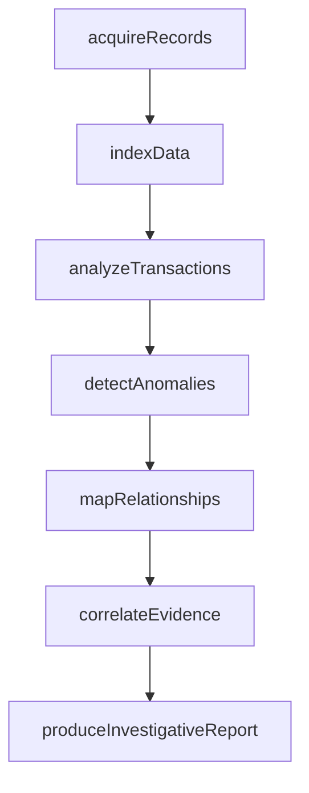
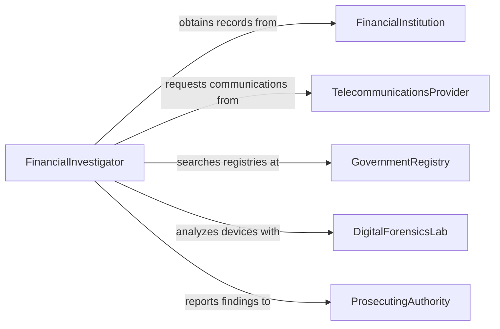

# Examine Records or Data to Investigate Criminal Activities

> Business-as-Code definition for examining records or data to investigate criminal activities. Models the workflow from data acquisition through pattern analysis, anomaly detection, and investigative findings production.

## Overview

Examining records or other types of data to investigate criminal activities involves acquiring and analyzing financial ledgers, transactional databases, communication logs, public records, and digital artifacts to identify patterns of criminal behavior such as fraud, money laundering, identity theft, or organized crime. This definition exposes actions for data-driven investigation, events for discovery milestones, and searches for retrieving analyzed records and findings.

## Actors

| Actor | Description |
|-------|-------------|
| ProsecutingAuthority | Directs the investigation and files charges based on findings |
| FinancialInstitution | Provides transaction records and suspicious activity reports |
| TelecommunicationsProvider | Supplies call detail records and communication metadata |
| GovernmentRegistry | Maintains public records such as property, corporate, and vehicle data |
| DigitalForensicsLab | Recovers and analyzes data from electronic devices |
| InternationalLawEnforcement | Coordinates cross-border record requests and intelligence sharing |

## Roles

| Role | Description |
|------|-------------|
| FinancialInvestigator | Analyzes financial records to trace illicit funds and transactions |
| IntelligenceAnalyst | Identifies patterns and connections across disparate data sources |
| DigitalForensicExaminer | Extracts and analyzes data from computers, phones, and servers |
| CaseAgent | Manages the overall investigation and coordinates team efforts |

## Entities

| Entity | Description |
|--------|-------------|
| FinancialRecord | A bank statement, ledger entry, or transactional record |
| CommunicationLog | A record of phone calls, messages, or email metadata |
| PublicRecord | A government-maintained document such as a deed or registration |
| DigitalArtifact | Data recovered from an electronic device or online platform |
| SuspiciousActivityReport | A filing by a financial institution flagging unusual transactions |
| LinkChart | A visual map of relationships between persons, accounts, and entities |
| InvestigativeReport | A document summarizing findings and evidence from the analysis |

## Actions

| Action | Description |
|--------|-------------|
| acquireRecords | Obtain financial, communication, or public records via legal process |
| indexData | Organize and catalog acquired records for systematic analysis |
| analyzeTransactions | Examine financial flows for patterns of fraud or laundering |
| mapRelationships | Build link charts connecting persons, accounts, and organizations |
| detectAnomalies | Identify unusual patterns or outliers in the data |
| correlateEvidence | Cross-reference findings across multiple data sources |
| produceInvestigativeReport | Document conclusions, evidence chains, and recommendations |

## Events

| Event | Description |
|-------|-------------|
| recordsAcquired | Financial, communication, or public records have been obtained |
| dataIndexed | Acquired records have been organized for analysis |
| transactionsAnalyzed | Financial flows have been examined for criminal patterns |
| relationshipsMapped | Connections between subjects have been charted |
| anomaliesDetected | Unusual patterns or outliers have been identified |
| evidenceCorrelated | Findings from multiple sources have been cross-referenced |
| investigativeReportProduced | Analysis conclusions have been formally documented |

## Searches

| Search | Description |
|--------|-------------|
| findRecords | Search acquired records by case, account, or date range |
| getTransactionAnalyses | Retrieve financial analyses by case, subject, or pattern type |
| getLinkCharts | Find relationship maps by case or subject entity |
| getAnomalies | List detected anomalies by severity, data source, or case |
| getInvestigativeReports | Locate completed reports by case or investigator |

## Workflow



## Actor Relationships



## Usage

### Calling Actions

```typescript
import { examineRecordsTypesDataInvestigate } from '@headlessly/examine-records-types-data-investigate'

const investigation = examineRecordsTypesDataInvestigate()

// Acquire bank records for a fraud case
const records = await investigation.acquireRecords({
  caseId: 'fraud-2026-0331',
  source: 'first-national-bank',
  recordType: 'bankStatements',
  accounts: ['acct-9921', 'acct-9922'],
  period: { from: '2024-06-01', to: '2026-01-31' }
})

// Analyze transactions for laundering patterns
const analysis = await investigation.analyzeTransactions({
  caseId: 'fraud-2026-0331',
  recordIds: records.map(r => r.id),
  patterns: ['structuring', 'layering', 'roundTripping']
})

// Map relationships between accounts and entities
await investigation.mapRelationships({
  caseId: 'fraud-2026-0331',
  entities: analysis.subjects,
  connections: ['sharedAddresses', 'commonBeneficiaries', 'coSigners']
})
```

### Event-Driven Automation

```typescript
// Alert the case agent when anomalies are detected
investigation.anomaliesDetected(async ({ caseId, anomalies }) => {
  await notify({
    to: 'case-agent',
    message: `${anomalies.length} anomalies detected in case ${caseId}`
  })
})

// Auto-produce report when evidence is correlated
investigation.evidenceCorrelated(async ({ caseId }) => {
  await investigation.produceInvestigativeReport({ caseId })
})
```
