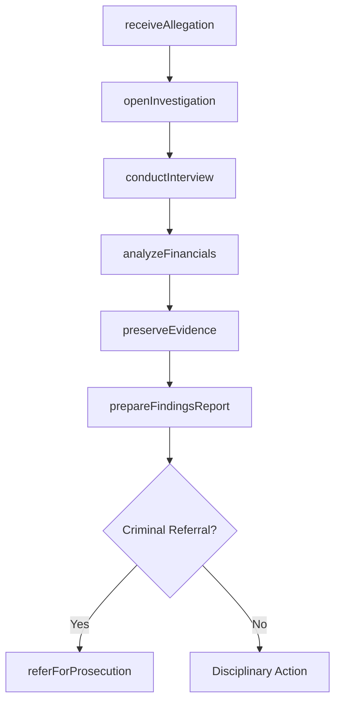
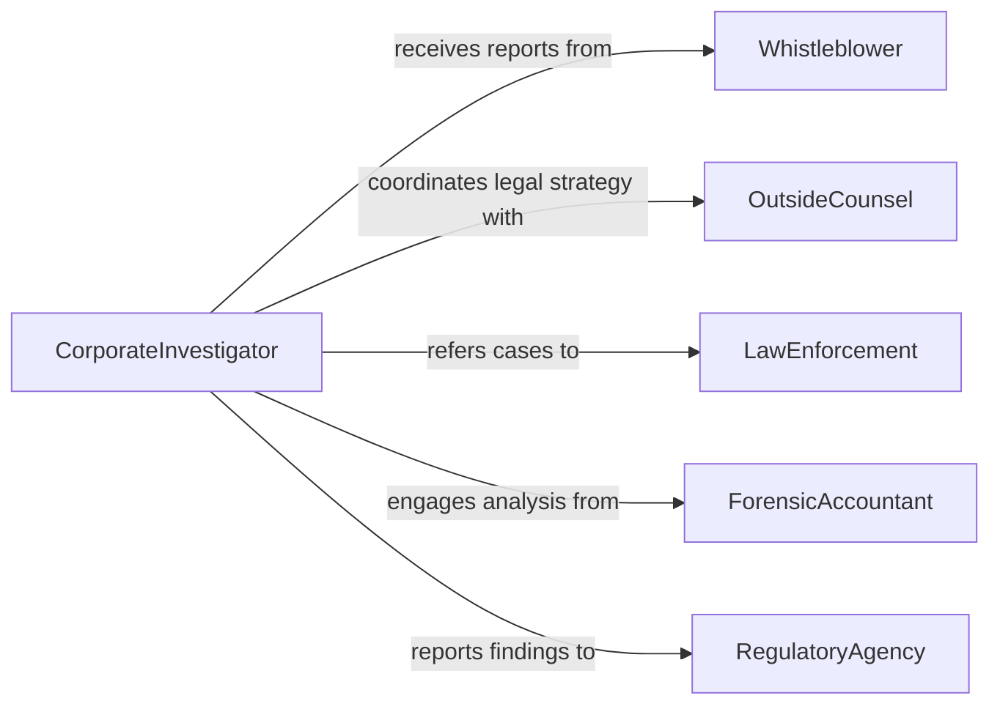

# Investigate Crimes Committed Within Organizations

> Business-as-Code definition for investigating crimes committed within organizations. Models the workflow from allegation intake through internal inquiry, evidence gathering, findings determination, and referral for prosecution or disciplinary action.

## Overview

Investigating crimes committed within organizations involves receiving and evaluating allegations of fraud, embezzlement, theft, corruption, or other criminal conduct by employees, officers, or contractors. The process includes conducting interviews, analyzing financial records and electronic communications, preserving evidence, and producing findings reports for management, legal counsel, or law enforcement. This definition exposes actions for internal investigation management, events for case progression, and searches for retrieving investigation data.

## Actors

| Actor | Description |
|-------|-------------|
| Whistleblower | Reports suspected criminal activity through internal channels |
| OutsideCounsel | Provides legal guidance on investigation scope and privilege |
| LawEnforcement | Receives referrals for criminal prosecution |
| ForensicAccountant | Analyzes financial records to detect fraud or misappropriation |
| RegulatoryAgency | Oversees compliance and may mandate investigation procedures |
| InsuranceBondingCompany | Processes fidelity claims related to employee dishonesty |

## Roles

| Role | Description |
|------|-------------|
| CorporateInvestigator | Leads the internal investigation and coordinates evidence gathering |
| ComplianceOfficer | Ensures the investigation follows legal and regulatory requirements |
| HRDirector | Manages employee-related aspects of the investigation |
| InternalAuditor | Examines financial controls and identifies irregularities |

## Entities

| Entity | Description |
|--------|-------------|
| Allegation | A reported claim of criminal activity within the organization |
| InvestigationCase | A formal inquiry initiated in response to an allegation |
| InterviewRecord | A documented account of a conversation with a witness or subject |
| FinancialAnalysis | An examination of transactions, ledgers, or accounts for irregularities |
| EvidencePackage | Collected documents, records, and artifacts supporting findings |
| FindingsReport | A summary of investigation conclusions and recommended actions |
| ReferralRecord | Documentation sent to law enforcement or regulatory bodies |

## Actions

| Action | Description |
|--------|-------------|
| receiveAllegation | Intake and log a report of suspected criminal activity |
| openInvestigation | Formally initiate a case and define the investigation scope |
| conductInterview | Interview witnesses, subjects, or complainants under protocol |
| analyzeFinancials | Examine financial records for evidence of fraud or theft |
| preserveEvidence | Secure documents, electronic data, and physical exhibits |
| prepareFindingsReport | Document conclusions, supporting evidence, and recommendations |
| referForProsecution | Submit the case to law enforcement or regulatory authorities |

## Events

| Event | Description |
|-------|-------------|
| allegationReceived | A report of suspected criminal activity has been logged |
| investigationOpened | A formal investigation case has been initiated |
| interviewConducted | A witness or subject interview has been completed |
| financialsAnalyzed | Financial records have been examined for irregularities |
| evidencePreserved | Documents and data have been secured for the case |
| findingsReportPrepared | Investigation conclusions have been documented |
| referredForProsecution | The case has been submitted to external authorities |

## Searches

| Search | Description |
|--------|-------------|
| findAllegations | Search allegations by reporter, date, or severity |
| getInvestigationCases | List cases by status, subject, or investigator |
| getInterviewRecords | Retrieve interviews by case, witness, or date |
| getFinancialAnalyses | Find financial examination results by case or account |
| getFindingsReports | Locate completed findings reports by case or outcome |

## Workflow



## Actor Relationships



## Usage

### Calling Actions

```typescript
import { investigateCrimesCommittedWithinOrganizations } from '@headlessly/investigate-crimes-committed-within-organizations'

const investigations = investigateCrimesCommittedWithinOrganizations()

// Receive an allegation of embezzlement
const allegation = await investigations.receiveAllegation({
  reporter: 'anonymous-hotline',
  category: 'embezzlement',
  description: 'Suspected misappropriation of vendor rebate funds',
  department: 'procurement'
})

// Open a formal investigation
const case_ = await investigations.openInvestigation({
  allegationId: allegation.id,
  scope: ['vendorPayments', 'rebateAccounting', 'expenseReports'],
  assignedTo: 'investigator-chen'
})

// Analyze financial records
await investigations.analyzeFinancials({
  caseId: case_.id,
  accounts: ['vendor-rebates', 'petty-cash', 'travel-expenses'],
  period: { from: '2024-01-01', to: '2026-01-31' }
})
```

### Event-Driven Automation

```typescript
// Notify compliance officer when an investigation is opened
investigations.investigationOpened(async ({ caseId, category, department }) => {
  await notify({
    to: 'compliance-officer',
    message: `Investigation opened: ${category} in ${department}`
  })
})

// Alert outside counsel when findings are prepared
investigations.findingsReportPrepared(async ({ caseId, outcome }) => {
  if (outcome === 'substantiated') {
    await notify({
      to: 'outside-counsel',
      message: `Substantiated findings for case ${caseId} - legal review needed`
    })
  }
})
```
