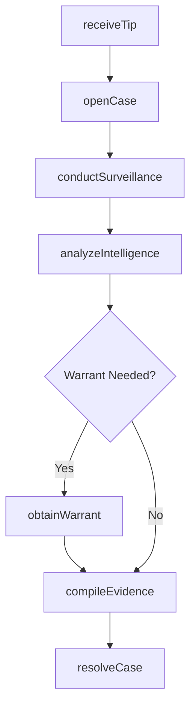
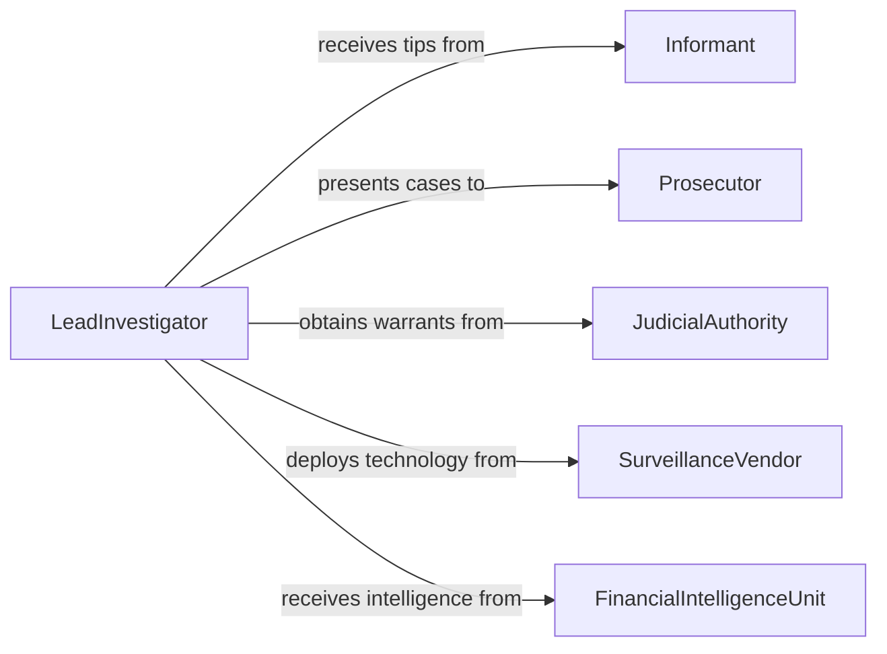

# Investigate Illegal or Suspicious Activities

> Business-as-Code definition for investigating illegal or suspicious activities. Models the workflow from tip intake through surveillance, intelligence analysis, evidence compilation, and case resolution.

## Overview

Investigating illegal or suspicious activities involves receiving tips and alerts, conducting surveillance, analyzing intelligence from multiple sources, interviewing witnesses and informants, compiling evidence, and building cases for prosecution, regulatory action, or organizational discipline. This applies to law enforcement investigations, corporate security inquiries, and regulatory enforcement actions. This definition exposes actions for investigation management, events for case progression, and searches for retrieving investigative data.

## Actors

| Actor | Description |
|-------|-------------|
| Informant | Provides tips or intelligence about suspicious activities |
| Prosecutor | Evaluates the case for filing charges |
| JudicialAuthority | Issues warrants, subpoenas, and court orders |
| SurveillanceVendor | Provides monitoring technology and services |
| FinancialIntelligenceUnit | Shares suspicious transaction reports and analysis |
| VictimParty | Reports harm resulting from the illegal activity |

## Roles

| Role | Description |
|------|-------------|
| LeadInvestigator | Directs the investigation and coordinates the team |
| SurveillanceOfficer | Conducts physical or electronic monitoring of subjects |
| IntelligenceAnalyst | Synthesizes data from multiple sources to identify patterns |
| CaseManager | Tracks all investigative activities, evidence, and timelines |

## Entities

| Entity | Description |
|--------|-------------|
| Tip | An initial report or alert indicating suspicious activity |
| InvestigationCase | A formal inquiry into reported illegal or suspicious conduct |
| SurveillanceRecord | Logs of physical or electronic monitoring activities |
| IntelligenceReport | An analytical product synthesizing findings from multiple sources |
| Warrant | A court-issued authorization for search, seizure, or arrest |
| EvidenceFile | A collection of exhibits and documentation supporting the case |
| CaseDisposition | The final outcome of the investigation such as prosecution or closure |

## Actions

| Action | Description |
|--------|-------------|
| receiveTip | Intake and evaluate an initial report of suspicious activity |
| openCase | Formally initiate an investigation and assign resources |
| conductSurveillance | Monitor subjects through physical or electronic means |
| analyzeIntelligence | Synthesize data from tips, records, and surveillance |
| obtainWarrant | Request judicial authorization for search or arrest |
| compileEvidence | Assemble all evidence into a case file |
| resolveCase | Determine the final disposition through prosecution, referral, or closure |

## Events

| Event | Description |
|-------|-------------|
| tipReceived | An initial report of suspicious activity has been logged |
| caseOpened | A formal investigation has been initiated |
| surveillanceConducted | Monitoring of a subject has been carried out |
| intelligenceAnalyzed | Data from multiple sources has been synthesized |
| warrantObtained | Judicial authorization has been secured |
| evidenceCompiled | All case evidence has been assembled |
| caseResolved | The investigation has reached a final disposition |

## Searches

| Search | Description |
|--------|-------------|
| findTips | Search tips by source, date, or activity type |
| getCases | List investigation cases by status, subject, or investigator |
| getSurveillanceRecords | Retrieve monitoring logs by case or subject |
| getIntelligenceReports | Find analytical products by case, subject, or date |
| getCaseDispositions | Locate case outcomes by type or date range |

## Workflow



## Actor Relationships



## Usage

### Calling Actions

```typescript
import { investigateIllegalSuspiciousActivities } from '@headlessly/investigate-illegal-suspicious-activities'

const investigations = investigateIllegalSuspiciousActivities()

// Receive a tip about suspicious activity
const tip = await investigations.receiveTip({
  source: 'confidential-informant',
  activityType: 'narcotics-distribution',
  location: 'warehouse-district',
  description: 'Frequent late-night deliveries to abandoned warehouse'
})

// Open an investigation case
const case_ = await investigations.openCase({
  tipId: tip.id,
  category: 'narcotics',
  assignedTeam: ['detective-garcia', 'analyst-nguyen'],
  priority: 'high'
})

// Conduct surveillance and analyze intelligence
await investigations.conductSurveillance({
  caseId: case_.id,
  subject: 'warehouse-target',
  methods: ['physical', 'vehicleTracking'],
  duration: '14d'
})
```

### Event-Driven Automation

```typescript
// Alert the prosecutor when evidence is compiled
investigations.evidenceCompiled(async ({ caseId, evidenceCount }) => {
  await notify({
    to: 'prosecutor',
    message: `Case ${caseId} evidence package ready: ${evidenceCount} items`
  })
})

// Notify team when intelligence analysis is complete
investigations.intelligenceAnalyzed(async ({ caseId, findings }) => {
  await notify({
    to: 'investigation-team',
    message: `Intelligence analysis complete for case ${caseId}: ${findings.summary}`
  })
})
```
