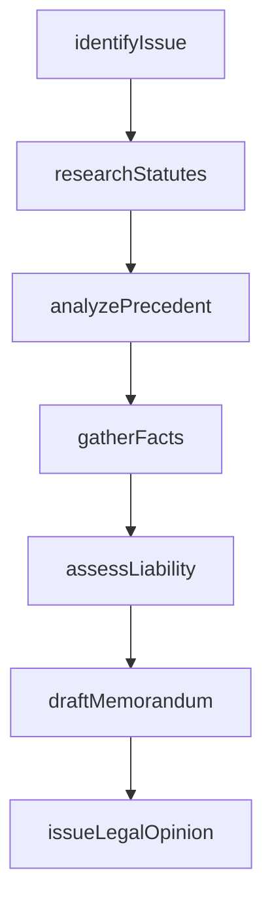
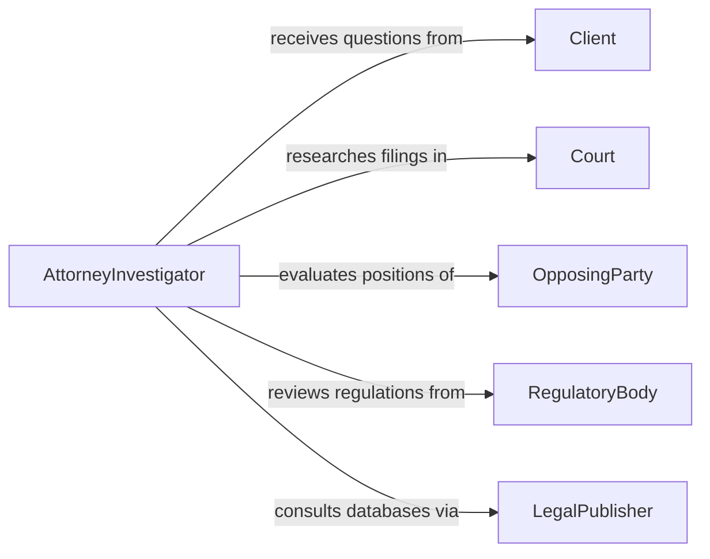

# Investigate Legal Issues

> Business-as-Code definition for investigating legal issues. Models the workflow from issue identification through legal research, fact gathering, analysis, and opinion formulation.

## Overview

Investigating legal issues involves identifying questions of law or fact that arise in the course of business operations, litigation, or regulatory compliance, and conducting systematic research and fact-gathering to develop informed legal positions. This includes reviewing statutes, case law, regulations, contracts, and factual records to assess liability, rights, obligations, and available remedies. This definition exposes actions for legal investigation, events for research milestones, and searches for retrieving legal research data.

## Actors

| Actor | Description |
|-------|-------------|
| Client | Raises legal questions and provides factual background |
| Court | Interprets and applies the law in disputed matters |
| OpposingParty | Holds a contrary legal position in the matter |
| RegulatoryBody | Administers the regulations at issue |
| ExpertWitness | Provides specialized knowledge relevant to the legal question |
| LegalPublisher | Maintains databases of case law, statutes, and regulations |

## Roles

| Role | Description |
|------|-------------|
| AttorneyInvestigator | Leads the legal research and fact-gathering process |
| LegalResearcher | Conducts statutory and case law research |
| Paralegal | Gathers factual records and organizes case files |
| SeniorCounsel | Reviews findings and formulates the legal opinion |

## Entities

| Entity | Description |
|--------|-------------|
| LegalIssue | A specific question of law or fact requiring investigation |
| Statute | A legislative enactment relevant to the legal issue |
| CasePrecedent | A prior court decision bearing on the legal question |
| Regulation | An administrative rule published by a regulatory body |
| FactualRecord | A document or testimony providing facts relevant to the issue |
| LegalMemorandum | A written analysis of the legal issue and conclusions |
| LegalOpinion | A formal statement of the attorney's position on the issue |

## Actions

| Action | Description |
|--------|-------------|
| identifyIssue | Define the legal question and its scope |
| researchStatutes | Search applicable statutes and legislative history |
| analyzePrecedent | Review case law for relevant rulings and reasoning |
| gatherFacts | Collect documents, records, and witness accounts |
| assessLiability | Evaluate exposure, rights, and obligations under the law |
| draftMemorandum | Produce a written analysis of the legal issue |
| issueLegalOpinion | Formalize the attorney's conclusions and recommendations |

## Events

| Event | Description |
|-------|-------------|
| issueIdentified | A legal question has been defined and scoped |
| statutesResearched | Applicable statutes and legislative history have been reviewed |
| precedentAnalyzed | Relevant case law has been examined |
| factsGathered | Documents and testimony have been collected |
| liabilityAssessed | Legal exposure and obligations have been evaluated |
| memorandumDrafted | A written legal analysis has been produced |
| legalOpinionIssued | The attorney's formal position has been communicated |

## Searches

| Search | Description |
|--------|-------------|
| findLegalIssues | Search issues by matter, client, or subject area |
| getStatutes | Retrieve statutes by jurisdiction, topic, or citation |
| getCasePrecedents | Find case law by citation, keyword, or jurisdiction |
| getFactualRecords | List collected documents by matter or source |
| getMemorandums | Retrieve legal memorandums by matter or author |

## Workflow



## Actor Relationships



## Usage

### Calling Actions

```typescript
import { investigateLegalIssues } from '@headlessly/investigate-legal-issues'

const legal = investigateLegalIssues()

// Identify a legal issue arising from a contract dispute
const issue = await legal.identifyIssue({
  matterId: 'contract-dispute-2026-0088',
  question: 'Whether the force majeure clause applies to supply chain disruptions',
  jurisdiction: 'delaware'
})

// Research applicable statutes and case precedent
const statutes = await legal.researchStatutes({
  issueId: issue.id,
  topics: ['forceMajeure', 'contractPerformance', 'commercialImpracticability']
})

const precedents = await legal.analyzePrecedent({
  issueId: issue.id,
  keywords: ['force majeure', 'pandemic', 'supply chain'],
  jurisdictions: ['delaware', 'federal-3rd-circuit']
})

// Draft the legal memorandum
await legal.draftMemorandum({
  issueId: issue.id,
  sections: ['issueStatement', 'applicableLaw', 'analysis', 'conclusion']
})
```

### Event-Driven Automation

```typescript
// Notify senior counsel when the memorandum is drafted
legal.memorandumDrafted(async ({ issueId, matterId }) => {
  await notify({
    to: 'senior-counsel',
    message: `Legal memorandum ready for review on matter ${matterId}`
  })
})

// Alert client when legal opinion is issued
legal.legalOpinionIssued(async ({ matterId, conclusion }) => {
  await notify({
    to: 'client',
    message: `Legal opinion issued for matter ${matterId}`
  })
})
```
