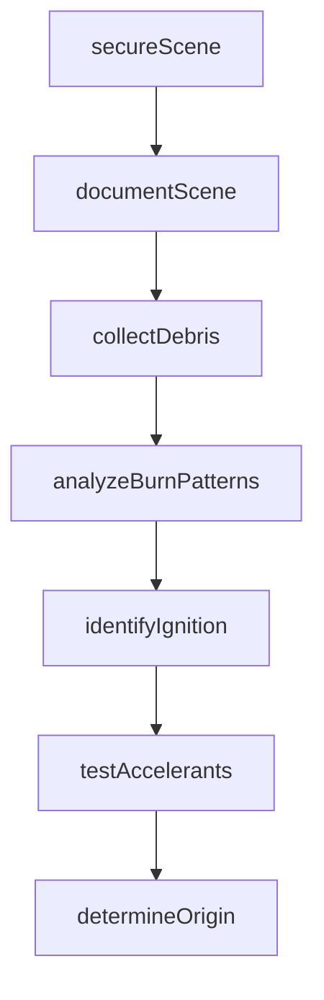
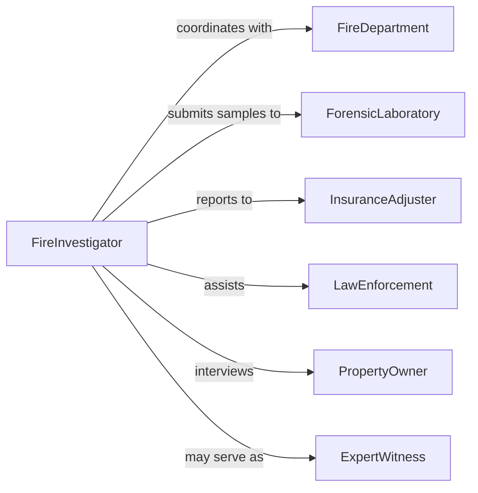

# Examine Debris Obtain Information About

> Business-as-Code definition for examining debris to obtain information about fire causes. Models fire investigation, origin and cause determination, and forensic evidence analysis.

## Overview

Examining debris to obtain information about fire causes involves systematic investigation of fire scenes, collection and analysis of physical evidence, identification of ignition sources, assessment of burn patterns, and reconstruction of fire progression. This definition supports fire investigators, forensic scientists, arson specialists, and insurance adjusters in documenting fire scenes, testing hypotheses, determining origin and cause, identifying accelerants, and producing evidence-based conclusions for legal proceedings, insurance claims, and prevention efforts.

## Actors

| Actor | Description |
|-------|-------------|
| FireDepartment | First responders providing initial scene observations and reports |
| ForensicLaboratory | Scientific facility performing debris analysis and testing |
| InsuranceAdjuster | Claims professional investigating fire losses |
| LawEnforcement | Police agency investigating suspected arson |
| PropertyOwner | Individual or entity owning affected structure |
| ExpertWitness | Specialist providing testimony on fire cause and origin |

## Roles

| Role | Description |
|------|-------------|
| FireInvestigator | Certified professional conducting origin and cause investigation |
| ForensicSpecialist | Scientist performing laboratory analysis of fire debris |
| SceneDocumenter | Technician photographing and mapping fire scenes |
| EvidenceCustodian | Officer maintaining chain of custody for collected samples |

## Entities

| Entity | Description |
|--------|-------------|
| FireScene | Physical location where fire occurred requiring investigation |
| DebrisSample | Physical material collected from scene for analysis |
| BurnPattern | Observable indicator of fire behavior and direction |
| IgnitionSource | Identified origin point or cause of fire initiation |
| AccelerantAnalysis | Laboratory test results for flammable liquid detection |
| InvestigationReport | Comprehensive documentation of findings and conclusions |

## Actions

| Action | Description |
|--------|-------------|
| secureScene | Establish and maintain fire scene integrity |
| documentScene | Photograph, measure, and map fire-affected area |
| collectDebris | Gather physical samples for laboratory analysis |
| analyzeBurnPatterns | Examine indicators of fire origin and progression |
| identifyIgnition | Determine source and cause of fire initiation |
| testAccelerants | Perform laboratory analysis for flammable liquids |
| determineOrigin | Establish point where fire began based on evidence |

## Events

| Event | Description |
|-------|-------------|
| sceneSecured | Fire scene has been protected for investigation |
| sceneDocumented | Photographs and measurements have been completed |
| debrisCollected | Physical samples have been gathered |
| patternsAnalyzed | Burn indicators have been examined |
| ignitionIdentified | Fire source has been determined |
| accelerantsTested | Laboratory analysis has been completed |
| originDetermined | Fire starting point has been established |

## Searches

| Search | Description |
|--------|-------------|
| findScenes | List fire scenes by location, date, or investigator |
| getDebris | Retrieve collected samples by scene or analysis status |
| getPatterns | Find documented burn patterns by type or significance |
| getReports | Search investigation reports by cause, origin, or classification |

## Workflow



## Actor Relationships



## Usage

### Calling Actions

```typescript
import { examineDebrisObtainInformationAbout } from '@headlessly/examine-debris-obtain-information-about'

const fireInvestigation = examineDebrisObtainInformationAbout()

// Secure fire scene upon arrival
const scene = await fireInvestigation.secureScene({
  incidentId: 'FIRE-2026-0205',
  location: '1234 Oak Street, Building 2',
  sceneType: 'commercial-structure',
  securityMeasures: ['perimeter-tape', 'posted-guard', 'entry-log']
})

// Document scene with photographs and measurements
await fireInvestigation.documentScene({
  sceneId: scene.id,
  documentation: {
    overallPhotos: 45,
    detailPhotos: 128,
    measurements: 'floor-plan-with-dimensions',
    sketch: 'hand-drawn-scene-diagram',
    video: '360-degree-walkthrough'
  }
})

// Collect debris samples from areas of interest
const samples = await fireInvestigation.collectDebris({
  sceneId: scene.id,
  samples: [
    { location: 'area-of-origin-floor', type: 'carpet-debris', quantity: '1-quart', container: 'sealed-metal-can' },
    { location: 'near-electrical-panel', type: 'wire-insulation', quantity: '6-inches', container: 'evidence-bag' },
    { location: 'storage-room-floor', type: 'charred-wood', quantity: '2-pieces', container: 'evidence-bag' }
  ],
  chainOfCustody: 'investigator-smith'
})

// Analyze burn patterns to determine fire behavior
const patterns = await fireInvestigation.analyzeBurnPatterns({
  sceneId: scene.id,
  observations: [
    { pattern: 'v-pattern', location: 'north-wall', significance: 'indicates-upward-fire-spread' },
    { pattern: 'pour-pattern', location: 'floor-near-origin', significance: 'suggests-liquid-accelerant' },
    { pattern: 'alligatoring', location: 'structural-beams', significance: 'rapid-high-temperature-fire' }
  ]
})

// Identify ignition source
const ignition = await fireInvestigation.identifyIgnition({
  sceneId: scene.id,
  hypothesis: 'electrical-failure',
  supportingEvidence: [
    'arcing-damage-on-circuit-breaker',
    'heat-damage-concentrated-at-panel',
    'witness-reported-power-surge-before-fire'
  ]
})

// Test debris for accelerants
const accelerantTest = await fireInvestigation.testAccelerants({
  sampleIds: samples.map(s => s.id),
  testMethod: 'gas-chromatography-mass-spectrometry',
  laboratoryId: 'STATE-FORENSIC-LAB'
})

// Determine origin based on all evidence
const origin = await fireInvestigation.determineOrigin({
  sceneId: scene.id,
  originLocation: 'electrical-panel-room-northeast-corner',
  cause: 'electrical-malfunction',
  classification: 'accidental',
  confidence: 'probable',
  supportingFindings: [
    'burn-patterns-converge-at-electrical-panel',
    'greatest-heat-damage-at-panel-location',
    'electrical-arcing-evidence-found',
    'no-accelerants-detected'
  ]
})
```

### Event-Driven Automation

```typescript
// Document scene immediately after securing
fireInvestigation.sceneSecured(async ({ sceneId }) => {
  await fireInvestigation.documentScene({ sceneId })
})

// Collect debris after documentation is complete
fireInvestigation.sceneDocumented(async ({ sceneId }) => {
  await fireInvestigation.collectDebris({ sceneId })
})

// Analyze patterns after debris collection
fireInvestigation.debrisCollected(async ({ sceneId }) => {
  await fireInvestigation.analyzeBurnPatterns({ sceneId })
})

// Test for accelerants when debris is collected
fireInvestigation.debrisCollected(async ({ samples }) => {
  await fireInvestigation.testAccelerants({
    sampleIds: samples.map(s => s.id)
  })
})

// Determine origin when all evidence is analyzed
fireInvestigation.accelerantsTested(async ({ sceneId }) => {
  await fireInvestigation.determineOrigin({ sceneId })
})

// Alert law enforcement if arson is suspected
fireInvestigation.originDetermined(async ({ sceneId, classification, cause }) => {
  if (classification === 'incendiary' || cause === 'arson') {
    await notify({
      to: 'law-enforcement-arson-unit',
      message: `Suspected arson identified at scene ${sceneId} - investigation assistance requested`,
      urgency: 'high'
    })
  }
})

// Generate report when origin is determined
fireInvestigation.originDetermined(async ({ sceneId, origin, cause, classification }) => {
  await generateReport({
    sceneId,
    reportType: 'fire-investigation-final',
    sections: ['scene-description', 'evidence-collected', 'analysis', 'conclusions'],
    findings: { origin, cause, classification }
  })
})
