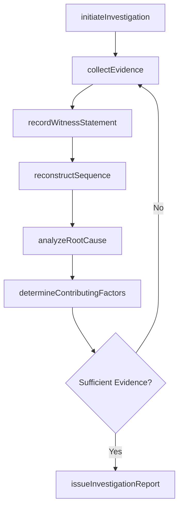
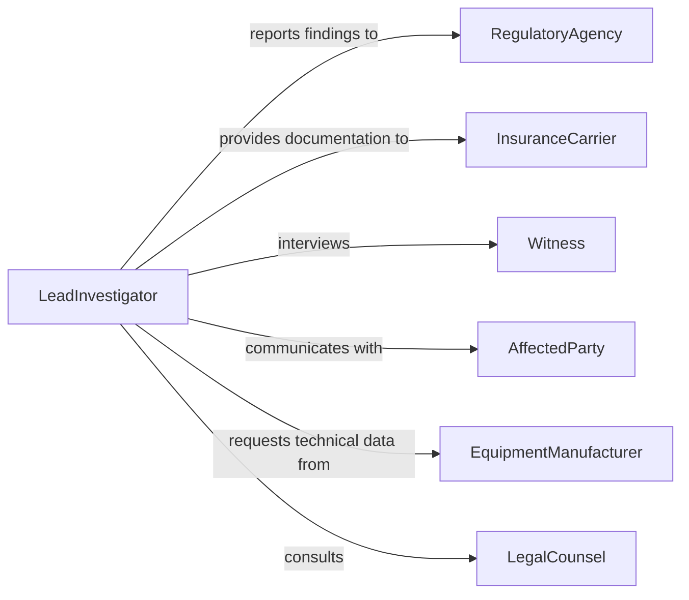

# Investigate Accidents Determine Causes

> Business-as-Code definition for accident investigation and root cause analysis. Models the end-to-end process from incident notification through evidence collection, analysis, and final determination of contributing factors.

## Overview

Accident investigation involves systematically examining incidents to identify their root causes and contributing factors. Investigators collect physical evidence, interview witnesses, review operational records, and apply analytical methodologies to reconstruct the sequence of events leading to an accident. The findings inform corrective actions, regulatory compliance reports, and organizational safety improvements.

## Actors

| Actor | Description |
|-------|-------------|
| RegulatoryAgency | Government body requiring accident reports and compliance (e.g., OSHA, NTSB) |
| InsuranceCarrier | Insurer evaluating claims and liability related to the accident |
| Witness | Individual who observed the accident or relevant conditions |
| AffectedParty | Person or entity harmed or impacted by the accident |
| EquipmentManufacturer | Maker of machinery or components involved in the incident |
| LegalCounsel | Attorney advising on liability exposure and regulatory obligations |

## Roles

| Role | Description |
|------|-------------|
| LeadInvestigator | Directs the investigation process and coordinates all team activities |
| SafetyEngineer | Analyzes technical and environmental factors contributing to the accident |
| ForensicAnalyst | Examines physical evidence and performs laboratory testing |
| ComplianceOfficer | Ensures investigation meets regulatory reporting requirements |

## Entities

| Entity | Description |
|--------|-------------|
| Incident | A recorded accident event with date, location, and severity classification |
| EvidenceItem | Physical or documentary evidence collected from the accident scene |
| WitnessStatement | Formal account from an individual who observed the event |
| RootCauseAnalysis | Structured analysis identifying primary and contributing causes |
| InvestigationReport | Final document summarizing findings, causes, and recommendations |
| CorrectiveAction | Remedial measure recommended to prevent recurrence |

## Actions

| Action | Description |
|--------|-------------|
| initiateInvestigation | Open a new investigation case upon receiving an incident report |
| collectEvidence | Gather physical evidence, photographs, and documents from the scene |
| recordWitnessStatement | Capture and document a formal witness account |
| analyzeRootCause | Apply causal analysis methods such as fault tree or fishbone diagrams |
| reconstructSequence | Build a timeline of events leading to the accident |
| determineContributingFactors | Identify human, mechanical, and environmental factors |
| issueInvestigationReport | Publish the final report with findings and corrective actions |

## Events

| Event | Description |
|-------|-------------|
| investigationInitiated | A new accident investigation case has been opened |
| evidenceCollected | Physical or documentary evidence has been secured and cataloged |
| witnessStatementRecorded | A formal witness account has been documented |
| rootCauseIdentified | The primary cause of the accident has been determined |
| sequenceReconstructed | The timeline of events has been fully assembled |
| reportIssued | The final investigation report has been published |
| correctiveActionAssigned | A recommended remedial action has been assigned for implementation |

## Searches

| Search | Description |
|--------|-------------|
| findInvestigations | List investigations by date, location, severity, or status |
| getEvidenceItems | Retrieve evidence items associated with a specific investigation |
| getContributingFactors | Query identified root causes and contributing factors by category |
| findSimilarIncidents | Locate past investigations with matching characteristics or causes |

## Workflow



## Actor Relationships



## Usage

### Calling Actions

```typescript
import { investigateAccidentsDetermineCauses } from '@headlessly/investigate-accidents-determine-causes'

const investigations = investigateAccidentsDetermineCauses()

// Open a new investigation
const investigation = await investigations.initiateInvestigation({
  incidentDate: '2026-01-15',
  location: 'Warehouse B, Dock 3',
  severity: 'serious',
  description: 'Forklift collision with racking system causing structural collapse'
})

// Collect evidence from the scene
await investigations.collectEvidence({
  investigationId: investigation.id,
  items: [
    { type: 'photograph', description: 'Damaged racking section, north wall' },
    { type: 'equipment', description: 'Forklift steering mechanism' },
    { type: 'document', description: 'Operator training certification records' }
  ]
})

// Perform root cause analysis
const analysis = await investigations.analyzeRootCause({
  investigationId: investigation.id,
  method: 'faultTree',
  factors: ['mechanical', 'human', 'environmental']
})
```

### Event-Driven Automation

```typescript
// Notify regulatory agency when investigation is opened
investigations.investigationInitiated(async ({ investigationId, severity }) => {
  if (severity === 'serious' || severity === 'fatal') {
    await notify({
      to: 'regulatory-compliance',
      message: `Serious incident investigation ${investigationId} opened - OSHA notification required within 8 hours`
    })
  }
})

// Trigger corrective action tracking when report is finalized
investigations.reportIssued(async ({ investigationId, correctiveActions }) => {
  for (const action of correctiveActions) {
    await assign({
      task: action.description,
      to: action.responsibleParty,
      deadline: action.targetDate
    })
  }
})
```
