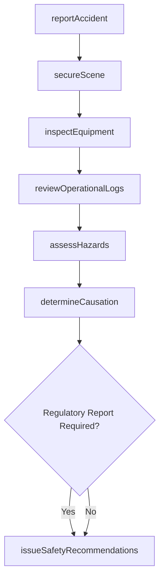
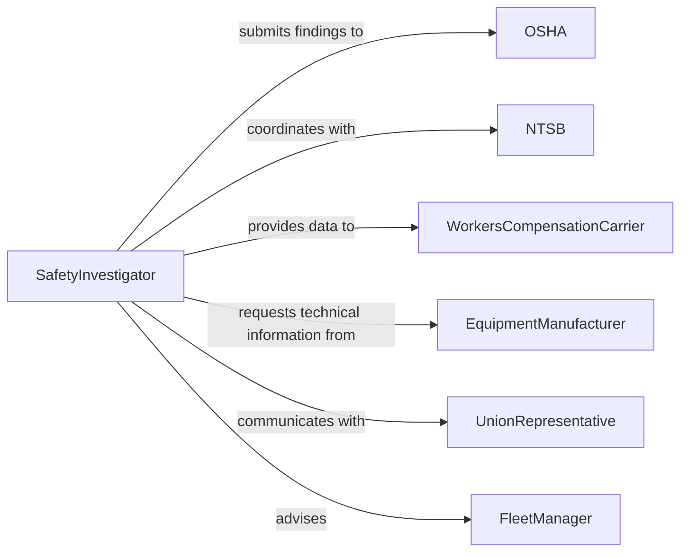

# Investigate Industrial Transportation Accidents

> Business-as-Code definition for investigating industrial and transportation accidents. Models the specialized investigation process for workplace, manufacturing, logistics, and vehicle-related incidents to determine causes and improve safety protocols.

## Overview

Investigating industrial and transportation accidents involves examining workplace injuries, equipment failures, vehicle collisions, and facility incidents within industrial and logistics operations. Investigators collect evidence from accident scenes, review operational logs and maintenance records, interview witnesses and operators, analyze environmental conditions, and determine root causes. Findings support workers' compensation claims, regulatory compliance reports, safety program improvements, and liability determinations.

## Actors

| Actor | Description |
|-------|-------------|
| OSHA | Occupational Safety and Health Administration requiring incident reporting |
| NTSB | National Transportation Safety Board investigating major transportation accidents |
| WorkersCompensationCarrier | Insurer processing employee injury claims |
| EquipmentManufacturer | Producer of machinery or vehicles involved in the accident |
| UnionRepresentative | Labor organization representing affected employees |
| FleetManager | Manages commercial vehicle operations and driver safety programs |

## Roles

| Role | Description |
|------|-------------|
| SafetyInvestigator | Leads the investigation and coordinates data collection |
| IncidentResponseCoordinator | Manages immediate post-accident actions and scene preservation |
| MaintenanceEngineer | Analyzes equipment maintenance history and mechanical failures |
| TransportationAnalyst | Examines vehicle logs, routes, and driver performance records |

## Entities

| Entity | Description |
|--------|-------------|
| AccidentReport | An initial notification of an industrial or transportation incident |
| SceneInspection | A detailed examination of the accident location and conditions |
| EquipmentLog | Maintenance and operational records for machinery or vehicles |
| OperatorRecord | Training, certification, and performance history for employees |
| HazardAssessment | An evaluation of environmental and operational risk factors |
| CausationAnalysis | A structured determination of primary and contributing causes |
| SafetyRecommendation | A proposed change to prevent similar accidents |

## Actions

| Action | Description |
|--------|-------------|
| reportAccident | File an initial notification of an industrial or transportation incident |
| secureScene | Preserve the accident site and prevent contamination of evidence |
| inspectEquipment | Examine machinery, vehicles, or infrastructure involved in the accident |
| reviewOperationalLogs | Analyze maintenance records, driver logs, and work schedules |
| assessHazards | Identify environmental, procedural, or equipment risk factors |
| determineCausation | Apply root cause analysis methods to identify failure modes |
| issueSafetyRecommendations | Propose corrective actions and protocol improvements |

## Events

| Event | Description |
|-------|-------------|
| accidentReported | An industrial or transportation incident has been filed |
| sceneSecured | The accident site has been preserved for investigation |
| equipmentInspected | Machinery or vehicles have been examined for defects |
| operationalLogsReviewed | Maintenance and operational records have been analyzed |
| hazardsAssessed | Risk factors contributing to the accident have been identified |
| causationDetermined | Root causes and failure modes have been established |
| safetyRecommendationsIssued | Corrective actions have been proposed |

## Searches

| Search | Description |
|--------|-------------|
| findAccidents | Search incidents by location, date, severity, or equipment type |
| getSceneInspections | Retrieve inspection reports by site or investigator |
| getEquipmentLogs | Find maintenance and operational records by asset or date |
| getCausationAnalyses | Locate root cause findings by incident or failure type |
| getSafetyRecommendations | List proposed corrective actions by incident or category |

## Workflow



## Actor Relationships



## Usage

### Calling Actions

```typescript
import { investigateIndustrialTransportationAccidents } from '@headlessly/investigate-industrial-transportation-accidents'

const investigations = investigateIndustrialTransportationAccidents()

// Report a transportation accident
const accident = await investigations.reportAccident({
  type: 'vehicleCollision',
  location: 'Interstate 40 Mile Marker 187',
  date: '2026-02-10T08:45:00Z',
  vehicle: 'tractor-trailer-unit-342',
  operator: 'driver-jenkins',
  injuries: ['minor-laceration', 'whiplash'],
  severity: 'moderate'
})

// Secure scene and inspect equipment
await investigations.secureScene({
  accidentId: accident.id,
  evidenceCollected: ['tire-marks', 'vehicle-damage-photos', 'cargo-securement'],
  weatherConditions: 'light-rain'
})

await investigations.inspectEquipment({
  accidentId: accident.id,
  items: ['brake-system', 'tire-condition', 'steering-mechanism', 'driver-logs'],
  inspectionDate: '2026-02-10'
})

// Review logs and determine causation
await investigations.reviewOperationalLogs({
  accidentId: accident.id,
  records: ['vehicle-maintenance-history', 'driver-hours-of-service', 'pre-trip-inspection-logs']
})

const causation = await investigations.determineCausation({
  accidentId: accident.id,
  method: 'fishboneDiagram',
  primaryCause: 'brake-system-failure',
  contributingFactors: ['deferred-maintenance', 'inadequate-inspection-protocol']
})
```

### Event-Driven Automation

```typescript
// Notify OSHA for serious accidents
investigations.accidentReported(async ({ accidentId, severity, injuries }) => {
  if (severity === 'serious' || injuries.includes('fatality')) {
    await notify({
      to: 'osha-regional-office',
      message: `Serious industrial accident ${accidentId} - 8-hour reporting requirement`
    })
  }
})

// Auto-generate safety recommendations when causation is determined
investigations.causationDetermined(async ({ accidentId, primaryCause }) => {
  await investigations.issueSafetyRecommendations({
    accidentId,
    recommendations: generateRecommendations(primaryCause)
  })
})
```
