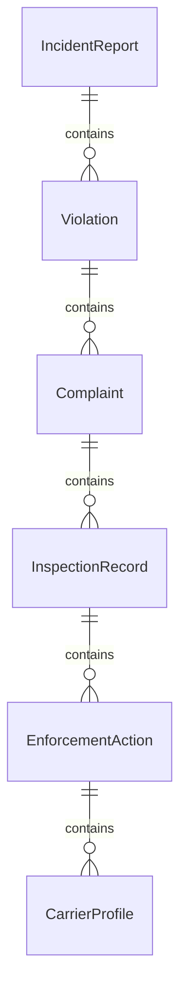
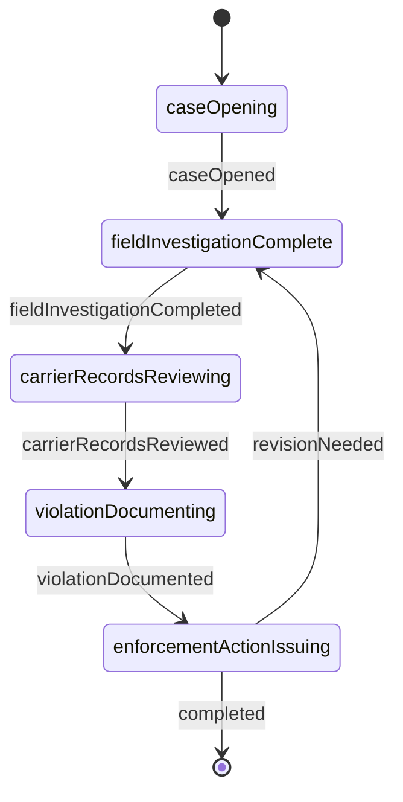
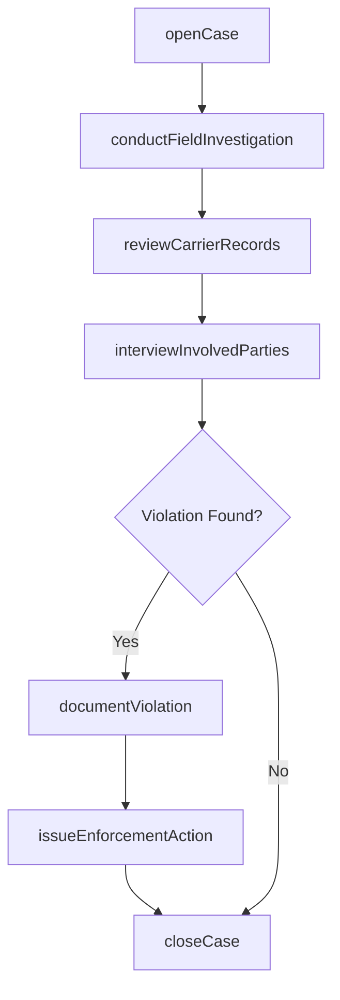
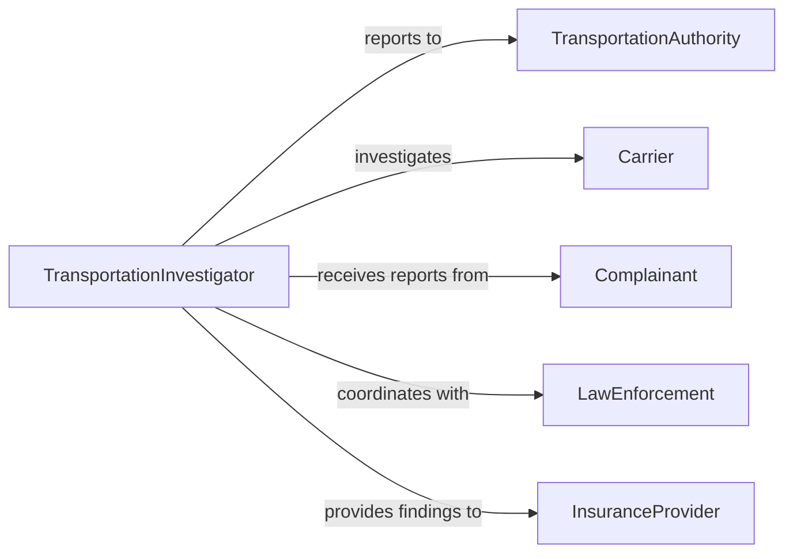

# Investigate Transportation Incidents Violations Compla

> Business-as-Code definition for investigating transportation incidents, violations, and complaints. Models the process of receiving reports, conducting field investigations, documenting findings, and issuing enforcement actions or corrective recommendations.

## Overview

Transportation incident investigation encompasses examining accidents, regulatory violations, and public complaints across road, rail, air, and maritime modes. Investigators review driver logs, vehicle inspection records, GPS telemetry, and surveillance data to reconstruct events and assess compliance with safety regulations. Findings drive enforcement actions, carrier safety ratings, and systemic improvements to transportation safety programs.

## Actors

| Actor | Description |
|-------|-------------|
| TransportationAuthority | Federal or state agency overseeing transportation safety (e.g., FMCSA, FAA, FRA) |
| Carrier | Transportation company operating vehicles or vessels involved in the incident |
| Complainant | Individual or organization filing a safety complaint or violation report |
| LawEnforcement | Police or highway patrol officers involved in the initial incident response |
| InsuranceProvider | Insurer covering the carrier or affected parties |

## Roles

| Role | Description |
|------|-------------|
| TransportationInvestigator | Conducts field investigations and collects evidence for incident cases |
| ComplianceInspector | Reviews carrier records and operations for regulatory adherence |
| CaseManager | Coordinates the overall investigation lifecycle and tracks resolution |
| EnforcementOfficer | Issues citations, fines, or out-of-service orders based on findings |

## Entities

| Entity | Description |
|--------|-------------|
| IncidentReport | Formal record of a transportation incident with location, parties, and circumstances |
| Violation | A documented infraction of transportation safety regulations |
| Complaint | A formal concern filed regarding unsafe transportation practices |
| InspectionRecord | Vehicle or facility inspection results with compliance status |
| EnforcementAction | Penalty, citation, or corrective order issued as a result of investigation |
| CarrierProfile | Safety rating and compliance history for a transportation company |

## Actions

| Action | Description |
|--------|-------------|
| openCase | Create a new investigation case from an incident report, violation, or complaint |
| conductFieldInvestigation | Perform on-site examination of the incident scene or carrier facility |
| reviewCarrierRecords | Examine driver logs, maintenance records, and operational documents |
| documentViolation | Record a specific regulatory infraction with supporting evidence |
| interviewInvolvedParties | Collect statements from drivers, operators, witnesses, and complainants |
| issueEnforcementAction | Issue a citation, fine, or out-of-service order based on findings |
| closeCase | Finalize the investigation and archive all case materials |

## Events

| Event | Description |
|-------|-------------|
| caseOpened | A new transportation investigation case has been created |
| fieldInvestigationCompleted | On-site investigation activities have been concluded |
| carrierRecordsReviewed | Carrier documentation review has been completed |
| violationDocumented | A regulatory violation has been formally recorded |
| enforcementActionIssued | A penalty or corrective order has been issued to the carrier |
| caseResolved | The investigation has been closed with final disposition |
| complaintValidated | A filed complaint has been substantiated through investigation |

## Searches

| Search | Description |
|--------|-------------|
| findCases | List investigation cases by type, carrier, date range, or status |
| getViolationHistory | Retrieve violation records for a specific carrier or driver |
| getComplaintsByCarrier | Find complaints filed against a particular transportation company |
| findEnforcementActions | Query enforcement actions by severity, type, or date |

## Entity Relationships



## State Diagram



## Workflow



## Actor Relationships



## Usage

### Calling Actions

```typescript
import { investigateTransportationIncidentsViolationsComplaints } from '@headlessly/investigate-transportation-incidents-violations-complaints'

const cases = investigateTransportationIncidentsViolationsComplaints()

// Open a case from a complaint
const caseRecord = await cases.openCase({
  type: 'complaint',
  carrier: { name: 'Midwest Freight Lines', dotNumber: 'DOT-1234567' },
  description: 'Multiple reports of driver hours-of-service violations on I-80 corridor',
  priority: 'high'
})

// Review carrier compliance records
const records = await cases.reviewCarrierRecords({
  caseId: caseRecord.id,
  carrierDotNumber: 'DOT-1234567',
  recordTypes: ['driverLogs', 'maintenanceRecords', 'drugTestResults']
})

// Document a discovered violation
await cases.documentViolation({
  caseId: caseRecord.id,
  regulation: '49 CFR 395.3',
  description: 'Driver exceeded 11-hour driving limit on 3 occasions in January 2026',
  severity: 'critical',
  evidence: records.findings
})
```

### Event-Driven Automation

```typescript
// Escalate critical violations to enforcement
cases.violationDocumented(async ({ caseId, violation }) => {
  if (violation.severity === 'critical') {
    await cases.issueEnforcementAction({
      caseId,
      type: 'outOfServiceOrder',
      targetEntity: violation.carrierId,
      reason: violation.description
    })
  }
})

// Update carrier safety rating when case closes
cases.caseResolved(async ({ caseId, carrierId, violations }) => {
  if (violations.length > 0) {
    await updateCarrierSafetyRating({
      carrierId,
      violations: violations.length,
      investigationId: caseId
    })
  }
})
```
