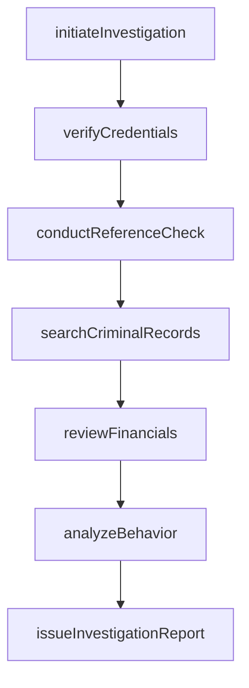
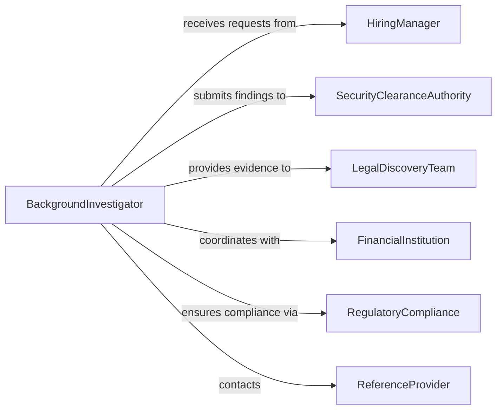

# Investigate Personal Characteristics Activities Indivi

> Business-as-Code definition for investigating personal characteristics and activities of individuals. Models background investigations, behavioral assessments, and activity monitoring for employment screening, security clearances, legal matters, and due diligence.

## Overview

Investigating personal characteristics and activities involves researching an individual's background, verifying credentials, examining behavior patterns, and documenting activities for employment decisions, security clearances, legal proceedings, or risk assessment. Investigators conduct database searches, verify education and employment history, check references, review financial records, and assess character. This definition supports pre-employment screening, security clearance adjudication, litigation discovery, and fraud investigations.

## Actors

| Actor | Description |
|-------|-------------|
| HiringManager | Requests background investigations for job candidates |
| SecurityClearanceAuthority | Adjudicates investigations for classified access |
| LegalDiscoveryTeam | Uses investigation findings in civil or criminal proceedings |
| FinancialInstitution | Conducts due diligence for account holders or loan applicants |
| RegulatoryCompliance | Ensures investigations meet privacy and fair credit reporting laws |
| ReferenceProvider | Supplies information about an individual's character or work history |

## Roles

| Role | Description |
|------|-------------|
| BackgroundInvestigator | Conducts research and verifies personal information |
| CredentialVerifier | Authenticates education, certifications, and licenses |
| BehavioralAnalyst | Assesses patterns of conduct and character traits |
| RecordsSpecialist | Searches public and private databases for relevant information |

## Entities

| Entity | Description |
|--------|-------------|
| InvestigationRequest | A formal directive to research an individual's background |
| SubjectProfile | A compiled dossier of personal characteristics and activities |
| CredentialVerification | Confirmation of educational degrees, certifications, or licenses |
| ReferenceCheck | A documented conversation with a personal or professional reference |
| CriminalRecordSearch | A query of local, state, and federal criminal databases |
| FinancialReview | An examination of credit history, liens, or bankruptcy records |
| InvestigationReport | A comprehensive summary of findings and recommendations |

## Actions

| Action | Description |
|--------|-------------|
| initiateInvestigation | Open a new case to research an individual's background |
| verifyCredentials | Authenticate education, certifications, and professional licenses |
| conductReferenceCheck | Interview personal or professional references |
| searchCriminalRecords | Query law enforcement and court databases for convictions |
| reviewFinancials | Examine credit reports, tax liens, and bankruptcy filings |
| analyzeBehavior | Assess conduct patterns from interviews and documented activities |
| issueInvestigationReport | Compile findings and provide a recommendation |

## Events

| Event | Description |
|-------|-------------|
| investigationInitiated | A background investigation case has been opened |
| credentialsVerified | Educational and professional qualifications have been authenticated |
| referenceCheckConducted | A reference has provided information about the subject |
| criminalRecordsSearched | Criminal databases have been queried |
| financialsReviewed | Credit and financial records have been examined |
| behaviorAnalyzed | Conduct patterns have been assessed |
| investigationReportIssued | Findings have been documented and submitted |

## Searches

| Search | Description |
|--------|-------------|
| findInvestigations | List cases by subject, requestor, or status |
| getCredentialVerifications | Retrieve authentication results for education or licenses |
| getReferenceChecks | Find documented reference interviews by subject or reference |
| getCriminalRecords | Locate criminal database search results by subject |
| getFinancialReviews | Retrieve credit and financial examination results |

## Workflow



## Actor Relationships



## Usage

### Calling Actions

```typescript
import { investigatePersonalCharacteristicsActivitiesIndivi } from '@headlessly/investigate-personal-characteristics-activities-indivi'

const investigations = investigatePersonalCharacteristicsActivitiesIndivi()

// Initiate a background investigation for a job candidate
const investigation = await investigations.initiateInvestigation({
  subjectName: 'Michael Chen',
  subjectDOB: '1987-06-12',
  purpose: 'pre-employment',
  requestedBy: 'hiring-manager-ops',
  clearanceLevel: 'standard'
})

// Verify educational credentials
await investigations.verifyCredentials({
  investigationId: investigation.id,
  credentials: [
    { type: 'degree', institution: 'University of California Berkeley', degree: 'BS Computer Science', year: 2009 },
    { type: 'certification', issuer: 'AWS', credential: 'Solutions Architect Associate', year: 2022 }
  ]
})

// Conduct reference checks
await investigations.conductReferenceCheck({
  investigationId: investigation.id,
  referenceName: 'Sarah Kim',
  referenceType: 'professional',
  relationship: 'former-supervisor',
  contactMethod: 'phone'
})

// Search criminal records
await investigations.searchCriminalRecords({
  investigationId: investigation.id,
  jurisdictions: ['federal', 'california-state', 'alameda-county'],
  yearsBack: 7
})
```

### Event-Driven Automation

```typescript
// Flag adverse findings for review
investigations.criminalRecordsSearched(async ({ investigationId, findings }) => {
  if (findings.length > 0) {
    await notify({
      to: 'compliance-officer',
      message: `Criminal record findings require review for investigation ${investigationId}`
    })
  }
})

// Auto-issue report when all checks are complete
investigations.behaviorAnalyzed(async ({ investigationId }) => {
  await investigations.issueInvestigationReport({ investigationId })
})
```
