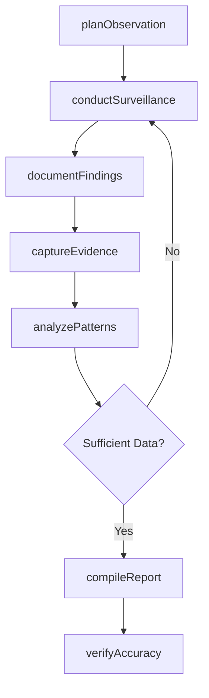
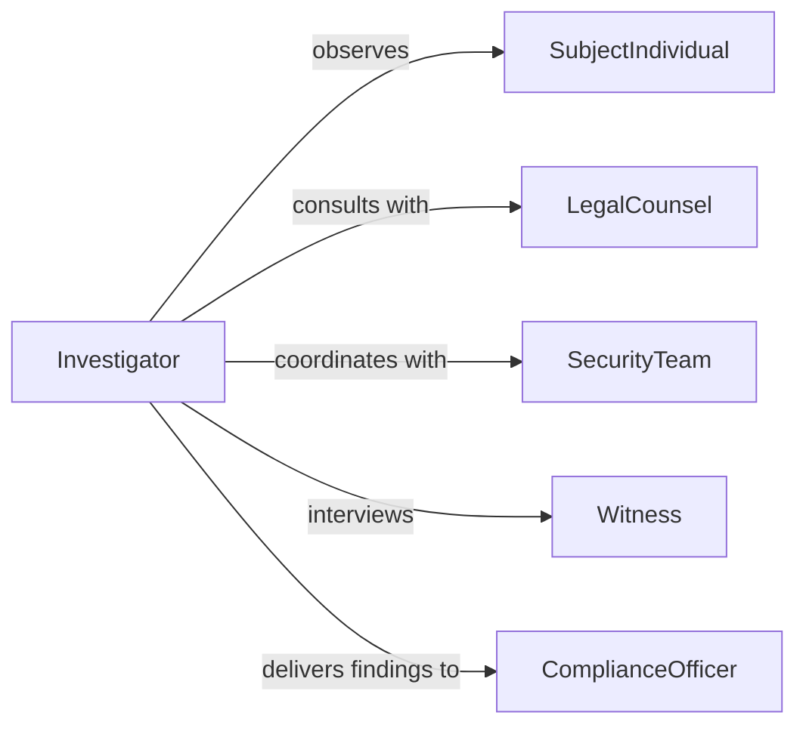

# Observe Individuals' Activities Gather Information

> Business-as-Code definition for observing individual activities to gather information and compile evidence. Models systematic observation, documentation, and analysis workflows for investigative, security, and research purposes.

## Overview

Observing individuals' activities involves planning surveillance, conducting ethical observation, documenting findings, and analyzing patterns. This definition supports security monitoring, workplace investigations, research studies, and compliance verification while maintaining appropriate privacy and legal boundaries.

## Actors

| Actor | Description |
|-------|-------------|
| SubjectIndividual | Person being observed for investigation or study |
| LegalCounsel | Ensures observation methods comply with privacy laws |
| SecurityTeam | Provides physical security and monitoring support |
| Witness | Third party who may corroborate observations |
| DataAnalyst | Processes and interprets observation data |
| EthicsBoard | Approves observation protocols for research studies |

## Roles

| Role | Description |
|------|-------------|
| Investigator | Conducts observation and gathers evidence |
| Researcher | Studies behavior patterns for analysis |
| SecurityMonitor | Watches for safety or policy violations |
| ComplianceOfficer | Verifies adherence to regulations |

## Entities

| Entity | Description |
|--------|-------------|
| Observation | Recorded instance of observed activity |
| Evidence | Documented proof of specific behavior |
| Pattern | Recurring behavior or activity trend |
| Report | Compiled findings from observation period |
| Timeline | Chronological sequence of observed events |
| Incident | Notable occurrence requiring documentation |

## Actions

| Action | Description |
|--------|-------------|
| planObservation | Define scope, methods, and duration of monitoring |
| conductSurveillance | Perform systematic observation of activities |
| documentFindings | Record observations with timestamps and details |
| captureEvidence | Collect supporting materials like photos or logs |
| analyzePatterns | Identify trends or anomalies in behavior |
| compileReport | Summarize findings in structured document |
| verifyAccuracy | Cross-check observations with multiple sources |

## Events

| Event | Description |
|-------|-------------|
| observationPlanned | Monitoring parameters have been defined |
| surveillanceConducted | Active observation session was completed |
| findingsDocumented | Observations have been recorded in system |
| evidenceCaptured | Supporting materials have been collected |
| patternsAnalyzed | Behavioral trends have been identified |
| reportCompiled | Findings have been summarized in report |
| accuracyVerified | Observations have been corroborated |

## Searches

| Search | Description |
|--------|-------------|
| findObservations | List observations by subject, date, or location |
| getPatterns | Retrieve identified behavioral trends |
| getEvidence | Search collected supporting materials |
| getReports | Find compiled investigation summaries |

## Workflow



## Actor Relationships



## Usage

### Calling Actions

```typescript
import { observeIndividualsActivitiesGatherInformation } from '@headlessly/observe-individuals-activities-gather-information'

const observation = observeIndividualsActivitiesGatherInformation()

// Plan systematic observation
const plan = await observation.planObservation({
  subject: 'Employee ID 4521',
  purpose: 'Workplace safety investigation',
  duration: '5 business days',
  methods: ['video-monitoring', 'activity-logs', 'witness-interviews'],
  legalBasis: 'Company policy Section 4.2'
})

// Document findings during surveillance
await observation.conductSurveillance({
  planId: plan.id,
  sessionStart: '2024-03-15T08:00:00Z',
  location: 'Warehouse Floor B'
})

await observation.documentFindings({
  planId: plan.id,
  timestamp: '2024-03-15T10:23:00Z',
  activity: 'Subject bypassed safety checkpoint without scanning badge',
  severity: 'high'
})
```

### Event-Driven Automation

```typescript
// Alert supervisor when concerning pattern detected
observation.patternsAnalyzed(async ({ planId, patterns }) => {
  const highRisk = patterns.filter(p => p.severity === 'high')
  if (highRisk.length > 0) {
    await notify({
      to: 'safety-supervisor@company.com',
      subject: 'High-Risk Pattern Detected',
      message: `Investigation ${planId} identified ${highRisk.length} high-risk behavioral patterns requiring immediate review.`
    })
  }
})

// Auto-compile report when observation period ends
observation.surveillanceConducted(async ({ planId, sessionEnd }) => {
  const plan = await observation.findObservations({ planId })
  if (plan.isComplete) {
    await observation.compileReport({ planId })
  }
})
```
