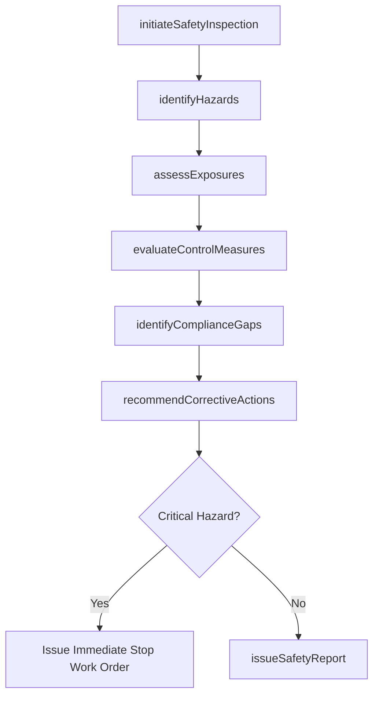
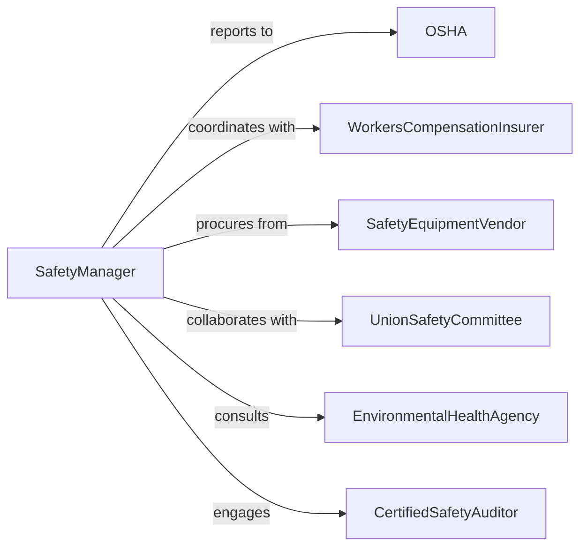

# Investigate Safety Work Environment

> Business-as-Code definition for investigating workplace safety conditions. Models comprehensive safety assessments, hazard identification, regulatory compliance reviews, and corrective action recommendations to protect employee health and wellbeing.

## Overview

Investigating workplace safety involves conducting systematic inspections, identifying hazards, evaluating control measures, reviewing safety procedures, and ensuring regulatory compliance. Safety professionals assess physical conditions, chemical exposures, ergonomic factors, equipment safeguards, and emergency preparedness. This definition supports OSHA compliance audits, proactive hazard assessments, incident prevention programs, and continuous safety improvement initiatives.

## Actors

| Actor | Description |
|-------|-------------|
| OSHA | Occupational Safety and Health Administration enforcing workplace safety regulations |
| WorkersCompensationInsurer | Evaluates workplace safety to determine insurance premiums and risk |
| SafetyEquipmentVendor | Supplies personal protective equipment and safety systems |
| UnionSafetyCommittee | Represents employee interests in workplace safety matters |
| EnvironmentalHealthAgency | Regulates chemical exposures and environmental hazards |
| CertifiedSafetyAuditor | Conducts independent third-party safety assessments |

## Roles

| Role | Description |
|------|-------------|
| SafetyManager | Oversees workplace safety programs and investigations |
| IndustrialHygienist | Assesses chemical, physical, and biological hazards |
| SafetyInspector | Conducts walkthroughs and identifies safety deficiencies |
| ErgoAssessor | Evaluates workstation design and repetitive motion hazards |

## Entities

| Entity | Description |
|--------|-------------|
| SafetyInspection | A documented examination of workplace conditions |
| HazardIdentification | A specific safety risk or dangerous condition |
| ExposureAssessment | Measurement of employee exposure to hazardous substances |
| ControlMeasure | A safeguard, procedure, or equipment preventing injuries |
| ComplianceGap | A deficiency in meeting regulatory safety standards |
| CorrectiveAction | A required improvement to eliminate or reduce hazards |
| SafetyInvestigationReport | A comprehensive summary of findings and recommendations |

## Actions

| Action | Description |
|--------|-------------|
| initiateSafetyInspection | Begin a systematic examination of workplace conditions |
| identifyHazards | Document specific risks, dangers, or unsafe conditions |
| assessExposures | Measure employee contact with chemicals, noise, or physical agents |
| evaluateControlMeasures | Review effectiveness of existing safety safeguards |
| identifyComplianceGaps | Document deficiencies in meeting regulatory requirements |
| recommendCorrectiveActions | Propose specific improvements to eliminate or reduce hazards |
| issueSafetyReport | Publish findings and required corrective measures |

## Events

| Event | Description |
|-------|-------------|
| safetyInspectionInitiated | A workplace safety investigation has been started |
| hazardsIdentified | Specific risks or dangerous conditions have been documented |
| exposuresAssessed | Employee contact with hazardous agents has been measured |
| controlMeasuresEvaluated | Effectiveness of existing safeguards has been reviewed |
| complianceGapsIdentified | Regulatory deficiencies have been documented |
| correctiveActionsRecommended | Specific improvements have been proposed |
| safetyReportIssued | Investigation findings have been published |

## Searches

| Search | Description |
|--------|-------------|
| findSafetyInspections | List inspections by location, date, or inspector |
| getHazardIdentifications | Retrieve documented risks by type, severity, or location |
| getExposureAssessments | Find measurements by substance, employee group, or date |
| getComplianceGaps | Locate regulatory deficiencies by standard or location |
| getCorrectiveActions | Search recommended improvements by priority or status |

## Workflow



## Actor Relationships



## Usage

### Calling Actions

```typescript
import { investigateSafetyWorkEnvironment } from '@headlessly/investigate-safety-work-environment'

const safety = investigateSafetyWorkEnvironment()

// Initiate a comprehensive safety inspection
const inspection = await safety.initiateSafetyInspection({
  location: 'Manufacturing Plant - Building 3',
  scope: ['machine-guarding', 'chemical-storage', 'emergency-exits', 'ergonomics'],
  inspector: 'safety-officer-martinez',
  scheduledDate: '2026-02-20'
})

// Identify hazards during walkthrough
await safety.identifyHazards({
  inspectionId: inspection.id,
  hazards: [
    { type: 'mechanical', description: 'Exposed belt on conveyor line 4', severity: 'high' },
    { type: 'chemical', description: 'Inadequate ventilation in paint booth', severity: 'medium' },
    { type: 'ergonomic', description: 'Repetitive motion at assembly station 12', severity: 'low' }
  ]
})

// Assess exposures for hazardous substances
await safety.assessExposures({
  inspectionId: inspection.id,
  substance: 'toluene',
  employees: ['paint-booth-operators'],
  measurementMethod: 'personal-air-sampling',
  duration: '8-hour-time-weighted-average'
})

// Recommend corrective actions
await safety.recommendCorrectiveActions({
  inspectionId: inspection.id,
  actions: [
    { hazardId: 'H-001', action: 'Install belt guard on conveyor', priority: 'immediate', deadline: '2026-02-25' },
    { hazardId: 'H-002', action: 'Upgrade paint booth ventilation system', priority: 'high', deadline: '2026-03-15' }
  ]
})
```

### Event-Driven Automation

```typescript
// Alert management immediately for critical hazards
safety.hazardsIdentified(async ({ inspectionId, hazards }) => {
  const critical = hazards.filter(h => h.severity === 'high' || h.severity === 'critical')
  if (critical.length > 0) {
    await notify({
      to: 'plant-manager',
      message: `Critical safety hazards identified in inspection ${inspectionId} - immediate action required`,
      priority: 'urgent'
    })
  }
})

// Auto-create work orders when corrective actions are recommended
safety.correctiveActionsRecommended(async ({ inspectionId, actions }) => {
  for (const action of actions) {
    await createWorkOrder({
      description: action.action,
      priority: action.priority,
      deadline: action.deadline,
      linkedTo: inspectionId
    })
  }
})
```
