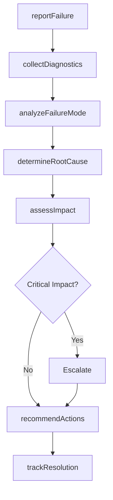
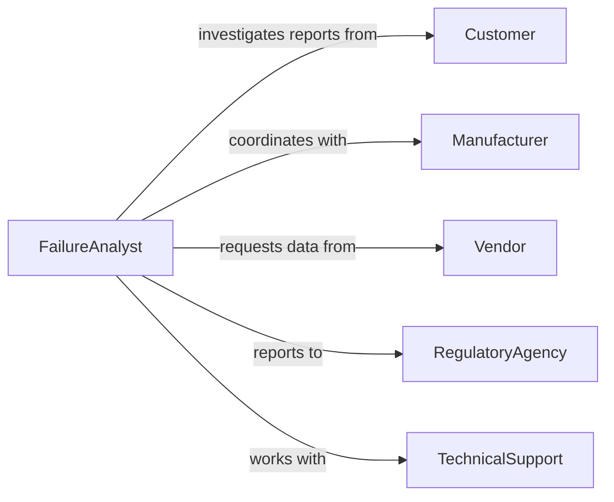

# Investigate System Equipment Product Failures

> Business-as-Code definition for investigating system, equipment, and product failures. Models root cause analysis, failure mode identification, and corrective action workflows for quality assurance, reliability engineering, and technical support.

## Overview

Investigating failures involves documenting incidents, collecting diagnostic data, performing root cause analysis, and recommending preventive measures. This definition supports manufacturing defect analysis, IT system outages, equipment malfunctions, and product quality investigations.

## Actors

| Actor | Description |
|-------|-------------|
| Manufacturer | Produces equipment or products under investigation |
| Customer | Reports failure or experiences product defect |
| Vendor | Supplies components that may have contributed to failure |
| RegulatoryAgency | Requires failure reporting for safety-critical systems |
| InsuranceCarrier | Evaluates claims related to equipment damage |
| TechnicalSupport | Provides first-line troubleshooting and diagnostics |

## Roles

| Role | Description |
|------|-------------|
| FailureAnalyst | Conducts technical investigation of failures |
| QualityEngineer | Analyzes defects for process improvement |
| ReliabilityEngineer | Assesses failure patterns and prevention strategies |
| FieldServiceTechnician | Diagnoses equipment failures on-site |

## Entities

| Entity | Description |
|--------|-------------|
| FailureReport | Documentation of system or equipment malfunction |
| RootCause | Underlying reason for failure occurrence |
| FailureMode | Specific way in which system or component failed |
| DiagnosticData | Technical measurements and test results |
| CorrectiveAction | Measure taken to prevent recurrence |
| Investigation | Systematic inquiry into failure incident |

## Actions

| Action | Description |
|--------|-------------|
| reportFailure | Document occurrence of system or equipment malfunction |
| collectDiagnostics | Gather technical data from failed system |
| analyzeFailureMode | Identify how component or system failed |
| determineRootCause | Establish underlying reason for failure |
| assessImpact | Evaluate consequences and affected systems |
| recommendActions | Propose corrective and preventive measures |
| trackResolution | Monitor implementation of recommended fixes |

## Events

| Event | Description |
|-------|-------------|
| failureReported | Malfunction has been documented in system |
| diagnosticsCollected | Technical data has been gathered from failure |
| failureModeAnalyzed | Specific failure mechanism has been identified |
| rootCauseDetermined | Underlying cause has been established |
| impactAssessed | Consequences have been evaluated |
| actionsRecommended | Corrective measures have been proposed |
| resolutionTracked | Fix implementation progress has been updated |

## Searches

| Search | Description |
|--------|-------------|
| findFailures | List failure reports by system, date, or severity |
| getRootCauses | Retrieve identified underlying causes |
| getFailureModes | Search failure mechanisms by type or component |
| getCorrectiveActions | Find recommended fixes and prevention measures |

## Workflow



## Actor Relationships



## Usage

### Calling Actions

```typescript
import { investigateSystemEquipmentProductFailures } from '@headlessly/investigate-system-equipment-product-failures'

const failures = investigateSystemEquipmentProductFailures()

// Report equipment failure
const failure = await failures.reportFailure({
  equipmentId: 'HVAC-UNIT-3421',
  location: 'Building A - Floor 3',
  failureDateTime: '2024-03-15T14:23:00Z',
  symptoms: 'Compressor overheating, system shutdown',
  operatorName: 'Facilities Technician'
})

// Collect diagnostic data
await failures.collectDiagnostics({
  failureId: failure.id,
  diagnostics: {
    temperature: '185F',
    pressure: '450 PSI',
    runtime: '4820 hours',
    errorCodes: ['E23', 'E45']
  }
})

// Analyze and determine root cause
await failures.analyzeFailureMode({
  failureId: failure.id,
  mode: 'Mechanical wear - bearing failure'
})

const rootCause = await failures.determineRootCause({
  failureId: failure.id,
  cause: 'Insufficient preventive maintenance interval',
  contributingFactors: ['high-duty-cycle', 'contaminated-lubricant']
})
```

### Event-Driven Automation

```typescript
// Auto-escalate critical failures
failures.impactAssessed(async ({ failureId, severity, affectedSystems }) => {
  if (severity === 'critical') {
    await notify({
      to: ['operations-director', 'maintenance-manager'],
      subject: 'Critical Equipment Failure Requires Immediate Action',
      message: `Failure ${failureId} affects ${affectedSystems.length} systems`,
      priority: 'urgent'
    })
  }
})

// Track similar failure patterns
failures.rootCauseDetermined(async ({ failureId, cause, equipmentType }) => {
  const similar = await failures.findFailures({
    rootCause: cause,
    equipmentType,
    timeframe: 'last-6-months'
  })

  if (similar.length > 3) {
    await createTask({
      assignee: 'reliability-engineer',
      title: `Pattern of ${cause} in ${equipmentType}`,
      priority: 'high'
    })
  }
})
```
