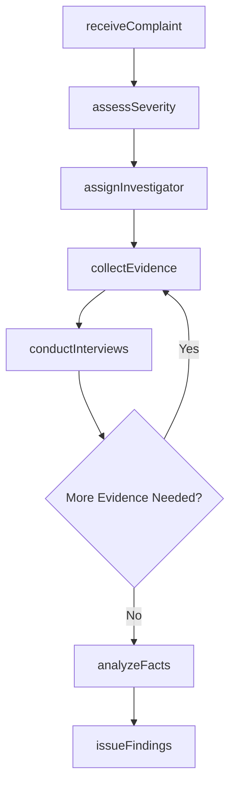
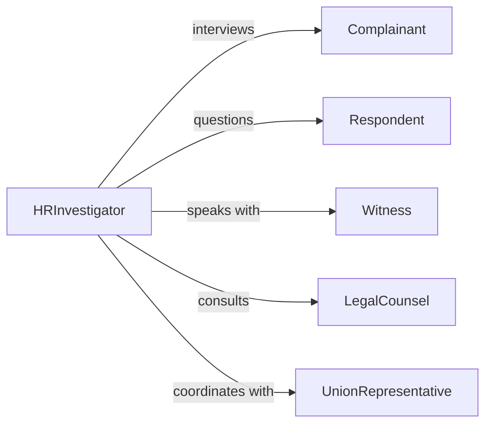

# Investigate Work Related Complaints Determine

> Business-as-Code definition for investigating work-related complaints to determine appropriate corrective actions. Models the complete complaint investigation lifecycle from intake through resolution and follow-up.

## Overview

Investigating work-related complaints involves receiving grievances, conducting impartial inquiries, gathering evidence, interviewing parties, and determining appropriate remedial actions. This definition supports workplace harassment claims, discrimination complaints, safety violations, policy disputes, and employee relations issues.

## Actors

| Actor | Description |
|-------|-------------|
| Complainant | Employee or party filing the workplace complaint |
| Respondent | Individual or entity named in the complaint |
| Witness | Person with relevant information about the complaint |
| LegalCounsel | Provides guidance on employment law compliance |
| UnionRepresentative | Represents employee interests in unionized workplaces |
| ExternalInvestigator | Third-party professional conducting impartial review |

## Roles

| Role | Description |
|------|-------------|
| HRInvestigator | Conducts internal workplace investigations |
| ComplianceOfficer | Ensures investigation meets regulatory requirements |
| Manager | Implements corrective actions following investigation |
| CaseManager | Tracks investigation progress and documentation |

## Entities

| Entity | Description |
|--------|-------------|
| Complaint | Formal allegation of workplace issue or violation |
| Investigation | Systematic inquiry into complaint allegations |
| Evidence | Documents, recordings, or testimony supporting findings |
| Interview | Documented conversation with involved parties |
| Finding | Conclusion about whether allegations are substantiated |
| CorrectiveAction | Remedial measure to address substantiated complaints |

## Actions

| Action | Description |
|--------|-------------|
| receiveComplaint | Document incoming workplace grievance |
| assessSeverity | Evaluate urgency and risk level of complaint |
| assignInvestigator | Designate impartial party to conduct inquiry |
| collectEvidence | Gather relevant documents and physical evidence |
| conductInterviews | Speak with complainant, respondent, and witnesses |
| analyzeFacts | Evaluate evidence and determine credibility |
| issueFindings | Document conclusions about complaint allegations |

## Events

| Event | Description |
|-------|-------------|
| complaintReceived | Workplace grievance has been formally filed |
| severityAssessed | Risk level and priority have been determined |
| investigatorAssigned | Inquiry has been delegated to specific person |
| evidenceCollected | Relevant materials have been gathered |
| interviewsConducted | All relevant parties have been questioned |
| factsAnalyzed | Evidence has been reviewed and evaluated |
| findingsIssued | Investigation conclusions have been documented |

## Searches

| Search | Description |
|--------|-------------|
| findComplaints | List complaints by type, status, or party |
| getInvestigations | Retrieve active or completed inquiries |
| getEvidence | Search collected materials by case or type |
| getFindings | Access investigation conclusions and outcomes |

## Workflow



## Actor Relationships



## Usage

### Calling Actions

```typescript
import { investigateWorkRelatedComplaintsDetermine } from '@headlessly/investigate-work-related-complaints-determine'

const complaints = investigateWorkRelatedComplaintsDetermine()

// Receive and document new complaint
const complaint = await complaints.receiveComplaint({
  complainant: 'Employee ID 5421',
  allegation: 'Workplace harassment',
  dateOfIncident: '2024-03-12',
  description: 'Repeated unwelcome comments about appearance',
  desiredOutcome: 'Investigation and corrective action'
})

// Assess severity and assign investigator
const assessment = await complaints.assessSeverity({
  complaintId: complaint.id,
  factors: ['pattern-of-behavior', 'hostile-environment', 'credible-threat']
})

await complaints.assignInvestigator({
  complaintId: complaint.id,
  investigatorId: 'senior-hr-investigator-02',
  targetCompletionDate: '2024-03-30'
})
```

### Event-Driven Automation

```typescript
// Auto-escalate high-severity complaints
complaints.severityAssessed(async ({ complaintId, severity }) => {
  if (severity === 'critical') {
    await notify({
      to: ['chief-hr-officer', 'legal-counsel'],
      subject: 'Critical Workplace Complaint Requires Immediate Attention',
      priority: 'urgent',
      complaintId
    })
  }
})

// Track investigation timeline compliance
complaints.investigatorAssigned(async ({ complaintId, targetCompletionDate }) => {
  await scheduleReminder({
    date: subtractDays(targetCompletionDate, 3),
    message: `Investigation ${complaintId} due in 3 days`,
    recipientRole: 'case-manager'
  })
})
```
