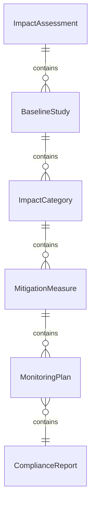
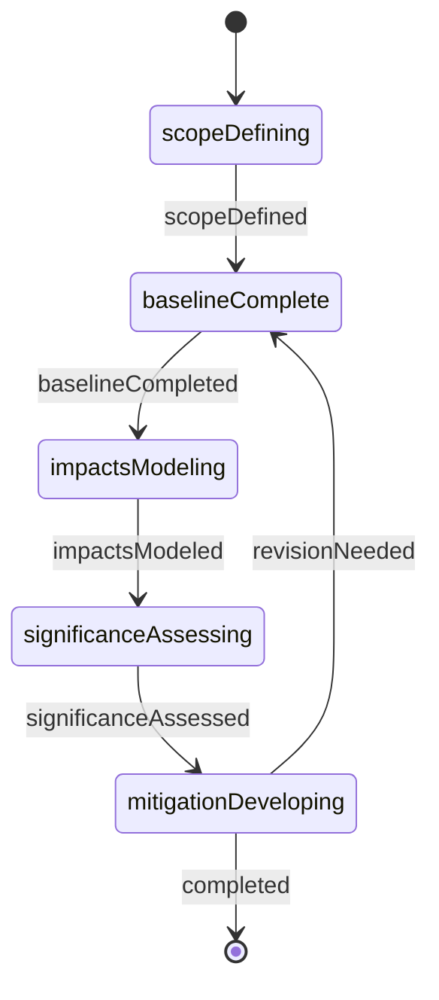
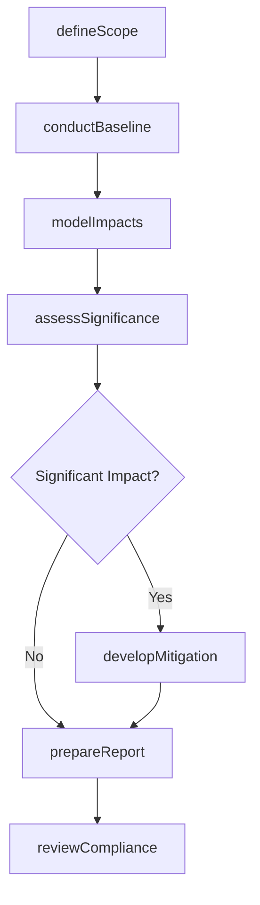
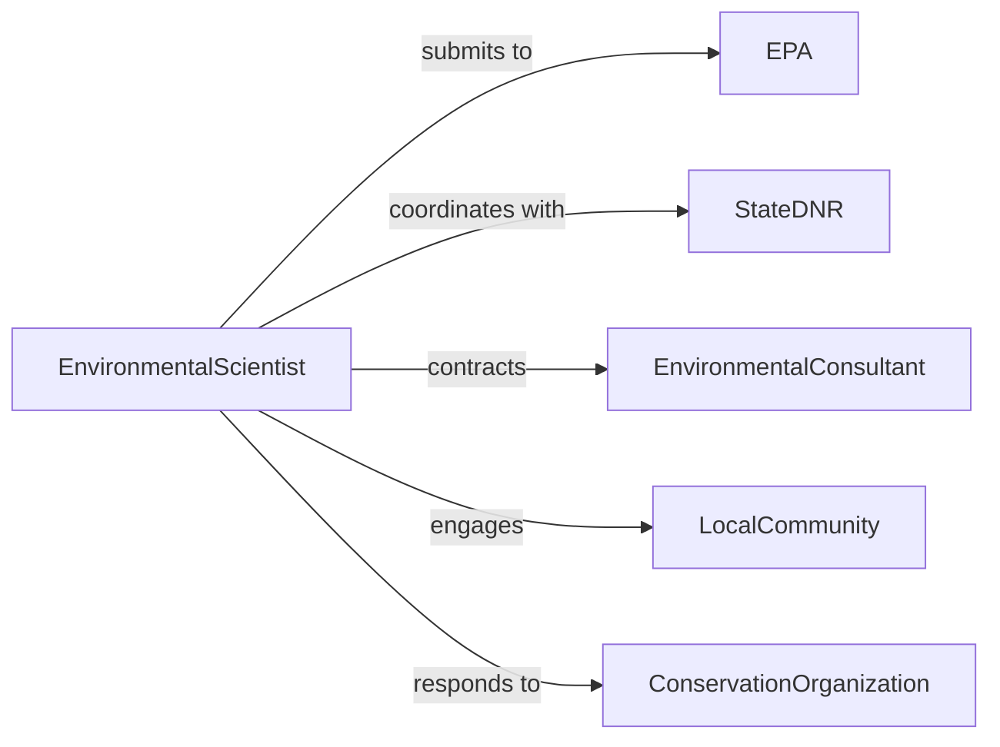

# Evaluate Environmental Impact Operational Development

> Business-as-Code definition for evaluating environmental impact of operational and development activities. Models comprehensive assessment of ecological effects from industrial operations, construction projects, and resource extraction activities.

## Overview

Evaluating environmental impact involves analyzing ecological effects of business operations, construction, and development projects on air quality, water resources, soil conditions, wildlife habitats, and communities. This definition supports environmental impact assessments, regulatory compliance, sustainability planning, and mitigation strategy development using established methodologies and scientific data.

## Actors

| Actor | Description |
|-------|-------------|
| EPA | Environmental Protection Agency enforcing federal regulations |
| StateDNR | Department of Natural Resources issuing permits |
| EnvironmentalConsultant | Provides specialized assessment and modeling services |
| LocalCommunity | Residents affected by project environmental impacts |
| ConservationOrganization | Advocates for environmental protection |
| RegulatoryAgency | Reviews and approves impact assessments |

## Roles

| Role | Description |
|------|-------------|
| EnvironmentalScientist | Conducts field studies and impact analysis |
| ProjectManager | Coordinates assessment activities |
| ComplianceSpecialist | Ensures regulatory adherence |
| DataAnalyst | Processes environmental monitoring data |

## Entities

| Entity | Description |
|--------|-------------|
| ImpactAssessment | Comprehensive evaluation of environmental effects |
| BaselineStudy | Pre-project environmental conditions documentation |
| ImpactCategory | Specific environmental aspect being evaluated |
| MitigationMeasure | Action to reduce or offset negative impacts |
| MonitoringPlan | Strategy for ongoing environmental tracking |
| ComplianceReport | Documentation of regulatory adherence |

## Actions

| Action | Description |
|--------|-------------|
| defineScope | Establish boundaries and aspects of assessment |
| conductBaseline | Document existing environmental conditions |
| modelImpacts | Simulate environmental effects of activities |
| assessSignificance | Determine magnitude of predicted impacts |
| developMitigation | Design measures to reduce negative effects |
| prepareReport | Document findings and recommendations |
| reviewCompliance | Verify adherence to environmental regulations |

## Events

| Event | Description |
|-------|-------------|
| scopeDefined | Assessment boundaries have been established |
| baselineCompleted | Pre-project conditions documented |
| impactsModeled | Environmental effects have been simulated |
| significanceAssessed | Impact magnitude determined |
| mitigationDeveloped | Reduction measures designed |
| reportPrepared | Assessment findings documented |
| complianceVerified | Regulatory requirements confirmed met |

## Searches

| Search | Description |
|--------|-------------|
| findAssessments | List environmental evaluations by project or date |
| getBaselines | Retrieve pre-project condition studies |
| getImpacts | Search predicted effects by category or severity |
| getMitigation | Access proposed reduction measures |

## Entity Relationships



## State Diagram



## Workflow



## Actor Relationships



## Usage

### Calling Actions

```typescript
import { evaluateEnvironmentalImpactOperationalDevelopment } from '@headlessly/evaluate-environmental-impact-operational-development'

const evaluation = evaluateEnvironmentalImpactOperationalDevelopment()

// Define assessment scope for new facility
const scope = await evaluation.defineScope({
  project: 'New Manufacturing Facility',
  location: '1500 Industrial Drive, Denver CO',
  activities: ['construction', 'wastewater discharge', 'air emissions', 'stormwater runoff'],
  categories: ['air quality', 'water resources', 'soil contamination', 'noise levels']
})

// Conduct baseline environmental study
await evaluation.conductBaseline({
  scopeId: scope.id,
  parameters: [
    { category: 'air quality', measurements: ['PM2.5', 'NOx', 'VOC'], duration: '12 months' },
    { category: 'water resources', measurements: ['pH', 'dissolved oxygen', 'turbidity'], sites: 3 }
  ],
  samplingPlan: 'baseline-monitoring-2026.pdf'
})

// Model environmental impacts
const impacts = await evaluation.modelImpacts({
  scopeId: scope.id,
  models: [
    { type: 'air dispersion', software: 'AERMOD', emissions: 'facility-emissions-inventory.csv' },
    { type: 'noise propagation', method: 'ISO 9613', sources: 'equipment-noise-levels.xlsx' }
  ]
})

// Assess significance and develop mitigation
await evaluation.assessSignificance({
  scopeId: scope.id,
  criteria: 'EPA significance thresholds',
  findings: impacts.results
})

await evaluation.developMitigation({
  scopeId: scope.id,
  measures: [
    { impact: 'NOx emissions', action: 'Install SCR system', reduction: '85%' },
    { impact: 'stormwater runoff', action: 'Construct retention pond', capacity: '100,000 gallons' }
  ]
})
```

### Event-Driven Automation

```typescript
// Alert when significant impacts identified
evaluation.significanceAssessed(async ({ scopeId, impacts }) => {
  const significant = impacts.filter(i => i.significance === 'major')
  if (significant.length > 0) {
    await notify({
      to: 'environmental-team@company.com',
      subject: 'Significant Environmental Impacts Identified',
      message: `Assessment ${scopeId} found ${significant.length} major impacts requiring mitigation`,
      priority: 'high'
    })
  }
})

// Create compliance tasks when report prepared
evaluation.reportPrepared(async ({ scopeId, requiredPermits }) => {
  for (const permit of requiredPermits) {
    await createTask({
      title: `Apply for ${permit.type}`,
      assignee: 'compliance-specialist',
      dueDate: permit.deadline,
      description: `Required for project approval`
    })
  }
})
```
