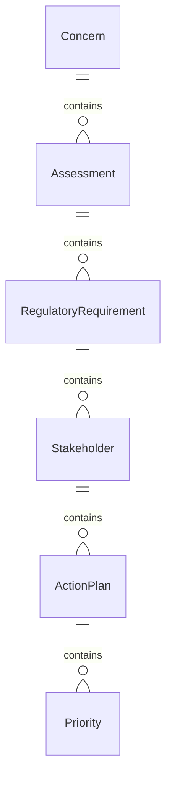
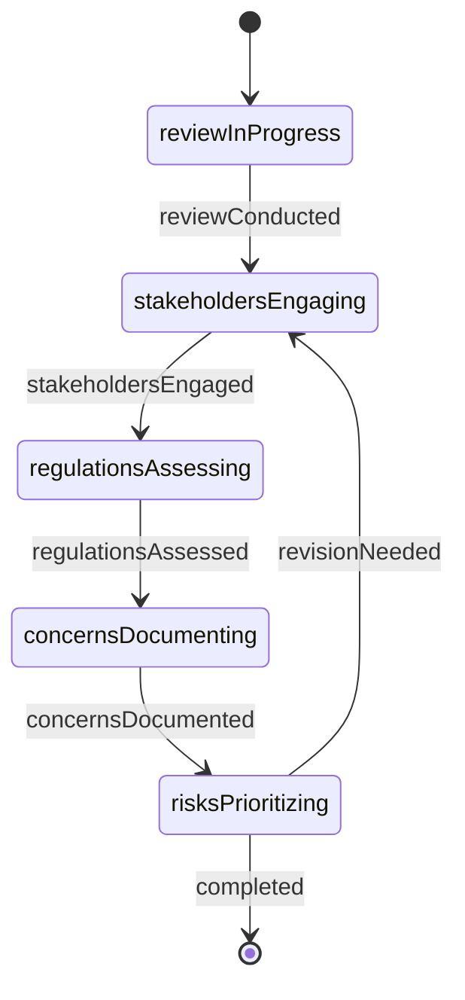
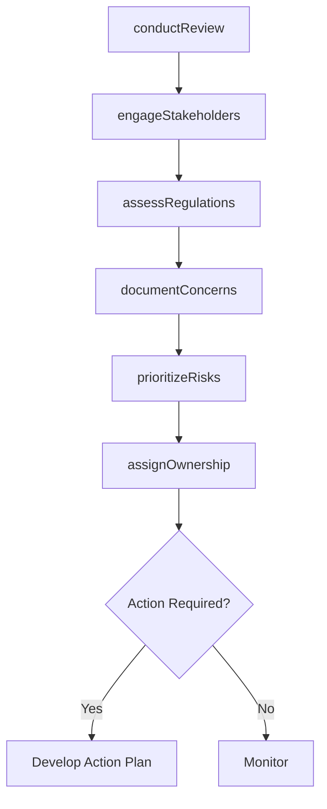
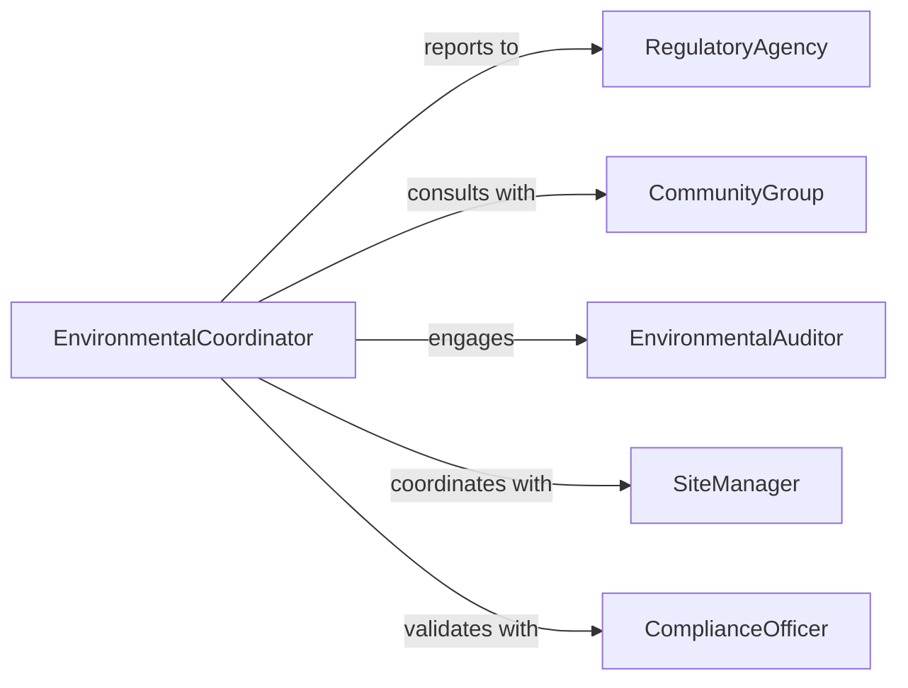

# Identify Environmental Concerns

> Business-as-Code definition for identifying environmental concerns in operations and development. Models systematic discovery and documentation of potential ecological risks, regulatory issues, and sustainability challenges.

## Overview

Identifying environmental concerns involves reviewing operational processes, site conditions, and regulatory requirements to discover potential ecological risks. This definition supports proactive risk assessment, regulatory compliance audits, sustainability program development, and stakeholder engagement through systematic concern identification and prioritization.

## Actors

| Actor | Description |
|-------|-------------|
| RegulatoryAgency | Enforces environmental laws and regulations |
| CommunityGroup | Raises concerns about local environmental impacts |
| EnvironmentalAuditor | Conducts independent compliance assessments |
| InsuranceCarrier | Evaluates environmental liability exposure |
| ConservationOrganization | Advocates for habitat and resource protection |
| Industry | Reports sector-specific environmental challenges |

## Roles

| Role | Description |
|------|-------------|
| EnvironmentalCoordinator | Leads concern identification process |
| SiteManager | Provides operational knowledge and facility access |
| ComplianceOfficer | Reviews regulatory requirements |
| SustainabilitySpecialist | Evaluates environmental performance |

## Entities

| Entity | Description |
|--------|-------------|
| Concern | Identified environmental risk or issue |
| Assessment | Evaluation of concern severity and scope |
| RegulatoryRequirement | Environmental law or permit condition |
| Stakeholder | Party affected by or interested in concern |
| ActionPlan | Strategy to address identified concern |
| Priority | Urgency ranking for concern resolution |

## Actions

| Action | Description |
|--------|-------------|
| conductReview | Examine operations for environmental risks |
| engageStakeholders | Solicit input from affected parties |
| assessRegulations | Review applicable environmental requirements |
| documentConcerns | Record identified environmental issues |
| prioritizeRisks | Rank concerns by severity and urgency |
| assignOwnership | Designate responsibility for resolution |

## Events

| Event | Description |
|-------|-------------|
| reviewConducted | Operations examination completed |
| stakeholdersEngaged | External input has been gathered |
| regulationsAssessed | Compliance requirements reviewed |
| concernsDocumented | Environmental issues have been recorded |
| risksPrioritized | Concerns ranked by importance |
| ownershipAssigned | Responsibility for resolution designated |

## Searches

| Search | Description |
|--------|-------------|
| findConcerns | List environmental issues by type or status |
| getAssessments | Retrieve concern severity evaluations |
| getRequirements | Search applicable environmental regulations |
| getPriorities | Access urgency-ranked concerns |

## Entity Relationships



## State Diagram



## Workflow



## Actor Relationships



## Usage

### Calling Actions

```typescript
import { identifyEnvironmentalConcerns } from '@headlessly/identify-environmental-concerns'

const concerns = identifyEnvironmentalConcerns()

// Conduct environmental review of facility
const review = await concerns.conductReview({
  facility: 'Manufacturing Plant - Building 5',
  scope: ['waste management', 'air emissions', 'water discharge', 'chemical storage'],
  methodology: 'ISO 14001 compliance audit',
  date: '2026-02-10'
})

// Engage stakeholders for input
await concerns.engageStakeholders({
  reviewId: review.id,
  stakeholders: [
    { type: 'community', group: 'Riverside Neighborhood Association', method: 'public meeting' },
    { type: 'regulatory', agency: 'State Environmental Quality Department', method: 'consultation' },
    { type: 'employee', group: 'Environmental Health & Safety Committee', method: 'survey' }
  ]
})

// Document identified concerns
await concerns.documentConcerns({
  reviewId: review.id,
  concerns: [
    {
      type: 'air emissions',
      description: 'VOC emissions from coating operation exceed permit limits during peak production',
      source: 'emissions monitoring data',
      regulatory: 'Clean Air Act Title V permit'
    },
    {
      type: 'waste management',
      description: 'Hazardous waste accumulation exceeds 90-day limit',
      source: 'internal audit',
      regulatory: 'RCRA generator requirements'
    },
    {
      type: 'community impact',
      description: 'Noise complaints from night shift operations',
      source: 'community feedback',
      regulatory: 'local noise ordinance'
    }
  ]
})

// Prioritize risks
await concerns.prioritizeRisks({
  reviewId: review.id,
  criteria: {
    regulatoryImpact: 'weight: 40%',
    communityImpact: 'weight: 30%',
    financialRisk: 'weight: 20%',
    reputationalRisk: 'weight: 10%'
  }
})
```

### Event-Driven Automation

```typescript
// Alert management when high-priority concerns identified
concerns.risksPrioritized(async ({ reviewId, concerns }) => {
  const critical = concerns.filter(c => c.priority === 'critical' || c.priority === 'high')
  if (critical.length > 0) {
    await notify({
      to: 'environmental-manager@company.com',
      subject: 'Critical Environmental Concerns Identified',
      message: `Review ${reviewId} found ${critical.length} high-priority environmental issues`,
      priority: 'urgent'
    })
  }
})

// Create action plan tasks when ownership assigned
concerns.ownershipAssigned(async ({ concernId, owner, priority }) => {
  await createTask({
    title: `Address environmental concern ${concernId}`,
    assignee: owner,
    priority: priority,
    dueDate: calculateDueDate(priority),
    type: 'environmental-action'
  })
})
