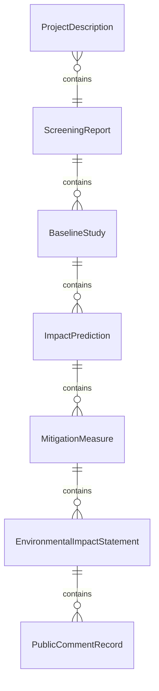
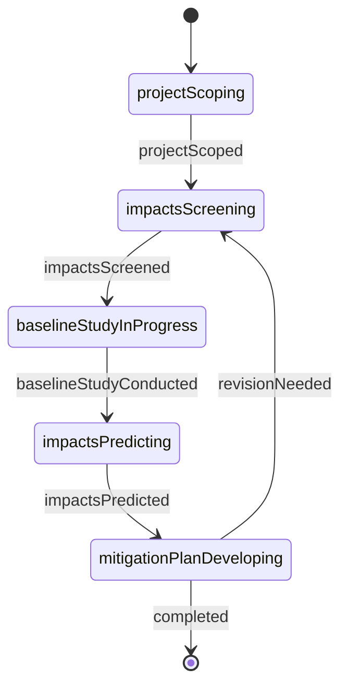
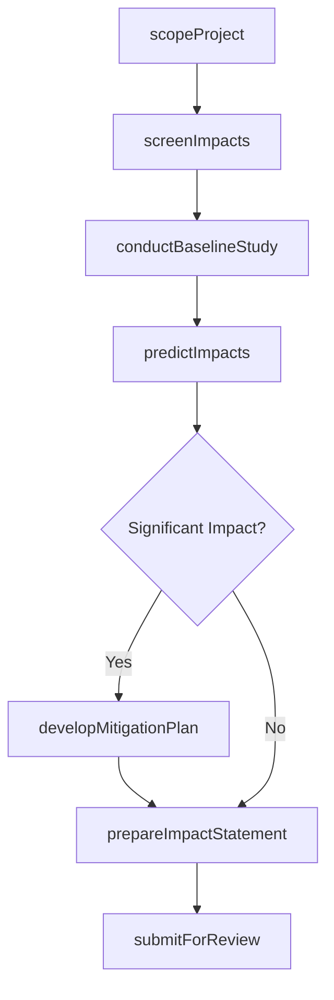
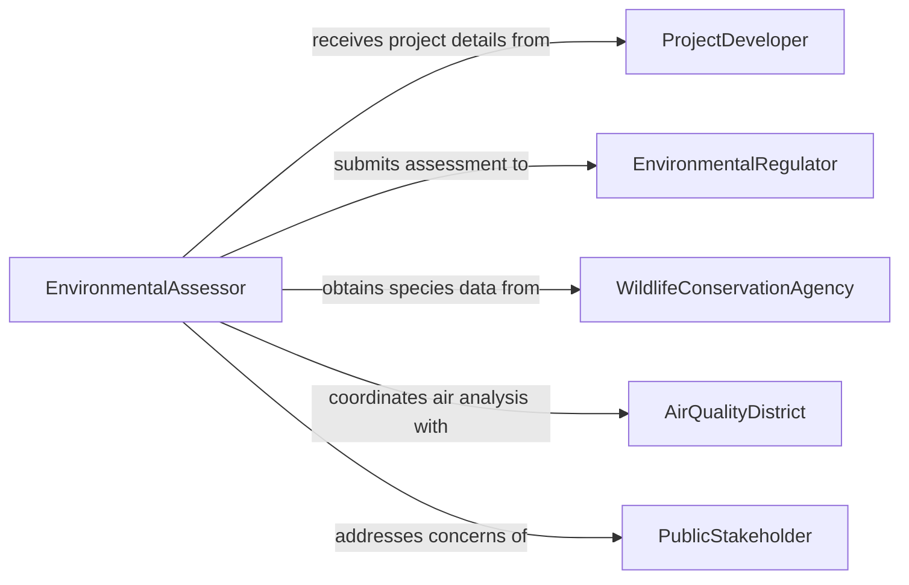

# Investigate the Environmental Impact of Projects

> Business-as-Code definition for investigating the environmental impact of projects. Models the workflow from project scoping through environmental screening, impact assessment, mitigation planning, and regulatory submission.

## Overview

Investigating the environmental impact of projects involves conducting environmental impact assessments (EIA) for proposed construction, infrastructure, industrial, and development projects to identify potential effects on air quality, water resources, soils, wildlife, vegetation, and human communities. Environmental professionals scope the project, screen for significant impacts, conduct baseline studies, model predicted effects, develop mitigation measures, and prepare reports for regulatory review. This definition exposes actions for environmental impact investigation, events for assessment milestones, and searches for retrieving impact data and reports.

## Actors

| Actor | Description |
|-------|-------------|
| ProjectDeveloper | Proposes the project and funds the environmental investigation |
| EnvironmentalRegulator | Reviews impact assessments and issues permits or conditions |
| PublicStakeholder | Participates in comment periods and public hearings on the assessment |
| WildlifeConservationAgency | Provides data on protected species and critical habitats |
| AirQualityDistrict | Sets emission standards and reviews air quality impact analyses |
| WaterResourcesBoard | Manages water rights and reviews hydrologic impact assessments |

## Roles

| Role | Description |
|------|-------------|
| EnvironmentalAssessor | Leads the investigation and coordinates all assessment disciplines |
| BiologicalSurveyor | Conducts wildlife and vegetation surveys at the project site |
| AirQualityModeler | Simulates pollutant dispersion from proposed project activities |
| MitigationPlanner | Designs measures to avoid, minimize, or offset environmental impacts |

## Entities

| Entity | Description |
|--------|-------------|
| ProjectDescription | A detailed specification of the proposed project and its activities |
| ScreeningReport | An initial evaluation of whether the project requires a full impact assessment |
| BaselineStudy | A characterization of existing environmental conditions at the project site |
| ImpactPrediction | A modeled estimate of how the project will affect specific resources |
| MitigationMeasure | A specific action designed to reduce or offset an identified impact |
| EnvironmentalImpactStatement | A comprehensive document presenting the assessment findings |
| PublicCommentRecord | Feedback received from stakeholders during the review period |

## Actions

| Action | Description |
|--------|-------------|
| scopeProject | Define the project activities and geographic area to be assessed |
| screenImpacts | Determine which environmental resources may be significantly affected |
| conductBaselineStudy | Characterize existing conditions for air, water, soil, and biological resources |
| predictImpacts | Model the expected effects of the project on each resource |
| developMitigationPlan | Design measures to avoid, minimize, or compensate for impacts |
| prepareImpactStatement | Draft the comprehensive assessment document for regulatory review |
| submitForReview | File the assessment with regulators and open the public comment period |

## Events

| Event | Description |
|-------|-------------|
| projectScoped | The project activities and assessment boundaries have been defined |
| impactsScreened | Resources potentially affected have been identified |
| baselineStudyConducted | Existing environmental conditions have been characterized |
| impactsPredicted | Expected effects on resources have been modeled |
| mitigationPlanDeveloped | Measures to reduce or offset impacts have been designed |
| impactStatementPrepared | The comprehensive assessment document has been drafted |
| assessmentSubmitted | The document has been filed for regulatory and public review |

## Searches

| Search | Description |
|--------|-------------|
| findAssessments | Search impact investigations by project, location, or status |
| getBaselineStudies | Retrieve environmental baseline data by site or resource |
| getImpactPredictions | Locate modeled effects by project, resource, or severity |
| getMitigationMeasures | Find proposed mitigation by project, impact, or type |
| getPublicComments | List stakeholder feedback by assessment or topic |

## Entity Relationships



## State Diagram



## Workflow



## Actor Relationships



## Usage

### Calling Actions

```typescript
import { investigateEnvironmentalImpactProjects } from '@headlessly/investigate-environmental-impact-projects'

const eia = investigateEnvironmentalImpactProjects()

// Scope the project and screen impacts
const project = await eia.scopeProject({
  projectName: 'Solar Farm Expansion - Phase III',
  developer: 'renewables-west-corp',
  location: { county: 'kern', state: 'CA', acreage: 2400 },
  activities: ['grading', 'panelInstallation', 'transmissionLine', 'accessRoads']
})

const screening = await eia.screenImpacts({
  projectId: project.id,
  resources: ['biologicalResources', 'waterResources', 'culturalResources', 'airQuality', 'visualResources']
})

// Conduct baseline and predict impacts
await eia.conductBaselineStudy({
  projectId: project.id,
  surveys: ['desertTortoiseSurvey', 'wetlandDelineation', 'culturalResourcesInventory'],
  season: 'spring-2026'
})

await eia.predictImpacts({
  projectId: project.id,
  methods: ['habitatLossCalculation', 'dustEmissionsModel', 'viewshedAnalysis']
})

// Develop mitigation and prepare statement
await eia.developMitigationPlan({
  projectId: project.id,
  measures: ['tortoiseFencing', 'dustSuppression', 'habitatOffsetPurchase']
})
```

### Event-Driven Automation

```typescript
// Notify developer when assessment is submitted
eia.assessmentSubmitted(async ({ projectId, projectName }) => {
  await notify({
    to: 'project-developer',
    message: `Environmental Impact Statement submitted for ${projectName} - public comment period open`
  })
})

// Auto-prepare statement when mitigation plan is complete
eia.mitigationPlanDeveloped(async ({ projectId }) => {
  await eia.prepareImpactStatement({ projectId })
})
```
