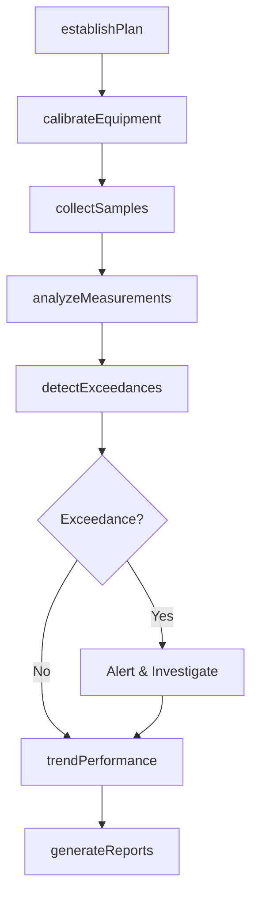
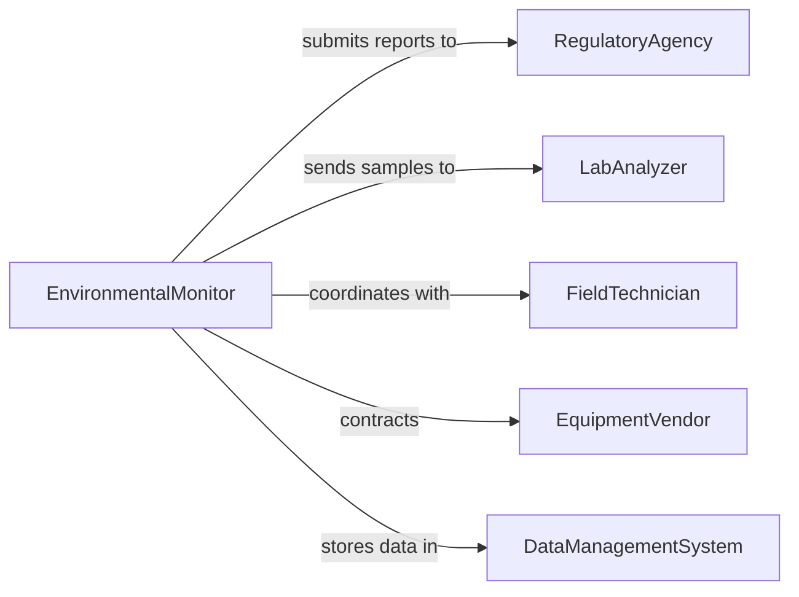

# Monitor Environmental Impacts Production Development

> Business-as-Code definition for monitoring environmental impacts of production and development activities. Models continuous tracking of ecological effects, compliance verification, and early warning systems for environmental incidents.

## Overview

Monitoring environmental impacts involves continuous measurement of air emissions, water discharge, waste generation, energy consumption, and ecological indicators throughout production operations and development projects. This definition supports regulatory compliance reporting, sustainability performance tracking, incident detection, and adaptive management through automated data collection and analysis.

## Actors

| Actor | Description |
|-------|-------------|
| RegulatoryAgency | Reviews monitoring reports and enforces compliance |
| LabAnalyzer | Performs testing of environmental samples |
| EquipmentVendor | Provides monitoring instruments and calibration |
| DataManagementSystem | Stores and processes environmental monitoring data |
| CommunityMonitor | Conducts independent environmental observations |
| CertificationBody | Verifies compliance with environmental standards |

## Roles

| Role | Description |
|------|-------------|
| EnvironmentalMonitor | Oversees data collection and reporting |
| FieldTechnician | Collects samples and operates monitoring equipment |
| DataAnalyst | Processes and interprets environmental data |
| ComplianceCoordinator | Ensures regulatory reporting requirements met |

## Entities

| Entity | Description |
|--------|-------------|
| MonitoringPlan | Strategy defining what, when, and how to monitor |
| DataPoint | Individual environmental measurement |
| ComplianceLimit | Regulatory threshold that must not be exceeded |
| Exceedance | Instance where measurement exceeds limit |
| MonitoringReport | Periodic summary of environmental performance |
| Trend | Pattern in environmental data over time |

## Actions

| Action | Description |
|--------|-------------|
| establishPlan | Define monitoring parameters and schedule |
| collectSamples | Gather environmental media for analysis |
| analyzeMeasurements | Process data and compare to standards |
| detectExceedances | Identify instances exceeding compliance limits |
| trendPerformance | Analyze patterns in environmental data |
| generateReports | Prepare regulatory compliance submissions |
| calibrateEquipment | Maintain accuracy of monitoring instruments |

## Events

| Event | Description |
|-------|-------------|
| planEstablished | Monitoring strategy has been defined |
| samplesCollected | Environmental media gathered for analysis |
| measurementsAnalyzed | Data has been processed and evaluated |
| exceedanceDetected | Compliance limit has been exceeded |
| performanceTrended | Data patterns have been analyzed |
| reportGenerated | Compliance documentation prepared |
| equipmentCalibrated | Instrument accuracy verified |

## Searches

| Search | Description |
|--------|-------------|
| findDataPoints | List measurements by parameter or date |
| getExceedances | Retrieve instances exceeding limits |
| getReports | Access monitoring reports by period |
| getTrends | Search performance patterns by parameter |

## Workflow



## Actor Relationships



## Usage

### Calling Actions

```typescript
import { monitorEnvironmentalImpactsProductionDevelopment } from '@headlessly/monitor-environmental-impacts-production-development'

const monitoring = monitorEnvironmentalImpactsProductionDevelopment()

// Establish monitoring plan for facility
const plan = await monitoring.establishPlan({
  facility: 'Chemical Processing Plant',
  parameters: [
    { type: 'air emissions', pollutants: ['NOx', 'SO2', 'PM10'], frequency: 'continuous' },
    { type: 'wastewater', parameters: ['pH', 'BOD', 'TSS'], frequency: 'daily' },
    { type: 'stormwater', parameters: ['pH', 'oil & grease'], frequency: 'quarterly' }
  ],
  complianceLimits: 'permit-limits-2026.pdf',
  reportingSchedule: 'monthly to State EPA'
})

// Collect samples according to plan
await monitoring.collectSamples({
  planId: plan.id,
  date: '2026-02-10',
  samples: [
    {
      location: 'Outfall 001',
      type: 'wastewater',
      parameters: ['pH', 'BOD', 'TSS'],
      collectedBy: 'J. Smith',
      chainOfCustody: 'COC-20260210-001'
    }
  ]
})

// Analyze measurements and detect exceedances
const analysis = await monitoring.analyzeMeasurements({
  planId: plan.id,
  results: [
    { parameter: 'BOD', value: 45, units: 'mg/L', limit: 30, status: 'exceeds' },
    { parameter: 'TSS', value: 22, units: 'mg/L', limit: 30, status: 'compliant' },
    { parameter: 'pH', value: 7.2, units: 'SU', limit: '6.0-9.0', status: 'compliant' }
  ]
})

await monitoring.detectExceedances({
  planId: plan.id,
  analysisId: analysis.id,
  exceedances: analysis.results.filter(r => r.status === 'exceeds')
})
```

### Event-Driven Automation

```typescript
// Alert operations when exceedance detected
monitoring.exceedanceDetected(async ({ planId, parameter, value, limit }) => {
  await notify({
    to: 'operations-manager@company.com',
    subject: `Environmental Exceedance: ${parameter}`,
    message: `Measured ${value} exceeds limit of ${limit}. Immediate action required.`,
    priority: 'urgent'
  })

  // Auto-notify regulatory agency if required
  if (parameter.reportable) {
    await notify({
      to: 'state-epa@environment.gov',
      subject: '24-Hour Exceedance Notification',
      message: `Facility reported exceedance of ${parameter}`
    })
  }
})

// Generate compliance reports on schedule
monitoring.planEstablished(async ({ planId, reportingSchedule }) => {
  await scheduleRecurring({
    frequency: reportingSchedule,
    action: 'generateReports',
    params: { planId }
  })
})
