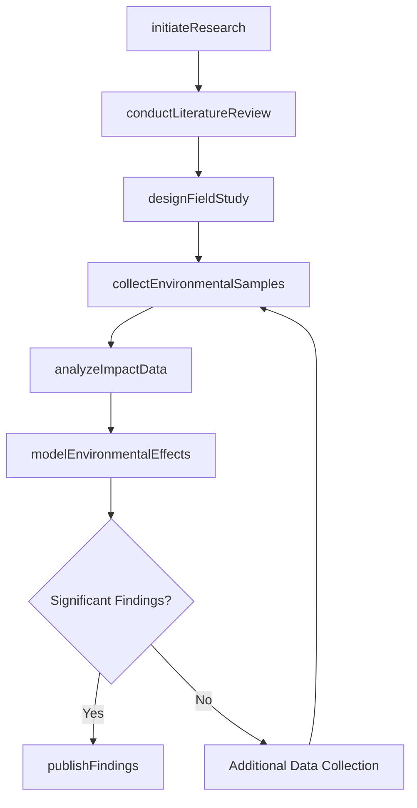
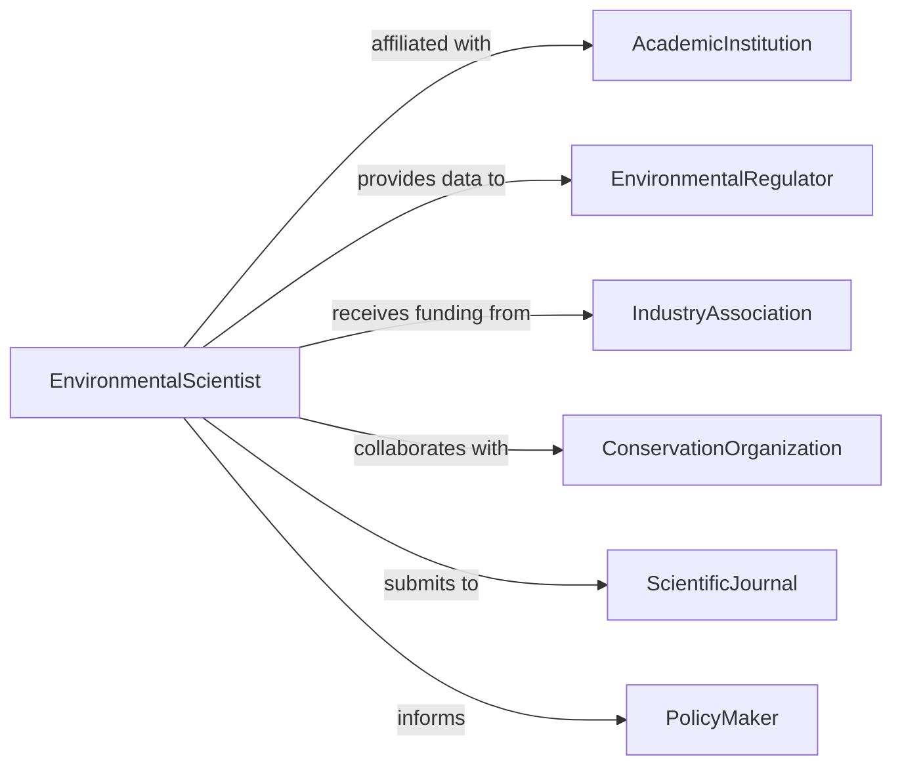

# Research Environmental Impact Industrial Development

> Business-as-Code definition for researching environmental impacts of industrial and development activities. Models scientific investigation, data collection, literature review, and impact analysis to inform environmental assessments, policy decisions, and sustainable development practices.

## Overview

Researching environmental impacts of industrial and development activities involves conducting scientific studies, reviewing academic literature, collecting field data, analyzing ecological effects, and publishing findings. Environmental scientists and researchers examine how manufacturing, construction, energy production, mining, and land development affect air quality, water resources, soil health, biodiversity, and climate. This definition supports environmental impact assessments, policy development, regulatory decisions, and corporate sustainability initiatives.

## Actors

| Actor | Description |
|-------|-------------|
| AcademicInstitution | Universities and research centers conducting environmental studies |
| EnvironmentalRegulator | Government agencies requiring impact research for permits |
| IndustryAssociation | Trade groups funding research on sectoral environmental impacts |
| ConservationOrganization | NGOs advocating for environmental protection and sustainability |
| ScientificJournal | Publishes peer-reviewed environmental research |
| PolicyMaker | Uses research findings to develop environmental regulations |

## Roles

| Role | Description |
|------|-------------|
| EnvironmentalScientist | Conducts research on industrial and development impacts |
| FieldResearcher | Collects environmental data from study sites |
| DataAnalyst | Processes and analyzes environmental measurements |
| LiteratureReviewer | Synthesizes existing research on environmental impacts |

## Entities

| Entity | Description |
|--------|-------------|
| ResearchProject | A scientific investigation of environmental impacts |
| LiteratureReview | A synthesis of existing research on a topic |
| FieldStudy | On-site data collection at impacted or control sites |
| EnvironmentalSample | Collected air, water, soil, or biological specimens |
| ImpactAnalysis | Statistical or modeling assessment of environmental effects |
| ResearchPublication | Peer-reviewed paper or report documenting findings |
| Dataset | Compiled environmental measurements and observations |

## Actions

| Action | Description |
|--------|-------------|
| initiateResearch | Define research questions and study design for environmental impacts |
| conductLiteratureReview | Synthesize existing scientific knowledge on the topic |
| designFieldStudy | Plan sampling locations, methods, and parameters |
| collectEnvironmentalSamples | Gather air, water, soil, or biological specimens |
| analyzeImpactData | Process measurements and assess statistical significance |
| modelEnvironmentalEffects | Simulate or project impacts using scientific models |
| publishFindings | Disseminate research through journals, reports, or conferences |

## Events

| Event | Description |
|-------|-------------|
| researchInitiated | A new environmental impact study has been started |
| literatureReviewConducted | Existing research has been synthesized |
| fieldStudyDesigned | Sampling plan and methods have been defined |
| environmentalSamplesCollected | Specimens have been gathered from study sites |
| impactDataAnalyzed | Measurements have been processed and assessed |
| environmentalEffectsModeled | Impacts have been simulated or projected |
| findingsPublished | Research has been disseminated publicly |

## Searches

| Search | Description |
|--------|-------------|
| findResearchProjects | List studies by topic, industry, or geographic region |
| getLiteratureReviews | Retrieve synthesized research by topic or publication date |
| getFieldStudies | Find on-site investigations by location or industry type |
| getImpactAnalyses | Locate statistical assessments by resource or effect type |
| getPublications | Search published research by author, journal, or keyword |

## Workflow



## Actor Relationships



## Usage

### Calling Actions

```typescript
import { researchEnvironmentalImpactIndustrialDevelopment } from '@headlessly/research-environmental-impact-industrial-development'

const research = researchEnvironmentalImpactIndustrialDevelopment()

// Initiate a research project on mining impacts
const project = await research.initiateResearch({
  title: 'Water Quality Impacts of Open-Pit Mining in the Sierra Nevada',
  researchQuestions: [
    'What is the extent of heavy metal contamination in downstream watersheds?',
    'How does pH vary with distance from mining operations?',
    'What are the effects on aquatic invertebrate communities?'
  ],
  fundingSource: 'National Science Foundation',
  principalInvestigator: 'Dr. Patricia Chen',
  duration: '3-years'
})

// Conduct literature review
await research.conductLiteratureReview({
  projectId: project.id,
  topics: ['mine-drainage', 'heavy-metal-toxicity', 'aquatic-ecology'],
  databases: ['Web of Science', 'Google Scholar', 'Environmental Science Database'],
  yearsReviewed: 20
})

// Design field study and collect samples
await research.designFieldStudy({
  projectId: project.id,
  samplingLocations: ['upstream-control', 'adjacent-to-mine', 'downstream-5km', 'downstream-20km'],
  parameters: ['pH', 'dissolved-oxygen', 'copper', 'lead', 'zinc', 'macroinvertebrates'],
  frequency: 'quarterly',
  duration: '2-years'
})

await research.collectEnvironmentalSamples({
  projectId: project.id,
  sampleDate: '2026-03-15',
  location: 'downstream-5km',
  samples: [
    { type: 'water', parameter: 'heavy-metals', method: 'ICP-MS' },
    { type: 'sediment', parameter: 'metal-accumulation', method: 'acid-digestion' },
    { type: 'biological', parameter: 'invertebrate-survey', method: 'kick-net' }
  ]
})

// Analyze data and publish findings
await research.analyzeImpactData({
  projectId: project.id,
  methods: ['ANOVA', 'regression-analysis', 'biodiversity-indices'],
  findings: 'Copper levels exceeded aquatic life criteria at downstream sites'
})
```

### Event-Driven Automation

```typescript
// Alert regulators when significant impacts are found
research.impactDataAnalyzed(async ({ projectId, findings }) => {
  if (findings.includes('exceeded') || findings.includes('significant')) {
    await notify({
      to: 'regional-water-quality-board',
      message: `Research project ${projectId} found significant environmental impacts requiring regulatory attention`
    })
  }
})

// Auto-submit findings for publication when modeling is complete
research.environmentalEffectsModeled(async ({ projectId }) => {
  await research.publishFindings({
    projectId,
    venues: ['Environmental Science & Technology', 'Water Resources Research']
  })
})
```
