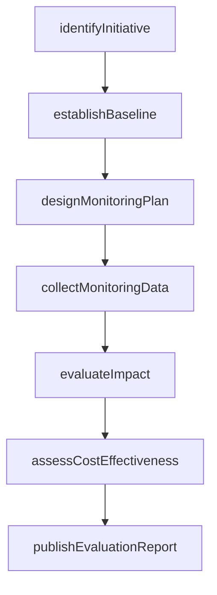
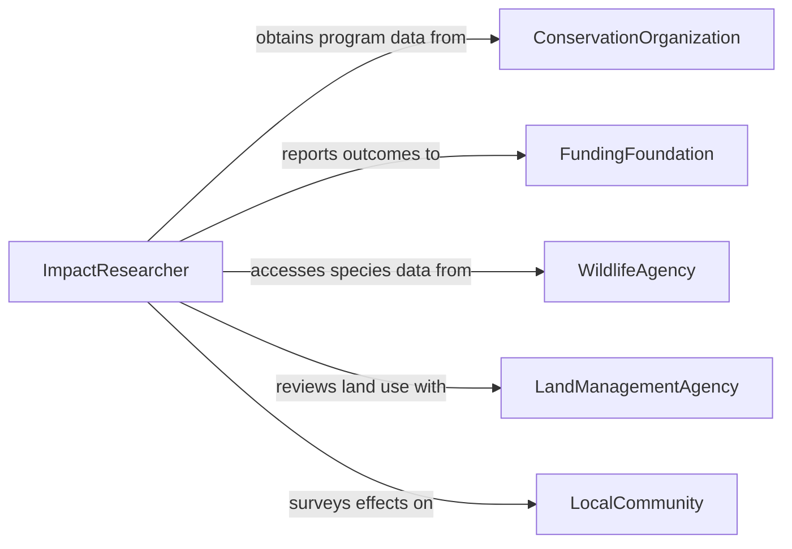

# Research Impacts of Environmental Conservation Initiatives

> Business-as-Code definition for researching impacts of environmental conservation initiatives. Models the workflow from initiative identification through baseline assessment, monitoring, impact evaluation, and reporting.

## Overview

Researching impacts of environmental conservation initiatives involves evaluating the effectiveness of programs such as habitat restoration, species recovery, pollution reduction, and sustainable land management in achieving their environmental objectives. Researchers establish baseline conditions, design monitoring programs, collect ecological and socioeconomic data, analyze outcomes against goals, and report findings to program managers and funders. This definition exposes actions for conservation impact research, events for evaluation milestones, and searches for retrieving impact data and assessments.

## Actors

| Actor | Description |
|-------|-------------|
| ConservationOrganization | Implements the initiative and provides program data |
| FundingFoundation | Finances the conservation program and requires impact reporting |
| WildlifeAgency | Manages species and habitat data relevant to the initiative |
| LandManagementAgency | Oversees protected areas and land use changes |
| AcademicPartner | Provides research expertise and analytical capabilities |
| LocalCommunity | Experiences the social and economic effects of conservation activities |

## Roles

| Role | Description |
|------|-------------|
| ImpactResearcher | Designs and conducts the impact evaluation study |
| EcologicalMonitor | Collects field data on species, habitats, and ecosystem health |
| SocioeconomicAnalyst | Assesses the human dimensions of conservation impacts |
| ProgramEvaluator | Synthesizes findings to determine whether the initiative met its goals |

## Entities

| Entity | Description |
|--------|-------------|
| ConservationInitiative | A defined program aimed at protecting or restoring environmental resources |
| BaselineAssessment | A measurement of conditions before the initiative began |
| MonitoringPlan | A schedule of data collection activities to track changes over time |
| EcologicalIndicator | A measurable parameter reflecting ecosystem health or species status |
| SocioeconomicSurvey | Data on how the initiative affects local livelihoods and communities |
| ImpactAssessment | An analysis comparing post-initiative conditions to the baseline |
| EvaluationReport | A comprehensive document summarizing findings and recommendations |

## Actions

| Action | Description |
|--------|-------------|
| identifyInitiative | Select the conservation program to evaluate |
| establishBaseline | Measure ecological and socioeconomic conditions before the initiative |
| designMonitoringPlan | Define indicators, sampling methods, and data collection schedules |
| collectMonitoringData | Gather ecological, hydrological, and socioeconomic measurements |
| evaluateImpact | Compare current conditions to baseline and program goals |
| assessCostEffectiveness | Analyze the relationship between resources invested and outcomes achieved |
| publishEvaluationReport | Document findings and recommendations for stakeholders |

## Events

| Event | Description |
|-------|-------------|
| initiativeIdentified | The conservation program to evaluate has been selected |
| baselineEstablished | Pre-initiative conditions have been measured and documented |
| monitoringPlanDesigned | Indicators and data collection schedules have been defined |
| monitoringDataCollected | Field and survey data have been gathered |
| impactEvaluated | Post-initiative conditions have been compared to the baseline |
| costEffectivenessAssessed | Investment-to-outcome ratios have been analyzed |
| evaluationReportPublished | Findings and recommendations have been documented |

## Searches

| Search | Description |
|--------|-------------|
| findInitiatives | Search conservation programs by type, region, or funder |
| getBaselineData | Retrieve pre-initiative measurements by site or indicator |
| getMonitoringData | Locate field data by indicator, date, or sampling location |
| getImpactAssessments | Find evaluations by initiative, outcome, or date |
| getEvaluationReports | List completed reports by program or evaluator |

## Workflow



## Actor Relationships



## Usage

### Calling Actions

```typescript
import { researchImpactsEnvironmentalConservationInitiatives } from '@headlessly/research-impacts-environmental-conservation-initiatives'

const impact = researchImpactsEnvironmentalConservationInitiatives()

// Identify the initiative and establish baseline
const initiative = await impact.identifyInitiative({
  programName: 'Chesapeake Bay Watershed Restoration Program',
  type: 'watershedRestoration',
  region: 'chesapeake-bay',
  startDate: '2020-01-01'
})

await impact.establishBaseline({
  initiativeId: initiative.id,
  indicators: ['waterClarity', 'dissolvedOxygen', 'submergedAquaticVegetation', 'blueClabPopulation'],
  baselineYear: 2019
})

// Design monitoring and collect data
await impact.designMonitoringPlan({
  initiativeId: initiative.id,
  frequency: 'quarterly',
  sites: ['upperBay', 'middleBay', 'lowerBay', 'tributaries'],
  duration: '5-years'
})

await impact.collectMonitoringData({
  initiativeId: initiative.id,
  period: { from: '2025-01-01', to: '2025-12-31' }
})
```

### Event-Driven Automation

```typescript
// Notify funder when evaluation report is published
impact.evaluationReportPublished(async ({ initiativeId, programName }) => {
  await notify({
    to: 'funding-foundation',
    message: `Impact evaluation report published for ${programName}`
  })
})

// Auto-evaluate impact when monitoring data is collected
impact.monitoringDataCollected(async ({ initiativeId }) => {
  await impact.evaluateImpact({ initiativeId })
})
```
