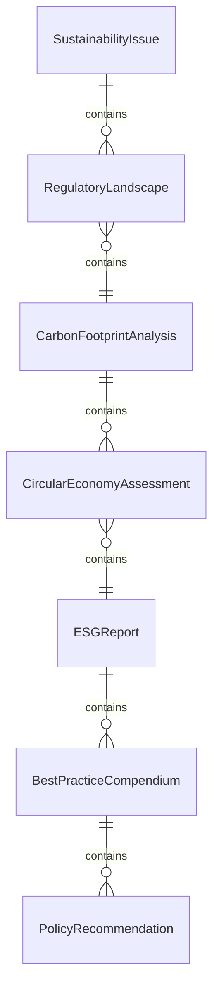
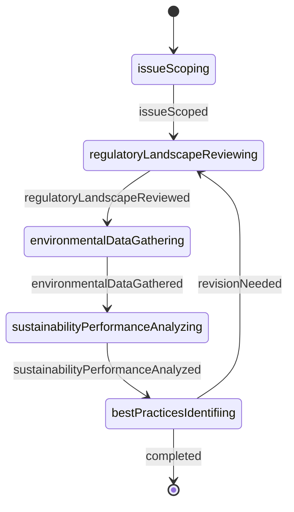
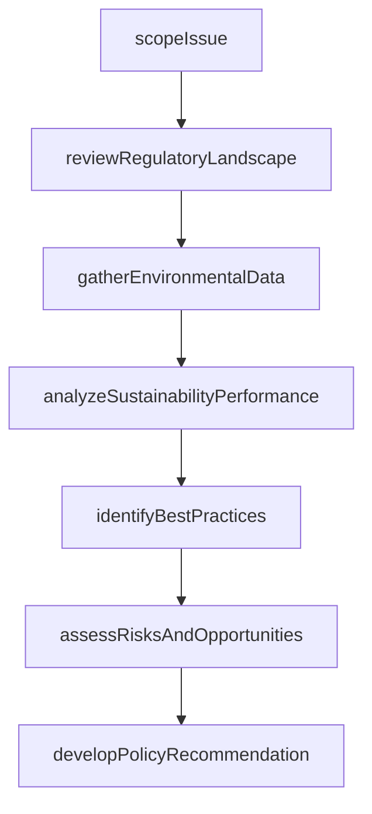
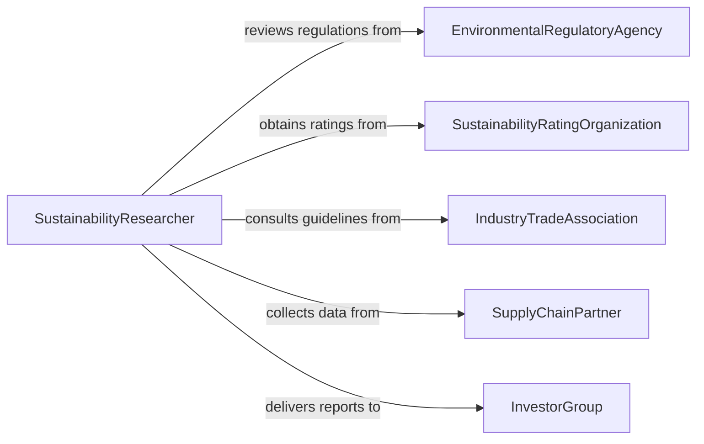

# Research Issues Related to the Environment or Sustainable Business Practices

> Business-as-Code definition for researching issues related to the environment or sustainable business practices. Models the workflow from issue scoping through literature review, data gathering, sustainability analysis, and policy recommendation.

## Overview

Researching issues related to the environment or sustainable business practices involves investigating topics such as carbon emissions, resource depletion, circular economy models, supply chain sustainability, environmental regulations, and corporate social responsibility to inform strategic decisions and compliance efforts. Researchers scope the issue, review regulatory and scientific literature, gather operational and environmental data, analyze sustainability performance, and develop recommendations for organizational policy. This definition exposes actions for sustainability research, events for investigation milestones, and searches for retrieving environmental and sustainability data.

## Actors

| Actor | Description |
|-------|-------------|
| EnvironmentalRegulatoryAgency | Sets environmental standards and compliance requirements |
| SustainabilityRatingOrganization | Publishes ESG ratings and sustainability benchmarks |
| IndustryTradeAssociation | Develops sector-specific sustainability guidelines and reporting frameworks |
| SupplyChainPartner | Provides data on upstream environmental practices and certifications |
| InvestorGroup | Demands sustainability disclosures and ESG performance data |
| NonGovernmentalOrganization | Advocates for environmental protection and monitors corporate practices |

## Roles

| Role | Description |
|------|-------------|
| SustainabilityResearcher | Investigates environmental issues and evaluates sustainable practices |
| EnvironmentalComplianceOfficer | Ensures organizational activities meet regulatory requirements |
| ESGAnalyst | Evaluates environmental, social, and governance performance metrics |
| PolicyAdvisor | Translates research findings into actionable organizational policies |

## Entities

| Entity | Description |
|--------|-------------|
| SustainabilityIssue | A defined environmental or business sustainability topic under investigation |
| RegulatoryLandscape | A summary of applicable environmental laws, standards, and reporting requirements |
| CarbonFootprintAnalysis | A quantification of greenhouse gas emissions from operations or supply chains |
| CircularEconomyAssessment | An evaluation of material reuse, recycling, and waste reduction practices |
| ESGReport | A disclosure document covering environmental, social, and governance performance |
| BestPracticeCompendium | A collection of proven sustainable business strategies from industry leaders |
| PolicyRecommendation | A proposed organizational policy or strategy based on research findings |

## Actions

| Action | Description |
|--------|-------------|
| scopeIssue | Define the environmental or sustainability topic and research boundaries |
| reviewRegulatoryLandscape | Examine applicable laws, standards, and reporting frameworks |
| gatherEnvironmentalData | Collect emissions, resource usage, waste, and biodiversity data |
| analyzeSustainabilityPerformance | Evaluate organizational practices against benchmarks and targets |
| identifyBestPractices | Research proven strategies from industry leaders and frameworks |
| assessRisksAndOpportunities | Evaluate environmental risks and strategic sustainability opportunities |
| developPolicyRecommendation | Propose organizational policies based on research conclusions |

## Events

| Event | Description |
|-------|-------------|
| issueScoped | The sustainability topic and research boundaries have been defined |
| regulatoryLandscapeReviewed | Applicable laws and reporting requirements have been examined |
| environmentalDataGathered | Emissions, resource, and waste data have been collected |
| sustainabilityPerformanceAnalyzed | Organizational practices have been evaluated against benchmarks |
| bestPracticesIdentified | Proven strategies from industry leaders have been documented |
| risksAndOpportunitiesAssessed | Environmental risks and strategic opportunities have been evaluated |
| policyRecommendationDeveloped | Organizational policy proposals have been formulated |

## Searches

| Search | Description |
|--------|-------------|
| findIssues | Search sustainability topics by sector, regulation, or priority |
| getRegulatoryRequirements | Retrieve applicable laws and standards by jurisdiction or topic |
| getEnvironmentalData | Locate emissions and resource data by facility, period, or metric |
| getBestPractices | Find proven strategies by industry, topic, or framework |
| getPolicyRecommendations | List proposals by issue, status, or expected impact |

## Entity Relationships



## State Diagram



## Workflow



## Actor Relationships



## Usage

### Calling Actions

```typescript
import { researchIssuesRelatedEnvironmentSustainable } from '@headlessly/research-issues-related-environment-sustainable'

const sustainability = researchIssuesRelatedEnvironmentSustainable()

// Scope the issue and review regulations
const issue = await sustainability.scopeIssue({
  topic: 'scope3SupplyChainEmissions',
  sector: 'consumerElectronics',
  urgency: 'high',
  drivers: ['euCsrd', 'investorPressure', 'customerDemand']
})

await sustainability.reviewRegulatoryLandscape({
  issueId: issue.id,
  jurisdictions: ['eu', 'us-california', 'uk'],
  frameworks: ['ghgProtocol', 'tcfd', 'sbti']
})

// Gather data and analyze
await sustainability.gatherEnvironmentalData({
  issueId: issue.id,
  sources: ['supplierSurveys', 'lifeCycleAssessments', 'emissionFactorDatabases'],
  metrics: ['scope3Emissions', 'materialIntensity', 'renewableEnergyShare']
})

await sustainability.analyzeSustainabilityPerformance({
  issueId: issue.id,
  benchmarks: ['industryAverage', 'sbtiTargets', 'peerGroup']
})
```

### Event-Driven Automation

```typescript
// Notify ESG analyst when performance analysis is complete
sustainability.sustainabilityPerformanceAnalyzed(async ({ issueId, gapToTarget }) => {
  await notify({
    to: 'esg-analyst',
    message: `Sustainability analysis complete for issue ${issueId}: gap to target is ${gapToTarget}%`
  })
})

// Auto-develop policy when risks are assessed
sustainability.risksAndOpportunitiesAssessed(async ({ issueId }) => {
  await sustainability.developPolicyRecommendation({ issueId })
})
```
