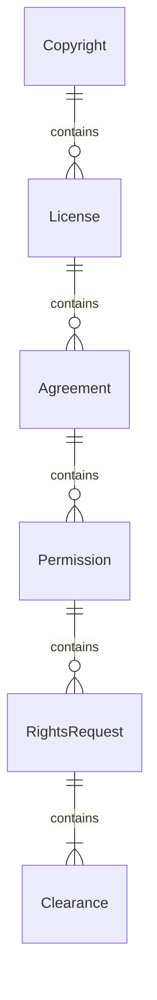
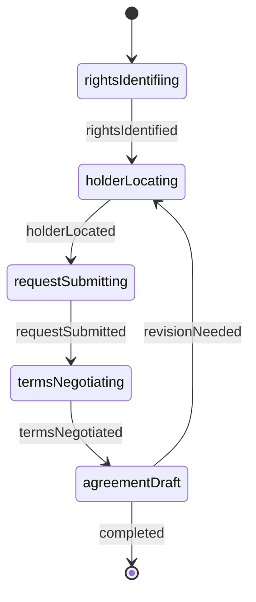
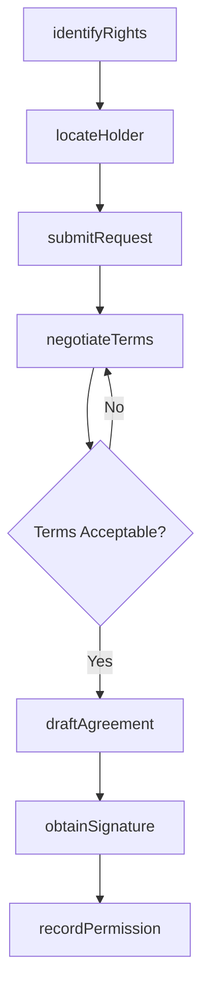
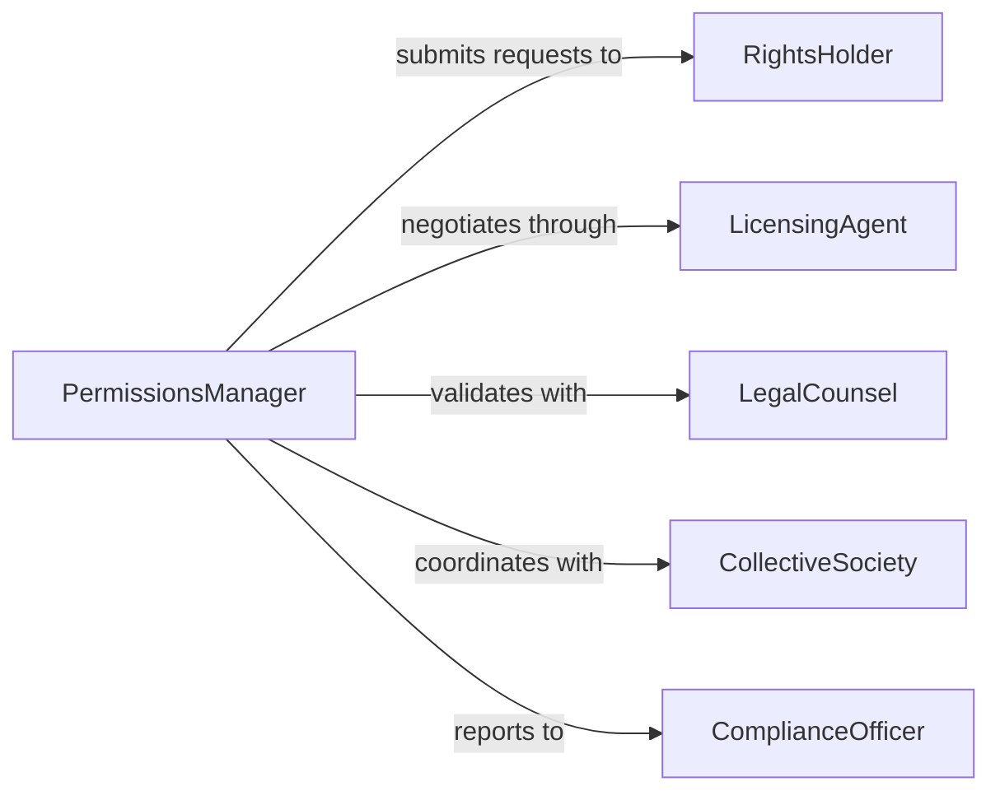

# Obtain Copyrights Legal Permissions

> Business-as-Code definition for obtaining copyrights and legal permissions. Models the complete process from identifying intellectual property needs through securing formal authorizations and managing licensing agreements.

## Overview

Obtaining copyrights and legal permissions involves identifying protected intellectual property, researching rights holders, negotiating terms, and securing formal authorizations. This definition provides actions for the entire permission lifecycle and events for tracking approval workflows.

## Actors

| Actor | Description |
|-------|-------------|
| RightsHolder | Owns intellectual property and grants permissions |
| LicensingAgent | Represents rights holders and negotiates terms |
| LegalCounsel | Reviews agreements and ensures compliance |
| CollectiveSociety | Manages bulk licensing for member rights |
| RegulatoryAgency | Enforces copyright law and dispute resolution |
| Vendor | Provides content or materials requiring permissions |

## Roles

| Role | Description |
|------|-------------|
| PermissionsManager | Oversees permission acquisition process |
| ComplianceOfficer | Ensures legal compliance with usage terms |
| ContractNegotiator | Negotiates licensing terms and fees |
| ContentCurator | Identifies materials requiring permissions |

## Entities

| Entity | Description |
|--------|-------------|
| Copyright | Legal protection for creative works |
| License | Formal permission to use protected material |
| Agreement | Contract defining usage rights and terms |
| Permission | Specific authorization for particular use |
| RightsRequest | Formal inquiry for intellectual property usage |
| Clearance | Verified approval for content usage |

## Actions

| Action | Description |
|--------|-------------|
| identifyRights | Determine what intellectual property needs clearance |
| locateHolder | Find the rights holder for protected material |
| submitRequest | File formal permission request with rights holder |
| negotiateTerms | Discuss licensing fees and usage conditions |
| draftAgreement | Create formal license or permission contract |
| obtainSignature | Secure authorized signature on agreement |
| recordPermission | Document permission in rights management system |

## Events

| Event | Description |
|-------|-------------|
| rightsIdentified | Protected material requiring permission was discovered |
| holderLocated | Rights holder contact information was found |
| requestSubmitted | Permission request was sent to rights holder |
| termsNegotiated | Licensing terms have been agreed upon |
| agreementDrafted | Contract document has been prepared |
| permissionGranted | Rights holder has formally authorized usage |
| clearanceRecorded | Permission is documented in compliance system |

## Searches

| Search | Description |
|--------|-------------|
| findPermissions | List all permissions by status or content type |
| getRightsHolders | Retrieve contact information for rights owners |
| getAgreements | Search license agreements by terms or date |
| getPendingRequests | Find permission requests awaiting response |

## Entity Relationships



## State Diagram



## Workflow



## Actor Relationships



## Usage

### Calling Actions

```typescript
import { obtainCopyrightsLegalPermissions } from '@headlessly/obtain-copyrights-legal-permissions'

const permissions = obtainCopyrightsLegalPermissions()

// Identify content requiring permissions
const rights = await permissions.identifyRights({
  contentType: 'photograph',
  usage: 'commercial publication',
  metadata: { source: 'Getty Images', imageId: 'IMG-12345' }
})

// Locate rights holder and submit request
const holder = await permissions.locateHolder({
  rightsId: rights.id,
  searchDatabases: ['USPTO', 'Copyright Office']
})

await permissions.submitRequest({
  holderId: holder.id,
  usage: 'Print and digital marketing materials',
  territory: 'North America',
  duration: '2 years'
})
```

### Event-Driven Automation

```typescript
// Auto-notify legal when permission is granted
permissions.permissionGranted(async ({ agreementId, rightsHolder }) => {
  await notify({
    to: 'legal-compliance@company.com',
    subject: 'New Permission Granted',
    message: `Permission from ${rightsHolder} has been authorized. Agreement ID: ${agreementId}`
  })
})

// Alert if permission request expires without response
permissions.requestSubmitted(async ({ requestId, submittedDate }) => {
  const expiryDate = addDays(submittedDate, 30)
  await scheduleAlert({
    date: expiryDate,
    action: 'followUpOnPermissionRequest',
    params: { requestId }
  })
})
```
