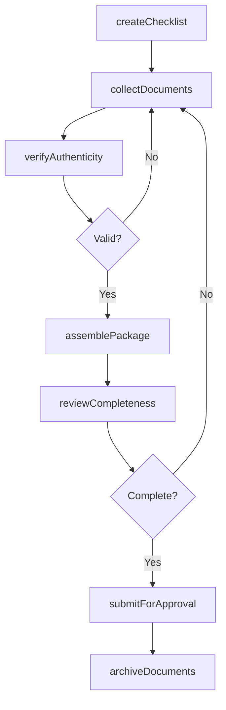
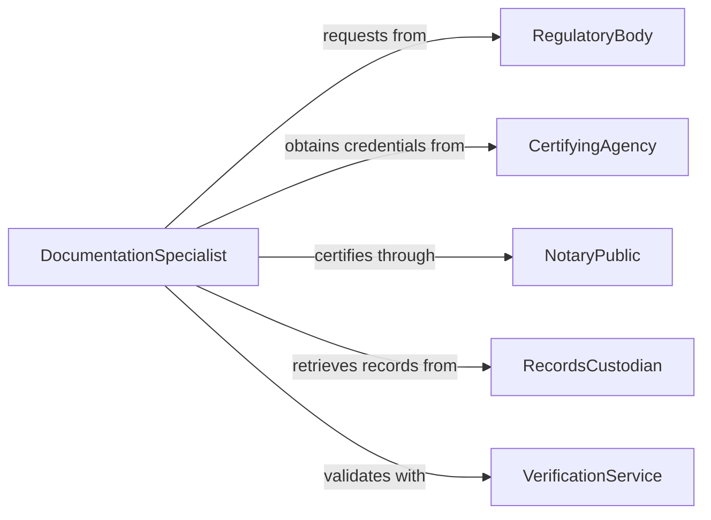

# Obtain Documentation Authorize Activities

> Business-as-Code definition for obtaining documentation necessary to authorize business activities. Models the documentation collection, verification, and approval process for operational and regulatory compliance.

## Overview

Obtaining authorization documentation involves identifying required documents, collecting supporting materials, verifying authenticity, and assembling complete authorization packages. This definition supports both internal authorization workflows and external regulatory documentation requirements.

## Actors

| Actor | Description |
|-------|-------------|
| RegulatoryBody | Issues compliance documentation and certifications |
| CertifyingAgency | Provides professional certifications and credentials |
| NotaryPublic | Authenticates and certifies document signatures |
| RecordsCustodian | Maintains official records and document archives |
| VerificationService | Validates document authenticity and accuracy |
| Stakeholder | Provides supporting documentation for authorization |

## Roles

| Role | Description |
|------|-------------|
| DocumentationSpecialist | Manages document collection and preparation |
| ComplianceManager | Ensures documentation meets requirements |
| Approver | Reviews and authorizes activity based on documentation |
| Requestor | Initiates documentation gathering for planned activity |

## Entities

| Entity | Description |
|--------|-------------|
| Document | Official record supporting authorization |
| Certificate | Formal credential or qualification document |
| Attestation | Sworn statement or verification of facts |
| Package | Complete set of documents for authorization |
| Verification | Confirmation of document validity |
| Checklist | List of required documentation items |

## Actions

| Action | Description |
|--------|-------------|
| createChecklist | Generate list of required documents |
| collectDocuments | Gather necessary documentation from sources |
| verifyAuthenticity | Confirm documents are genuine and current |
| assemblePackage | Compile complete documentation set |
| reviewCompleteness | Check all requirements are satisfied |
| submitForApproval | Present documentation to approving authority |
| archiveDocuments | Store approved documentation for records |

## Events

| Event | Description |
|-------|-------------|
| checklistCreated | Documentation requirements have been defined |
| documentsCollected | Required materials have been gathered |
| authenticityVerified | Documents have been confirmed as genuine |
| packageAssembled | Complete documentation set is ready |
| completenessReviewed | All requirements have been checked |
| approvalSubmitted | Documentation has been presented for authorization |
| documentsArchived | Approved records have been stored |

## Searches

| Search | Description |
|--------|-------------|
| findPackages | List documentation packages by status or activity |
| getRequiredDocs | Retrieve checklist of required documents |
| getMissingItems | Identify incomplete documentation requirements |
| getArchivedDocs | Search historical authorization documentation |

## Workflow



## Actor Relationships



## Usage

### Calling Actions

```typescript
import { obtainDocumentationAuthorizeActivities } from '@headlessly/obtain-documentation-authorize-activities'

const documentation = obtainDocumentationAuthorizeActivities()

// Create checklist of required documents
const checklist = await documentation.createChecklist({
  activity: 'International business expansion',
  jurisdiction: 'European Union',
  industry: 'Financial Services'
})

// Collect and verify documents
await documentation.collectDocuments({
  checklistId: checklist.id,
  sources: ['legal-records', 'finance-department', 'hr-files']
})

const verification = await documentation.verifyAuthenticity({
  checklistId: checklist.id,
  verificationMethods: ['apostille', 'notarization', 'digital-signature']
})
```

### Event-Driven Automation

```typescript
// Auto-submit when package is complete
documentation.completenessReviewed(async ({ packageId, isComplete }) => {
  if (isComplete) {
    await documentation.submitForApproval({
      packageId,
      submittedTo: 'regulatory-authority',
      priority: 'standard'
    })
  }
})

// Alert when documentation is missing
documentation.documentsCollected(async ({ checklistId }) => {
  const missing = await documentation.getMissingItems({ checklistId })
  if (missing.length > 0) {
    await notify({
      to: 'documentation-team@company.com',
      subject: 'Missing Authorization Documents',
      message: `${missing.length} required documents still needed: ${missing.join(', ')}`
    })
  }
})
```
