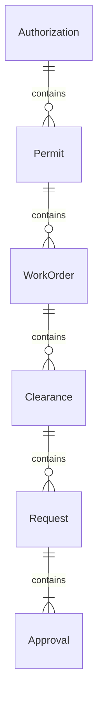
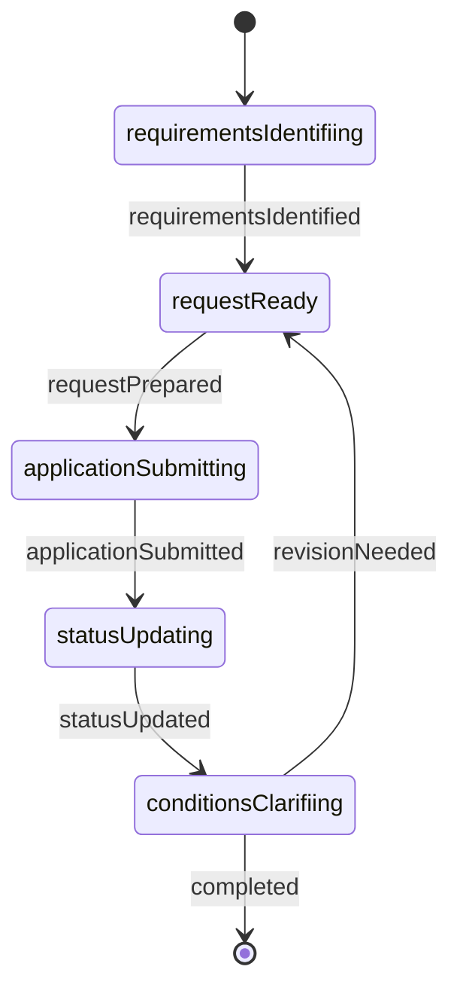
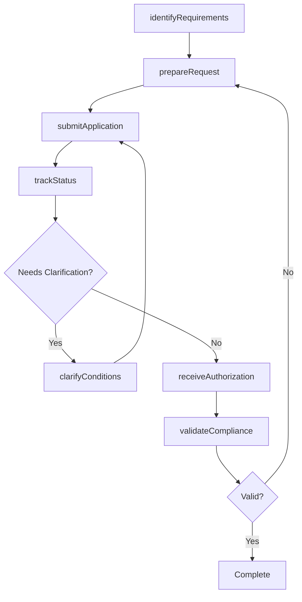
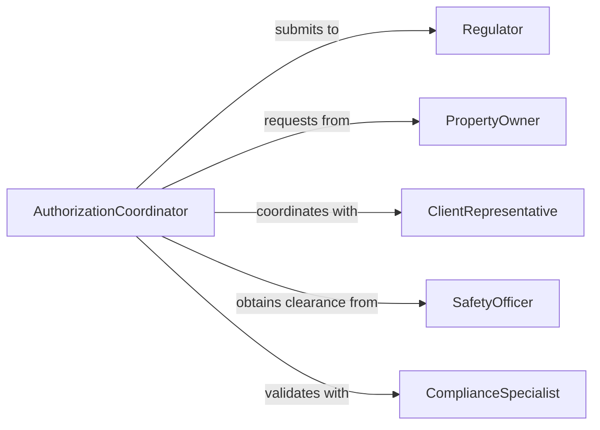

# Obtain Written Authorization Perform Activities

> Business-as-Code definition for obtaining written authorization to perform work activities. Models the process from identifying authorization requirements through securing formal approvals and maintaining compliance documentation.

## Overview

Obtaining written authorization involves identifying activities requiring approval, preparing authorization requests, routing through approval chains, and documenting formal permissions. This definition supports multiple authorization types including permits, work orders, safety clearances, and access approvals.

## Actors

| Actor | Description |
|-------|-------------|
| Regulator | Government or industry body issuing permits |
| PropertyOwner | Authorizes access to facilities or land |
| ClientRepresentative | Approves contracted work activities |
| SafetyOfficer | Certifies safety compliance for hazardous work |
| LegalCounsel | Reviews authorization documents for compliance |
| Insurer | Verifies insurance requirements are met |

## Roles

| Role | Description |
|------|-------------|
| AuthorizationCoordinator | Manages the authorization request process |
| ProjectManager | Requests authorization for planned activities |
| ComplianceSpecialist | Ensures all required approvals are obtained |
| FieldSupervisor | Executes authorized activities on-site |

## Entities

| Entity | Description |
|--------|-------------|
| Authorization | Formal permission to perform specific activity |
| Permit | Official document allowing regulated activity |
| WorkOrder | Approved instruction to begin work |
| Clearance | Safety or security approval for restricted work |
| Request | Formal application for activity authorization |
| Approval | Signed consent from authorized party |

## Actions

| Action | Description |
|--------|-------------|
| identifyRequirements | Determine what authorizations are needed |
| prepareRequest | Compile documentation for authorization application |
| submitApplication | File formal request with approving authority |
| trackStatus | Monitor approval progress through workflow |
| clarifyConditions | Address questions or requirements from approver |
| receiveAuthorization | Obtain signed approval document |
| validateCompliance | Verify authorization meets all requirements |

## Events

| Event | Description |
|-------|-------------|
| requirementsIdentified | Authorization needs have been determined |
| requestPrepared | Application documentation is complete |
| applicationSubmitted | Request has been filed with authority |
| statusUpdated | Approval workflow status has changed |
| conditionsClarified | Additional requirements have been addressed |
| authorizationReceived | Signed approval document was obtained |
| complianceValidated | Authorization meets all regulatory requirements |

## Searches

| Search | Description |
|--------|-------------|
| findAuthorizations | List authorizations by activity or status |
| getRequirements | Retrieve authorization requirements for activity type |
| getPendingRequests | Find applications awaiting approval |
| getExpiring | Identify authorizations nearing expiration |

## Entity Relationships



## State Diagram



## Workflow



## Actor Relationships



## Usage

### Calling Actions

```typescript
import { obtainWrittenAuthorizationPerformActivities } from '@headlessly/obtain-written-authorization-perform-activities'

const authorization = obtainWrittenAuthorizationPerformActivities()

// Identify what authorizations are needed
const requirements = await authorization.identifyRequirements({
  activity: 'Excavation for utility installation',
  location: '123 Main Street, Denver CO',
  duration: '2 weeks'
})

// Prepare and submit authorization request
const request = await authorization.prepareRequest({
  requirementId: requirements.id,
  documents: ['site-plan.pdf', 'insurance-cert.pdf', 'contractor-license.pdf'],
  requestedBy: 'John Smith',
  projectId: 'PROJ-2024-089'
})

await authorization.submitApplication({
  requestId: request.id,
  submittedTo: 'City Building Department'
})
```

### Event-Driven Automation

```typescript
// Auto-notify project team when authorization received
authorization.authorizationReceived(async ({ authorizationId, activity }) => {
  await notify({
    to: 'project-team@company.com',
    subject: 'Work Authorization Approved',
    message: `Authorization for ${activity} has been granted. You may proceed with work.`
  })
})

// Alert when authorizations are expiring soon
authorization.getExpiring(async (expiring) => {
  for (const auth of expiring) {
    if (auth.daysUntilExpiry < 30) {
      await createTask({
        assignee: 'authorization-coordinator',
        title: `Renew authorization for ${auth.activity}`,
        dueDate: auth.expiryDate
      })
    }
  }
})
```
