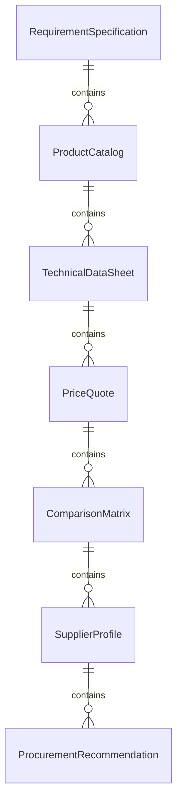
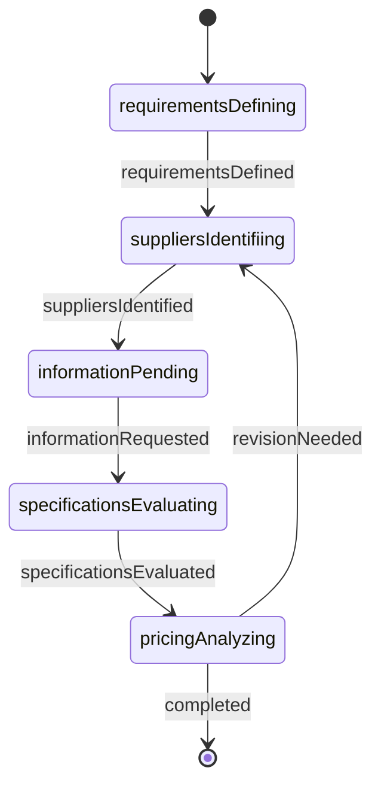
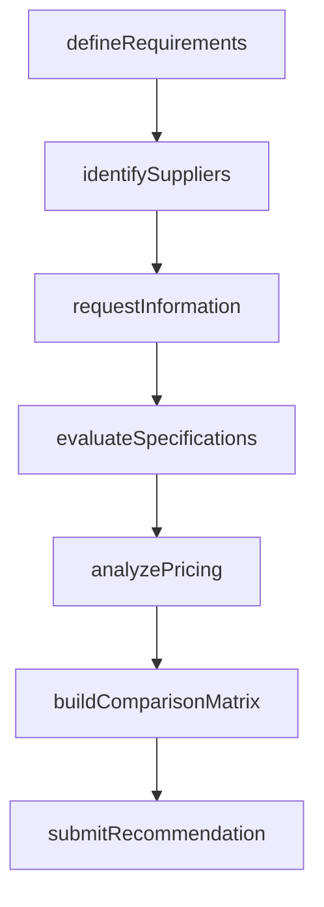
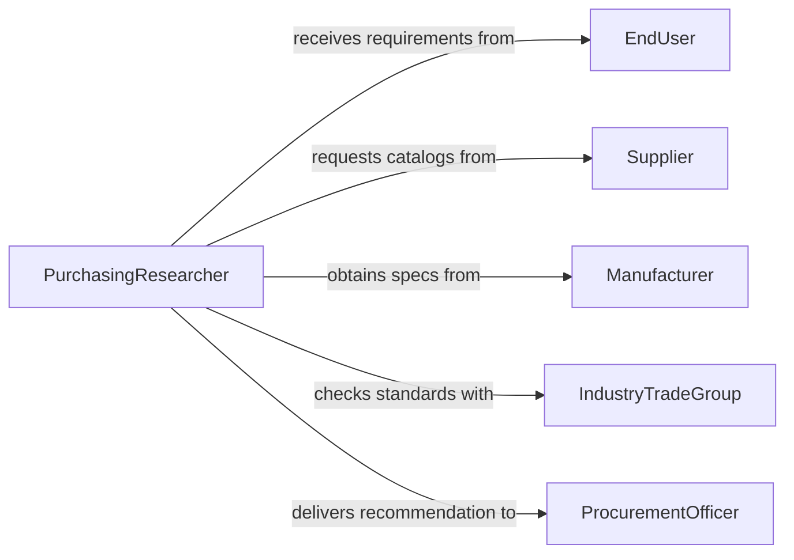

# Obtain Information About Goods or Services

> Business-as-Code definition for obtaining information about goods or services. Models the workflow from requirement definition through supplier research, specification gathering, comparison analysis, and procurement recommendation.

## Overview

Obtaining information about goods or services involves identifying what is needed, researching available suppliers and products, collecting specifications, pricing, availability, and terms, comparing options against requirements, and presenting findings to support procurement or purchasing decisions. This applies across purchasing, supply chain management, project planning, and consumer services. This definition exposes actions for product and service research, events for information-gathering milestones, and searches for retrieving supplier and product data.

## Actors

| Actor | Description |
|-------|-------------|
| Supplier | Provides product catalogs, pricing, and availability information |
| Manufacturer | Publishes technical specifications and product certifications |
| IndustryTradeGroup | Issues product standards, certifications, and supplier directories |
| ProcurementOfficer | Requests information to support purchasing decisions |
| EndUser | Specifies functional requirements and preferences for the goods or services |
| ContractingOffice | Sets terms and conditions for procurement agreements |

## Roles

| Role | Description |
|------|-------------|
| PurchasingResearcher | Identifies sources and gathers product and service information |
| SpecificationsAnalyst | Evaluates technical details against requirements |
| CostAnalyst | Compares pricing, total cost of ownership, and value across options |
| ProcurementAdvisor | Synthesizes findings and recommends suppliers or products |

## Entities

| Entity | Description |
|--------|-------------|
| RequirementSpecification | A statement of what the goods or services must provide |
| ProductCatalog | A supplier's listing of available items with descriptions and pricing |
| TechnicalDataSheet | Detailed specifications, certifications, and performance characteristics |
| PriceQuote | A supplier's formal offer including pricing, terms, and lead time |
| ComparisonMatrix | A side-by-side evaluation of options against requirements |
| SupplierProfile | Background information on a vendor's capabilities and track record |
| ProcurementRecommendation | A documented suggestion for which goods or services to acquire |

## Actions

| Action | Description |
|--------|-------------|
| defineRequirements | Specify what the goods or services must provide |
| identifySuppliers | Research and compile a list of potential vendors |
| requestInformation | Ask suppliers for catalogs, specifications, and pricing |
| evaluateSpecifications | Compare technical details against the defined requirements |
| analyzePricing | Review costs, terms, and total cost of ownership |
| buildComparisonMatrix | Create a structured evaluation of all options |
| submitRecommendation | Present findings and a recommended course of action |

## Events

| Event | Description |
|-------|-------------|
| requirementsDefined | The specifications for needed goods or services have been stated |
| suppliersIdentified | Potential vendors have been researched and listed |
| informationRequested | Suppliers have been asked for catalogs and pricing |
| specificationsEvaluated | Technical details have been compared against requirements |
| pricingAnalyzed | Costs and terms have been reviewed across options |
| comparisonMatrixBuilt | A structured evaluation of all options has been created |
| recommendationSubmitted | Findings and a procurement suggestion have been presented |

## Searches

| Search | Description |
|--------|-------------|
| findSuppliers | Search vendors by product category, location, or certification |
| getProductCatalogs | Retrieve catalogs by supplier, category, or keyword |
| getPriceQuotes | List quotes by supplier, product, or date |
| getComparisonMatrices | Locate evaluations by requirement, project, or analyst |
| getRecommendations | Find procurement recommendations by project or status |

## Entity Relationships



## State Diagram



## Workflow



## Actor Relationships



## Usage

### Calling Actions

```typescript
import { obtainInformationAboutGoodsServices } from '@headlessly/obtain-information-about-goods-services'

const procurement = obtainInformationAboutGoodsServices()

// Define requirements for industrial HVAC equipment
const requirements = await procurement.defineRequirements({
  projectId: 'facility-upgrade-2026',
  category: 'commercialHVAC',
  specifications: {
    coolingCapacity: '50-ton',
    energyRating: 'SEER-20-minimum',
    refrigerant: 'R-454B',
    warranty: '10-year-compressor'
  }
})

// Identify suppliers and request information
const suppliers = await procurement.identifySuppliers({
  requirementsId: requirements.id,
  criteria: { certification: 'AHRI', territory: 'north-america' }
})

await procurement.requestInformation({
  supplierIds: suppliers.map(s => s.id),
  requested: ['technicalDataSheets', 'pricing', 'leadTimes', 'references']
})

// Build comparison and recommend
const matrix = await procurement.buildComparisonMatrix({
  requirementsId: requirements.id,
  criteria: ['technicalFit', 'price', 'leadTime', 'warranty', 'energyEfficiency']
})
```

### Event-Driven Automation

```typescript
// Notify procurement officer when comparison is ready
procurement.comparisonMatrixBuilt(async ({ projectId, optionCount }) => {
  await notify({
    to: 'procurement-officer',
    message: `Comparison of ${optionCount} options ready for project ${projectId}`
  })
})

// Auto-build comparison when all pricing is analyzed
procurement.pricingAnalyzed(async ({ requirementsId }) => {
  await procurement.buildComparisonMatrix({ requirementsId })
})
```
