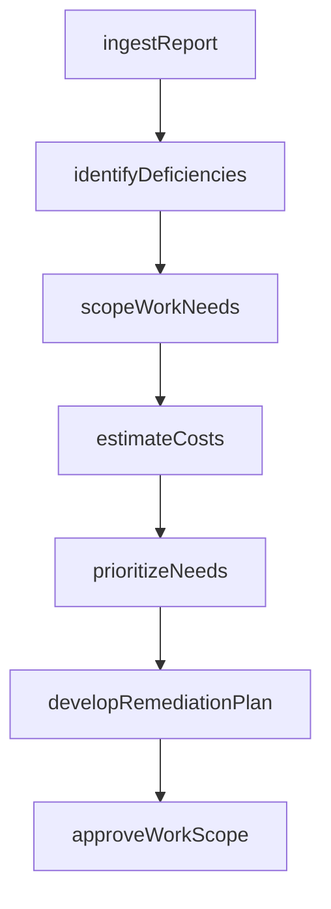
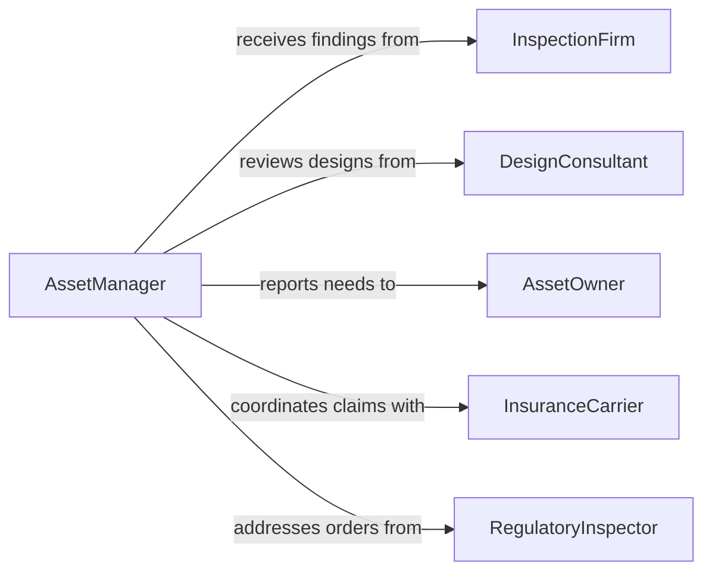

# Evaluate Reports or Designs to Determine Work Needs

> Business-as-Code definition for evaluating reports or designs to determine work needs. Models the workflow from report intake through gap analysis, work scoping, and remediation planning.

## Overview

Evaluating reports or designs to determine work needs involves analyzing inspection reports, engineering assessments, condition surveys, and design proposals to identify deficiencies, required upgrades, or new construction scope. This process converts diagnostic findings into prioritized work items with estimated costs and timelines. This definition exposes actions for evaluation and scoping, events for work discovery, and searches for retrieving assessment data.

## Actors

| Actor | Description |
|-------|-------------|
| InspectionFirm | Produces condition reports and deficiency assessments |
| DesignConsultant | Submits engineering designs and feasibility studies |
| AssetOwner | Commissions evaluations and authorizes resulting work |
| InsuranceCarrier | Reviews findings that affect coverage or claims |
| RegulatoryInspector | Issues compliance orders based on reported deficiencies |
| CostEstimatingService | Provides independent cost projections for identified work |

## Roles

| Role | Description |
|------|-------------|
| AssetManager | Evaluates reports and prioritizes work across the portfolio |
| FacilityEngineer | Assesses technical feasibility of identified work items |
| BudgetAnalyst | Estimates costs and aligns work needs with available funding |
| ProgramCoordinator | Integrates work needs into capital improvement programs |

## Entities

| Entity | Description |
|--------|-------------|
| AssessmentReport | A document detailing findings from an inspection or evaluation |
| DesignProposal | An engineering design submitted for evaluation |
| Deficiency | A specific condition requiring correction or improvement |
| WorkNeed | A scoped work item derived from report or design findings |
| CostEstimate | A projected cost for addressing a work need |
| PriorityScore | A ranking value based on urgency, safety, and impact |
| RemediationPlan | A strategy for addressing identified deficiencies |

## Actions

| Action | Description |
|--------|-------------|
| ingestReport | Import an assessment report or design proposal for evaluation |
| identifyDeficiencies | Extract specific conditions requiring action from a report |
| scopeWorkNeeds | Define the work items needed to address each deficiency |
| estimateCosts | Project costs for labor, materials, and services per work item |
| prioritizeNeeds | Rank work needs by urgency, safety risk, and strategic value |
| developRemediationPlan | Create a phased strategy for addressing prioritized work needs |
| approveWorkScope | Authorize the identified work needs for inclusion in programs |

## Events

| Event | Description |
|-------|-------------|
| reportIngested | An assessment report or design proposal has been imported |
| deficienciesIdentified | Conditions requiring action have been extracted |
| workNeedsScoped | Work items have been defined for identified deficiencies |
| costsEstimated | Cost projections have been calculated for work items |
| needsPrioritized | Work needs have been ranked by urgency and impact |
| remediationPlanDeveloped | A phased remediation strategy has been created |
| workScopeApproved | Identified work needs have been authorized for execution |

## Searches

| Search | Description |
|--------|-------------|
| findReports | Search assessment reports by facility, date, or finding type |
| getDeficiencies | Retrieve deficiencies by severity, system, or location |
| getWorkNeeds | List scoped work items by priority, cost, or status |
| getCostEstimates | Find cost projections by work item or funding source |
| getRemediationPlans | Retrieve remediation strategies by facility or program |

## Workflow



## Actor Relationships



## Usage

### Calling Actions

```typescript
import { evaluateReportsDesignsDetermineWork } from '@headlessly/evaluate-reports-designs-determine-work'

const evaluator = evaluateReportsDesignsDetermineWork()

// Ingest a bridge inspection report
const report = await evaluator.ingestReport({
  facilityId: 'bridge-441',
  reportType: 'biennial-inspection',
  inspectorId: 'smith-eng-inc',
  documentUrl: 'https://reports.example.com/bridge-441-2026.pdf'
})

// Identify deficiencies from the report
const deficiencies = await evaluator.identifyDeficiencies({
  reportId: report.id,
  severityThreshold: 'moderate'
})

// Scope and estimate work needs
for (const deficiency of deficiencies) {
  const workNeed = await evaluator.scopeWorkNeeds({ deficiencyId: deficiency.id })
  await evaluator.estimateCosts({ workNeedId: workNeed.id, rateYear: 2026 })
}
```

### Event-Driven Automation

```typescript
// Alert asset owner when high-priority needs are identified
evaluator.needsPrioritized(async ({ facilityId, criticalCount }) => {
  if (criticalCount > 0) {
    await notify({
      to: 'asset-owner',
      message: `${criticalCount} critical work needs identified at ${facilityId}`
    })
  }
})

// Auto-develop remediation plan after costs are estimated
evaluator.costsEstimated(async ({ facilityId, totalCost }) => {
  await evaluator.developRemediationPlan({
    facilityId,
    budget: totalCost,
    phases: 3
  })
})
```
