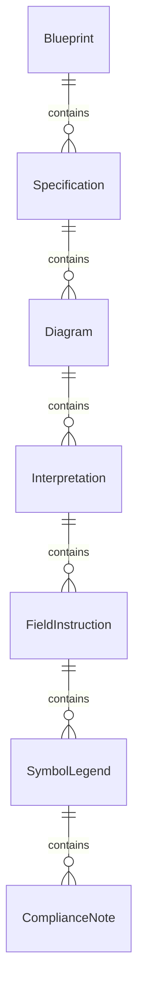
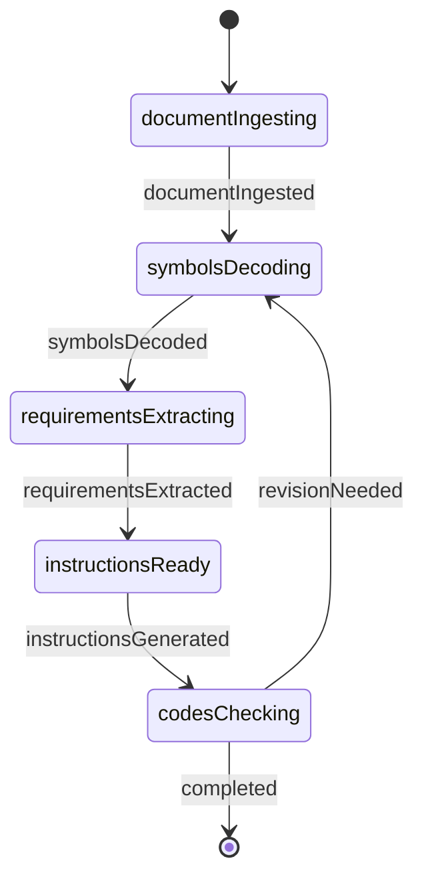
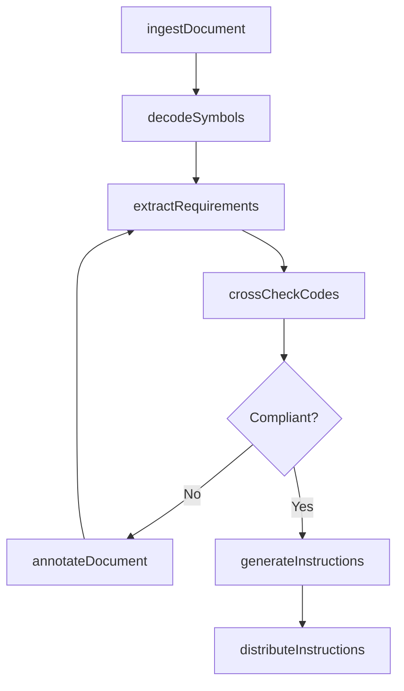
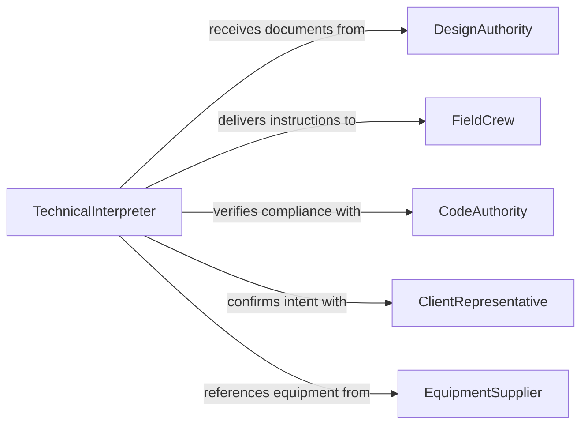

# Interpret Blueprints, Specifications, or Diagrams to Inform Activities

> Business-as-Code definition for interpreting blueprints, specifications, or diagrams to inform installation, development, or operation activities. Models the workflow from document ingestion through interpretation, instruction generation, and field-ready output preparation.

## Overview

Interpreting blueprints, specifications, or diagrams to inform installation, development, or operation activities involves translating technical drawings, schematics, process flow diagrams, and specification documents into clear, actionable instructions for field crews, developers, or operators. This process bridges the gap between engineering design and practical execution. This definition exposes actions for document interpretation, events for instruction readiness, and searches for retrieving interpreted data.

## Actors

| Actor | Description |
|-------|-------------|
| DesignAuthority | Produces the blueprints, specifications, and diagrams |
| FieldCrew | Receives interpreted instructions for on-site execution |
| InspectionAgency | Verifies that executed work matches the interpreted plans |
| EquipmentSupplier | Provides components referenced in the technical documents |
| CodeAuthority | Establishes standards that inform interpretation requirements |
| ClientRepresentative | Confirms that interpretations align with project intent |

## Roles

| Role | Description |
|------|-------------|
| TechnicalInterpreter | Reads and translates engineering documents into field instructions |
| InstallationLead | Uses interpreted information to guide installation activities |
| DevelopmentEngineer | Applies diagram interpretations to system development work |
| OperationsSpecialist | Translates operational diagrams into standard procedures |

## Entities

| Entity | Description |
|--------|-------------|
| Blueprint | A scaled technical drawing with dimensions and annotations |
| Specification | A written standard defining materials, methods, and acceptance criteria |
| Diagram | A schematic such as a wiring diagram, P&ID, or process flow |
| Interpretation | A translated summary of key requirements from a technical document |
| FieldInstruction | A practical directive derived from an interpreted document |
| SymbolLegend | A reference guide for symbols and abbreviations used in diagrams |
| ComplianceNote | A code or standard requirement identified during interpretation |

## Actions

| Action | Description |
|--------|-------------|
| ingestDocument | Import a blueprint, specification, or diagram for interpretation |
| decodeSymbols | Identify and translate technical symbols and abbreviations |
| extractRequirements | Pull dimensional, material, and procedural requirements |
| generateInstructions | Produce field-ready instructions from interpreted requirements |
| crossCheckCodes | Verify interpretation against applicable codes and standards |
| annotateDocument | Add clarifying notes or highlights to the original document |
| distributeInstructions | Deliver finalized instructions to field crews or operators |

## Events

| Event | Description |
|-------|-------------|
| documentIngested | A blueprint, specification, or diagram has been imported |
| symbolsDecoded | Technical symbols and abbreviations have been translated |
| requirementsExtracted | Dimensional, material, and procedural needs have been pulled |
| instructionsGenerated | Field-ready instructions have been produced |
| codesChecked | Interpretation has been verified against applicable standards |
| documentAnnotated | Clarifying notes have been added to the original document |
| instructionsDistributed | Finalized instructions have been delivered to execution teams |

## Searches

| Search | Description |
|--------|-------------|
| findDocuments | Search blueprints, specs, or diagrams by project or discipline |
| getInterpretations | Retrieve translated summaries by document or requirement type |
| getFieldInstructions | List instructions by project, trade, or distribution status |
| getSymbolLegends | Find symbol references by diagram type or standard |
| getComplianceNotes | Retrieve code requirements identified during interpretation |

## Entity Relationships



## State Diagram



## Workflow



## Actor Relationships



## Usage

### Calling Actions

```typescript
import { interpretBlueprintsSpecificationsDiagramsInform } from '@headlessly/interpret-blueprints-specifications-diagrams-inform'

const interpreter = interpretBlueprintsSpecificationsDiagramsInform()

// Ingest an electrical wiring diagram
const diagram = await interpreter.ingestDocument({
  projectId: 'datacenter-expansion',
  type: 'wiringDiagram',
  documentUrl: 'https://drawings.example.com.ai/dc-elec-sheet-E4.pdf'
})

// Decode symbols and extract requirements
await interpreter.decodeSymbols({ documentId: diagram.id })
const requirements = await interpreter.extractRequirements({
  documentId: diagram.id,
  categories: ['circuitLoads', 'conduitRouting', 'panelSchedule']
})

// Generate and distribute field instructions
const instructions = await interpreter.generateInstructions({
  documentId: diagram.id,
  audience: 'electrical-crew',
  format: 'stepByStep'
})
await interpreter.distributeInstructions({
  instructionId: instructions.id,
  recipients: ['electrical-foreman', 'apprentice-team']
})
```

### Event-Driven Automation

```typescript
// Notify field crew when instructions are distributed
interpreter.instructionsDistributed(async ({ projectId, recipients }) => {
  await notify({
    to: recipients,
    message: `New field instructions available for project ${projectId}`
  })
})

// Flag non-compliant interpretations for review
interpreter.codesChecked(async ({ documentId, violations }) => {
  if (violations.length > 0) {
    await notify({
      to: 'code-compliance',
      message: `${violations.length} code issues found in document ${documentId}`
    })
  }
})
```
