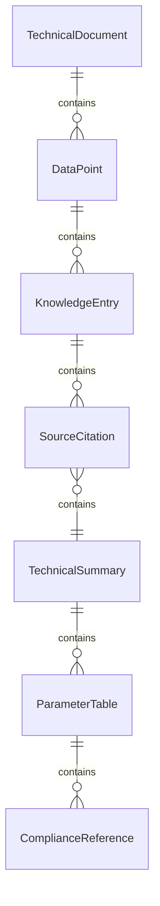
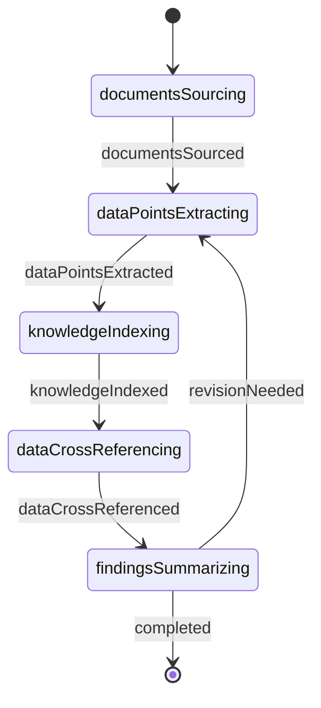
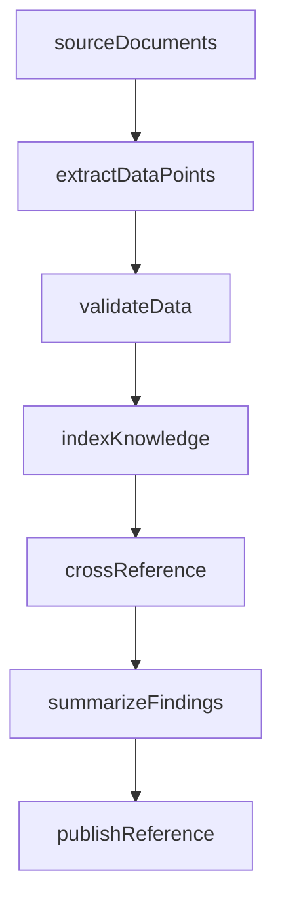
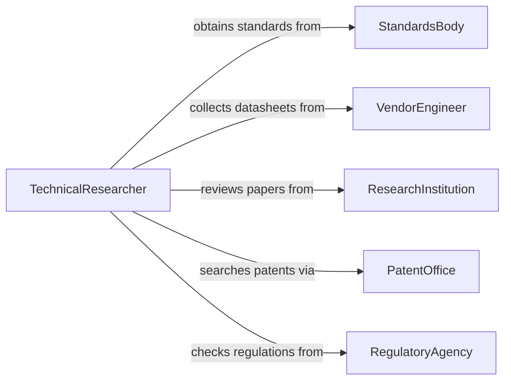

# Read Documents to Gather Technical Information

> Business-as-Code definition for reading documents to gather technical information. Models the workflow from document sourcing through data extraction, knowledge indexing, and technical reference preparation.

## Overview

Reading documents to gather technical information involves reviewing datasheets, white papers, standards documents, research publications, and vendor specifications to collect facts, parameters, and reference data needed for engineering, scientific, or operational decisions. This definition exposes actions for systematic document review, events for information capture milestones, and searches for retrieving indexed technical knowledge.

## Actors

| Actor | Description |
|-------|-------------|
| StandardsBody | Publishes industry standards such as ISO, ANSI, or IEEE documents |
| VendorEngineer | Provides product datasheets and application notes |
| ResearchInstitution | Produces technical papers and experimental findings |
| PatentOffice | Maintains patent databases with detailed technical disclosures |
| TechnicalPublisher | Distributes handbooks, reference guides, and journals |
| RegulatoryAgency | Issues technical regulations and compliance guidance |

## Roles

| Role | Description |
|------|-------------|
| TechnicalResearcher | Reads and synthesizes information from multiple technical sources |
| SystemsEngineer | Gathers specifications to inform design and integration decisions |
| TechnicalWriter | Compiles gathered information into structured reference materials |
| KnowledgeManager | Indexes and organizes technical data for retrieval |

## Entities

| Entity | Description |
|--------|-------------|
| TechnicalDocument | A datasheet, standard, paper, or specification under review |
| DataPoint | A discrete fact, measurement, or parameter extracted from a document |
| KnowledgeEntry | An indexed piece of technical information stored for reference |
| SourceCitation | A bibliographic reference linking data to its origin document |
| TechnicalSummary | A condensed overview of key findings from a set of documents |
| ParameterTable | A structured collection of specifications or measurements |
| ComplianceReference | A regulatory requirement extracted from guidance documents |

## Actions

| Action | Description |
|--------|-------------|
| sourceDocuments | Identify and acquire relevant technical documents for review |
| extractDataPoints | Pull specific facts, parameters, or measurements from a document |
| indexKnowledge | Catalog extracted information for structured retrieval |
| crossReference | Link related data points across multiple documents |
| summarizeFindings | Produce a condensed overview of gathered technical information |
| validateData | Confirm accuracy of extracted data against authoritative sources |
| publishReference | Make compiled technical information available to the team |

## Events

| Event | Description |
|-------|-------------|
| documentsSourced | Relevant technical documents have been identified and acquired |
| dataPointsExtracted | Specific facts or parameters have been pulled from a document |
| knowledgeIndexed | Extracted information has been cataloged for retrieval |
| dataCrossReferenced | Related data points have been linked across documents |
| findingsSummarized | A condensed overview of gathered information has been produced |
| dataValidated | Extracted data has been confirmed against authoritative sources |
| referencePublished | Compiled technical information has been made available |

## Searches

| Search | Description |
|--------|-------------|
| findDocuments | Search technical documents by subject, standard, or publisher |
| getDataPoints | Retrieve extracted parameters by document, topic, or unit |
| getKnowledgeEntries | List indexed information by category or keyword |
| getCitations | Find source citations by author, document, or date |
| searchParameters | Locate specific technical measurements or specifications |

## Entity Relationships



## State Diagram



## Workflow



## Actor Relationships



## Usage

### Calling Actions

```typescript
import { readDocumentsGatherTechnicalInformation } from '@headlessly/read-documents-gather-technical-information'

const techInfo = readDocumentsGatherTechnicalInformation()

// Source documents on a specific topic
const docs = await techInfo.sourceDocuments({
  topic: 'thermal conductivity of aerospace alloys',
  sources: ['astm', 'nasa-techreports', 'vendor-datasheets'],
  dateRange: { from: '2020-01-01', to: '2026-12-31' }
})

// Extract data points from a specific document
const dataPoints = await techInfo.extractDataPoints({
  documentId: docs[0].id,
  parameters: ['thermalConductivity', 'meltingPoint', 'tensileStrength']
})

// Summarize findings across all gathered documents
const summary = await techInfo.summarizeFindings({
  documentIds: docs.map(d => d.id),
  format: 'parameterComparison'
})
```

### Event-Driven Automation

```typescript
// Notify the systems engineer when new data points are extracted
techInfo.dataPointsExtracted(async ({ documentId, dataPoints }) => {
  await notify({
    to: 'systems-engineering',
    message: `${dataPoints.length} parameters extracted from document ${documentId}`
  })
})

// Auto-publish reference when summary is complete
techInfo.findingsSummarized(async ({ summaryId, topic }) => {
  await techInfo.publishReference({ summaryId, audience: 'engineering-team' })
})
```
