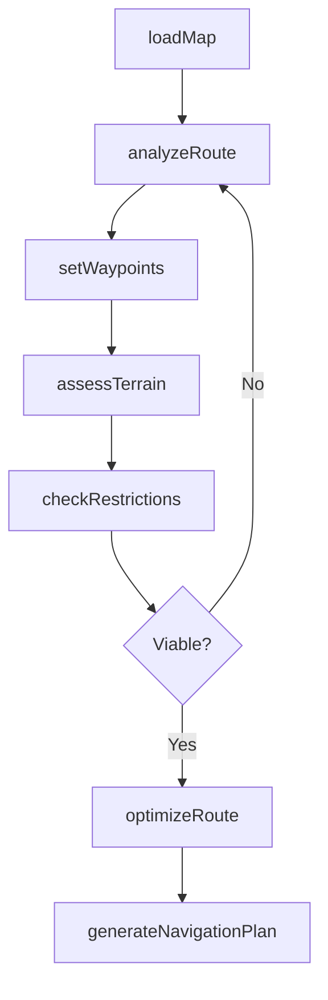
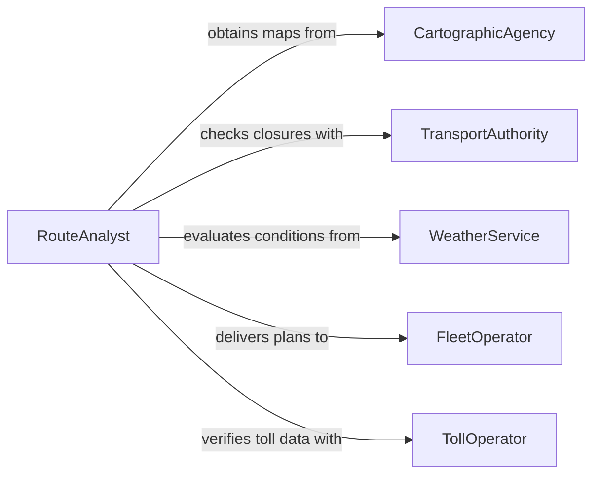

# Read Maps to Determine Routes

> Business-as-Code definition for reading maps to determine routes. Models the workflow from map acquisition through route analysis, waypoint selection, and navigation plan generation.

## Overview

Reading maps to determine routes involves interpreting cartographic data, topographic features, road networks, and geographic information to plan optimal paths between locations. This includes evaluating distance, terrain, road conditions, and regulatory restrictions. This definition exposes actions for route analysis, events for route planning milestones, and searches for map and waypoint data.

## Actors

| Actor | Description |
|-------|-------------|
| CartographicAgency | Provides official maps, charts, and geospatial data |
| TransportAuthority | Publishes road classifications, weight limits, and closures |
| WeatherService | Supplies conditions that affect route viability |
| FleetOperator | Requests route plans for vehicle dispatching |
| TollOperator | Manages toll roads and electronic pass systems |
| EmergencyServices | Issues detour advisories and road closure notices |

## Roles

| Role | Description |
|------|-------------|
| RouteAnalyst | Interprets maps and determines optimal travel paths |
| Dispatcher | Assigns routes to drivers or operators |
| NavigationOfficer | Plans routes for maritime, aviation, or overland operations |
| LogisticsPlanner | Integrates route data into supply chain scheduling |

## Entities

| Entity | Description |
|--------|-------------|
| Map | A cartographic document or digital geospatial dataset |
| Route | A planned path from origin to destination with waypoints |
| Waypoint | A geographic coordinate marking a turn, stop, or checkpoint |
| RoadSegment | A portion of road with specific attributes such as speed limit |
| TerrainFeature | A geographic element such as elevation, water body, or gradient |
| Restriction | A regulatory or physical constraint on a route segment |
| NavigationPlan | A finalized route document with turn-by-turn instructions |

## Actions

| Action | Description |
|--------|-------------|
| loadMap | Import a map or geospatial dataset for analysis |
| analyzeRoute | Evaluate a candidate path for distance, time, and feasibility |
| setWaypoints | Define intermediate stops or checkpoints along a route |
| assessTerrain | Evaluate topographic and surface conditions for a path |
| checkRestrictions | Verify regulatory limits such as weight, height, or hazmat on segments |
| optimizeRoute | Adjust the path for shortest distance, fastest time, or lowest cost |
| generateNavigationPlan | Produce a finalized route document with instructions |

## Events

| Event | Description |
|-------|-------------|
| mapLoaded | A map or dataset has been imported for analysis |
| routeAnalyzed | A candidate route has been evaluated |
| waypointsSet | Intermediate stops have been defined on a route |
| terrainAssessed | Topographic conditions have been evaluated |
| restrictionsChecked | Regulatory limits have been verified for route segments |
| routeOptimized | The route has been adjusted for optimal performance |
| navigationPlanGenerated | A finalized route plan has been produced |

## Searches

| Search | Description |
|--------|-------------|
| findRoutes | Search saved routes by origin, destination, or status |
| getMapLayers | Retrieve available map layers by type or region |
| getRestrictions | Find route restrictions by segment, vehicle type, or regulation |
| getWaypoints | List waypoints along a route by sequence or category |
| searchTerrainFeatures | Locate geographic features by type or proximity |

## Workflow



## Actor Relationships



## Usage

### Calling Actions

```typescript
import { readMapsDetermineRoutes } from '@headlessly/read-maps-determine-routes'

const routing = readMapsDetermineRoutes()

// Load a regional road map
const map = await routing.loadMap({
  region: 'midwest-us',
  layers: ['roads', 'topography', 'restrictions'],
  format: 'geojson'
})

// Analyze a candidate route
const route = await routing.analyzeRoute({
  mapId: map.id,
  origin: { lat: 41.8781, lng: -87.6298 },
  destination: { lat: 39.7684, lng: -86.1581 },
  vehicleType: 'class-8-truck'
})

// Optimize for fuel efficiency and generate the navigation plan
const optimized = await routing.optimizeRoute({
  routeId: route.id,
  criteria: 'fuelEfficiency'
})
await routing.generateNavigationPlan({ routeId: optimized.id })
```

### Event-Driven Automation

```typescript
// Alert dispatch when a navigation plan is ready
routing.navigationPlanGenerated(async ({ routeId, origin, destination }) => {
  await notify({
    to: 'dispatch',
    message: `Route plan ready: ${origin} to ${destination}`
  })
})

// Re-analyze route when restrictions change
routing.restrictionsChecked(async ({ routeId, violations }) => {
  if (violations.length > 0) {
    await routing.analyzeRoute({ routeId, excludeSegments: violations })
  }
})
```
