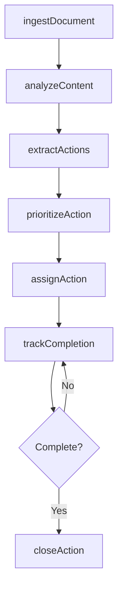
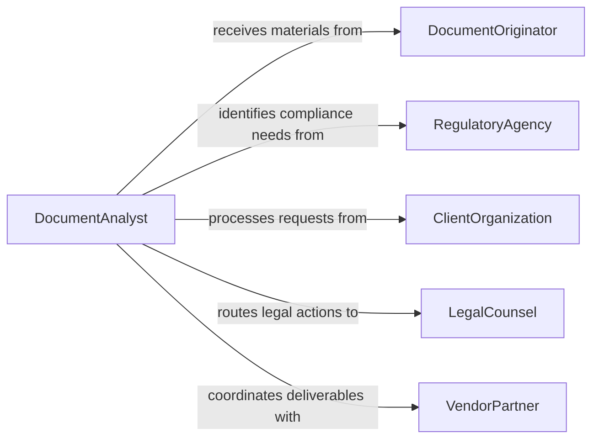

# Read Materials to Determine Needed Actions

> Business-as-Code definition for reading materials to determine needed actions. Models the workflow from document intake through content analysis, action item extraction, and task assignment.

## Overview

Reading materials to determine needed actions involves reviewing written documents, reports, correspondence, and directives to identify required responses, tasks, or decisions. This process translates unstructured information into structured action items that can be assigned, tracked, and completed. This definition exposes actions for document processing, events for action discovery, and searches for retrieving extracted tasks.

## Actors

| Actor | Description |
|-------|-------------|
| DocumentOriginator | Authors or sends the materials requiring review |
| RegulatoryAgency | Issues compliance directives or notices requiring action |
| ClientOrganization | Submits requests, contracts, or change orders |
| LegalCounsel | Provides legal opinions or notices that require response |
| VendorPartner | Sends invoices, delivery notices, or service agreements |
| AuditFirm | Delivers audit findings and recommended corrective actions |

## Roles

| Role | Description |
|------|-------------|
| DocumentAnalyst | Reads and interprets materials to extract action items |
| OperationsManager | Assigns and prioritizes extracted action items |
| ComplianceSpecialist | Identifies regulatory actions embedded in correspondence |
| ExecutiveAssistant | Triages incoming documents and routes them for review |

## Entities

| Entity | Description |
|--------|-------------|
| Document | A written material such as a memo, report, or directive |
| ActionItem | A discrete task or response extracted from a document |
| Priority | The urgency level assigned to an extracted action |
| Assignment | The delegation of an action item to a responsible party |
| Deadline | A due date associated with an action item |
| DocumentCategory | A classification of the material type for routing purposes |
| ResponseRecord | Documentation of actions taken in response to a material |

## Actions

| Action | Description |
|--------|-------------|
| ingestDocument | Import a document into the review system for analysis |
| analyzeContent | Parse the document to identify directives, requests, and deadlines |
| extractActions | Pull discrete action items from the analyzed content |
| prioritizeAction | Assign urgency and importance levels to each action item |
| assignAction | Delegate an action item to a responsible individual or team |
| trackCompletion | Monitor progress toward completing an assigned action |
| closeAction | Mark an action item as completed and record the outcome |

## Events

| Event | Description |
|-------|-------------|
| documentIngested | A document has been imported for analysis |
| contentAnalyzed | A document has been parsed and its content categorized |
| actionsExtracted | Action items have been identified from a document |
| actionPrioritized | An action item has been assigned a priority level |
| actionAssigned | An action item has been delegated to a responsible party |
| completionTracked | Progress on an action item has been updated |
| actionClosed | An action item has been marked as completed |

## Searches

| Search | Description |
|--------|-------------|
| findDocuments | Retrieve documents by category, date, or originator |
| getActionItems | List action items by status, priority, or assignee |
| getPendingActions | Find action items that have not yet been completed |
| getOverdueActions | Identify action items past their deadline |
| searchByKeyword | Search document content for specific terms or phrases |

## Workflow



## Actor Relationships



## Usage

### Calling Actions

```typescript
import { readMaterialsDetermineNeededActions } from '@headlessly/read-materials-determine-needed-actions'

const reader = readMaterialsDetermineNeededActions()

// Ingest a new compliance notice
const doc = await reader.ingestDocument({
  title: 'EPA Emissions Compliance Notice',
  category: 'regulatory',
  source: 'epa-region-5',
  url: 'https://docs.example.com/epa-notice-2026-04.pdf'
})

// Analyze content and extract action items
const analysis = await reader.analyzeContent({ documentId: doc.id })
const actions = await reader.extractActions({ documentId: doc.id })

// Assign extracted actions to responsible parties
for (const action of actions) {
  await reader.assignAction({
    actionId: action.id,
    assignee: 'compliance-team',
    deadline: action.suggestedDeadline
  })
}
```

### Event-Driven Automation

```typescript
// Alert operations when high-priority actions are extracted
reader.actionsExtracted(async ({ documentId, actions }) => {
  const urgent = actions.filter(a => a.priority === 'critical')
  if (urgent.length > 0) {
    await notify({
      to: 'operations-manager',
      message: `${urgent.length} critical actions identified from document ${documentId}`
    })
  }
})

// Escalate overdue actions automatically
reader.completionTracked(async ({ actionId, status, deadline }) => {
  if (status === 'overdue') {
    await notify({
      to: 'executive-team',
      message: `Action ${actionId} is past deadline ${deadline}`
    })
  }
})
```
