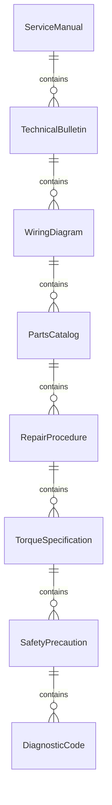
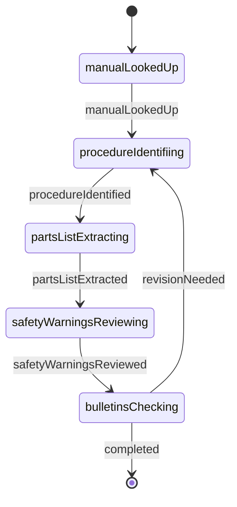
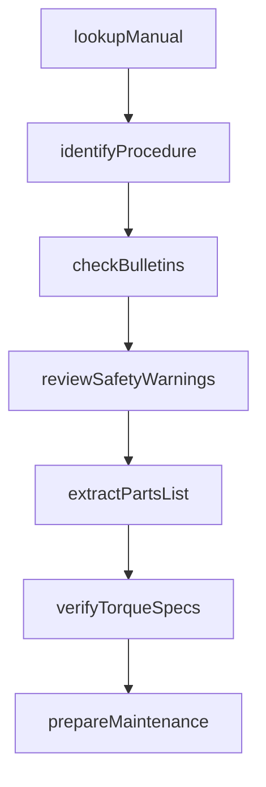
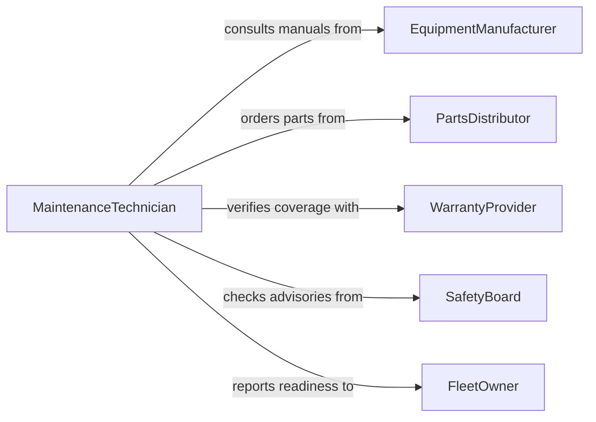

# Read Technical Information Needed to Perform Maintenance or Repairs

> Business-as-Code definition for reading technical information needed to perform maintenance or repairs. Models the workflow from manual lookup through procedure identification, parts determination, and maintenance task preparation.

## Overview

Reading technical information for maintenance or repairs involves consulting service manuals, troubleshooting guides, technical bulletins, wiring diagrams, and parts catalogs to understand the correct procedures, safety precautions, torque specifications, and replacement parts for a given repair task. This definition exposes actions for technical document retrieval and interpretation, events for maintenance readiness tracking, and searches for locating procedures and parts data.

## Actors

| Actor | Description |
|-------|-------------|
| EquipmentManufacturer | Publishes service manuals, technical bulletins, and parts catalogs |
| PartsDistributor | Supplies replacement components and consumables |
| WarrantyProvider | Covers repair costs under active warranty agreements |
| SafetyBoard | Issues safety advisories and mandatory recall notices |
| TrainingProvider | Delivers certification courses for specialized repair procedures |
| FleetOwner | Owns the equipment and authorizes maintenance activities |

## Roles

| Role | Description |
|------|-------------|
| MaintenanceTechnician | Reads technical documentation and executes repair procedures |
| ServiceAdvisor | Interprets diagnostic information and recommends repair actions |
| PartsSpecialist | Identifies and orders correct replacement components |
| MaintenanceSupervisor | Oversees repair quality and ensures adherence to procedures |

## Entities

| Entity | Description |
|--------|-------------|
| ServiceManual | A comprehensive document describing maintenance and repair procedures |
| TechnicalBulletin | An advisory notice addressing known issues or updated procedures |
| WiringDiagram | A schematic illustrating electrical connections and circuits |
| PartsCatalog | A reference listing available replacement components by model |
| RepairProcedure | A step-by-step instruction set for a specific maintenance task |
| TorqueSpecification | A required tightening value for fasteners in an assembly |
| SafetyPrecaution | A warning or protective measure required during a procedure |
| DiagnosticCode | A fault code indicating a specific malfunction or condition |

## Actions

| Action | Description |
|--------|-------------|
| lookupManual | Retrieve the service manual for a specific equipment model |
| identifyProcedure | Locate the correct repair or maintenance procedure by symptom or code |
| extractPartsList | Pull the list of replacement parts required for a procedure |
| reviewSafetyWarnings | Identify safety precautions and required protective equipment |
| checkBulletins | Search for technical bulletins that may supersede manual procedures |
| verifyTorqueSpecs | Confirm tightening values for fasteners in the repair scope |
| prepareMaintenance | Compile all information needed to begin the repair task |

## Events

| Event | Description |
|-------|-------------|
| manualLookedUp | A service manual has been retrieved for the equipment |
| procedureIdentified | The correct repair procedure has been located |
| partsListExtracted | Required replacement parts have been identified |
| safetyWarningsReviewed | Safety precautions for the procedure have been documented |
| bulletinsChecked | Technical bulletins have been searched for updates |
| torqueSpecsVerified | Fastener tightening values have been confirmed |
| maintenancePrepared | All information has been compiled for the repair task |

## Searches

| Search | Description |
|--------|-------------|
| findManuals | Search service manuals by equipment model, year, or system |
| getProcedures | Retrieve repair procedures by diagnostic code or symptom |
| getPartsForProcedure | List replacement parts needed for a specific procedure |
| getBulletins | Find technical bulletins by model, date, or severity |
| searchDiagnosticCodes | Look up diagnostic fault codes by code number or description |

## Entity Relationships



## State Diagram



## Workflow



## Actor Relationships



## Usage

### Calling Actions

```typescript
import { readTechnicalInformationNeededPerform } from '@headlessly/read-technical-information-needed-perform'

const techDocs = readTechnicalInformationNeededPerform()

// Look up the service manual for a specific unit
const manual = await techDocs.lookupManual({
  equipmentModel: 'CAT-D6T',
  serialNumber: 'JJG00892',
  system: 'hydraulic'
})

// Identify the correct repair procedure from a diagnostic code
const procedure = await techDocs.identifyProcedure({
  manualId: manual.id,
  diagnosticCode: 'E362',
  symptom: 'hydraulic pressure loss'
})

// Extract the parts list for the procedure
const parts = await techDocs.extractPartsList({
  procedureId: procedure.id,
  includeConsumables: true
})
```

### Event-Driven Automation

```typescript
// Notify parts specialist when a parts list is extracted
techDocs.partsListExtracted(async ({ procedureId, parts }) => {
  await notify({
    to: 'parts-specialist',
    message: `${parts.length} parts needed for procedure ${procedureId}`
  })
})

// Alert supervisor when maintenance preparation is complete
techDocs.maintenancePrepared(async ({ equipmentId, procedureId }) => {
  await notify({
    to: 'maintenance-supervisor',
    message: `Equipment ${equipmentId} is ready for repair - procedure ${procedureId}`
  })
})
```
