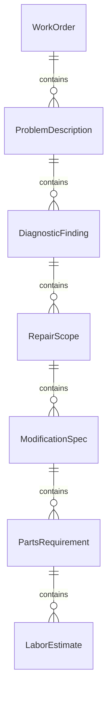
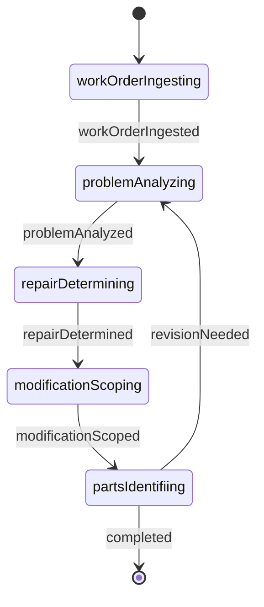
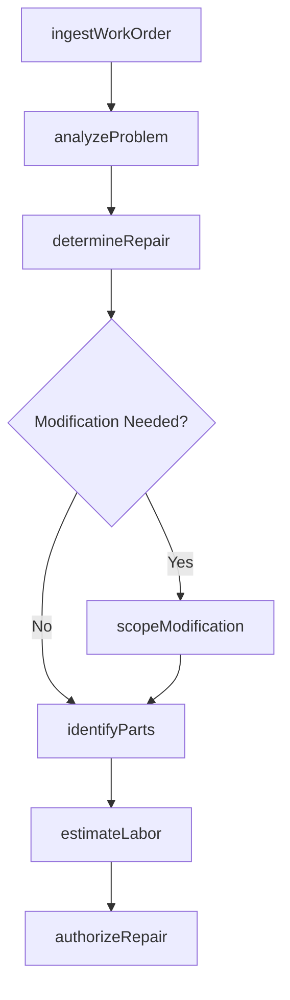
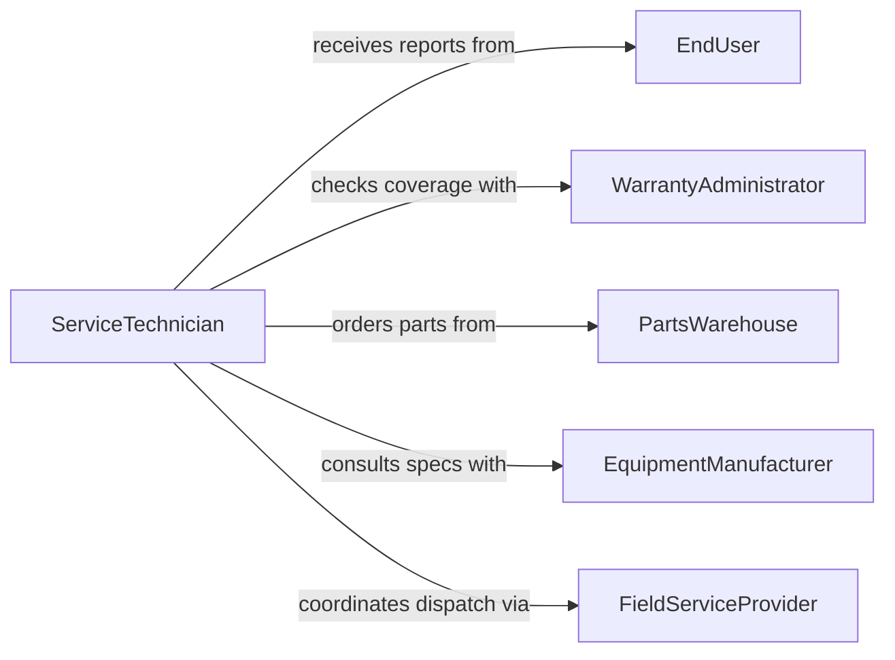

# Read Work Orders or Descriptions of Problems to Determine Repairs

> Business-as-Code definition for reading work orders or problem descriptions to determine needed repairs or modifications. Models the workflow from complaint intake through diagnostic analysis, repair scoping, and modification planning.

## Overview

Reading work orders or descriptions of problems to determine repairs or modifications involves reviewing service tickets, defect reports, customer complaints, and maintenance requests to diagnose the root cause and define the corrective actions required. This process translates reported symptoms into specific repair procedures, parts requirements, and labor estimates. This definition exposes actions for problem analysis, events for repair determination, and searches for retrieving diagnostic and repair data.

## Actors

| Actor | Description |
|-------|-------------|
| EndUser | Reports equipment failures or performance problems |
| WarrantyAdministrator | Determines coverage for reported defects |
| PartsWarehouse | Stocks and distributes replacement components |
| FieldServiceProvider | Dispatches technicians to perform on-site repairs |
| EquipmentManufacturer | Provides technical support and repair specifications |
| InsuranceAdjuster | Assesses damage claims related to equipment failures |

## Roles

| Role | Description |
|------|-------------|
| ServiceTechnician | Reads problem descriptions and determines repair actions |
| DiagnosticSpecialist | Analyzes symptoms to identify root causes |
| RepairPlanner | Scopes repair work and estimates time and materials |
| ModificationEngineer | Designs modifications to prevent recurrence of issues |

## Entities

| Entity | Description |
|--------|-------------|
| WorkOrder | A service request documenting the reported problem |
| ProblemDescription | A narrative of symptoms, conditions, and failure history |
| DiagnosticFinding | A root cause determination based on problem analysis |
| RepairScope | A defined set of corrective actions to resolve the problem |
| ModificationSpec | A design change to prevent recurrence of a reported issue |
| PartsRequirement | Components needed to complete the repair or modification |
| LaborEstimate | Projected technician hours for completing the repair |

## Actions

| Action | Description |
|--------|-------------|
| ingestWorkOrder | Import a service request or problem report for analysis |
| analyzeProblem | Examine symptoms and failure history to identify root cause |
| determineRepair | Define the specific corrective actions needed |
| scopeModification | Design a change to prevent the problem from recurring |
| identifyParts | Determine replacement components required for the repair |
| estimateLabor | Project the technician hours needed for the repair |
| authorizeRepair | Approve the repair scope for execution |

## Events

| Event | Description |
|-------|-------------|
| workOrderIngested | A service request has been imported for analysis |
| problemAnalyzed | Symptoms have been examined and root cause identified |
| repairDetermined | Specific corrective actions have been defined |
| modificationScoped | A preventive design change has been specified |
| partsIdentified | Required replacement components have been determined |
| laborEstimated | Technician hours have been projected |
| repairAuthorized | The repair scope has been approved for execution |

## Searches

| Search | Description |
|--------|-------------|
| findWorkOrders | Search service requests by equipment, date, or status |
| getDiagnosticHistory | Retrieve past findings for a specific equipment unit |
| getRepairScopes | List defined repairs by work order or equipment type |
| getPartsRequirements | Find parts needed by repair scope or work order |
| searchProblemPatterns | Identify recurring problem descriptions across equipment |

## Entity Relationships



## State Diagram



## Workflow



## Actor Relationships



## Usage

### Calling Actions

```typescript
import { readWorkOrdersDescriptionsProblems } from '@headlessly/read-work-orders-descriptions-problems'

const repairs = readWorkOrdersDescriptionsProblems()

// Ingest a service request
const wo = await repairs.ingestWorkOrder({
  equipmentId: 'hvac-unit-312',
  reportedBy: 'facility-ops',
  description: 'Unit cycling on and off every 5 minutes, not reaching setpoint'
})

// Analyze the problem
const diagnosis = await repairs.analyzeProblem({
  workOrderId: wo.id,
  symptoms: ['shortCycling', 'failureToReachSetpoint'],
  history: await repairs.getDiagnosticHistory({ equipmentId: 'hvac-unit-312' })
})

// Determine the repair and identify parts
const repair = await repairs.determineRepair({
  workOrderId: wo.id,
  rootCause: diagnosis.rootCause
})
await repairs.identifyParts({ repairScopeId: repair.id })
```

### Event-Driven Automation

```typescript
// Notify parts warehouse when parts are identified
repairs.partsIdentified(async ({ workOrderId, parts }) => {
  await notify({
    to: 'parts-warehouse',
    message: `${parts.length} parts needed for WO ${workOrderId}`
  })
})

// Auto-authorize repairs under warranty
repairs.laborEstimated(async ({ workOrderId, totalHours, warrantyStatus }) => {
  if (warrantyStatus === 'covered') {
    await repairs.authorizeRepair({ workOrderId })
  }
})
```
