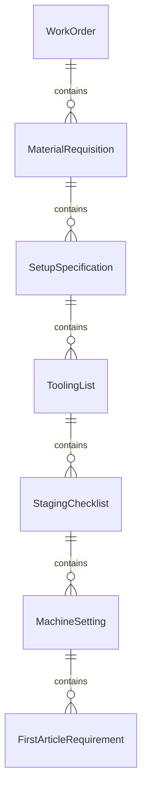
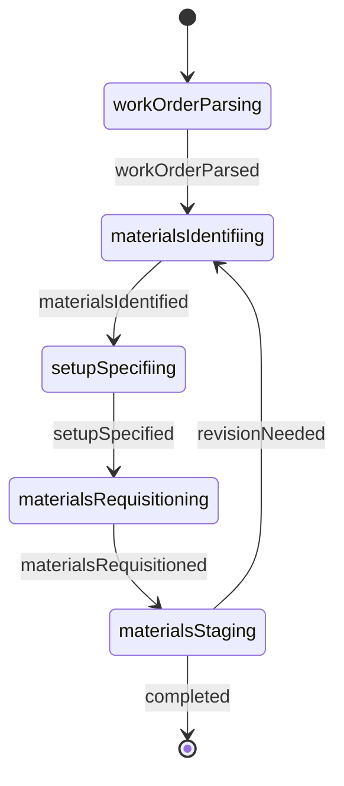
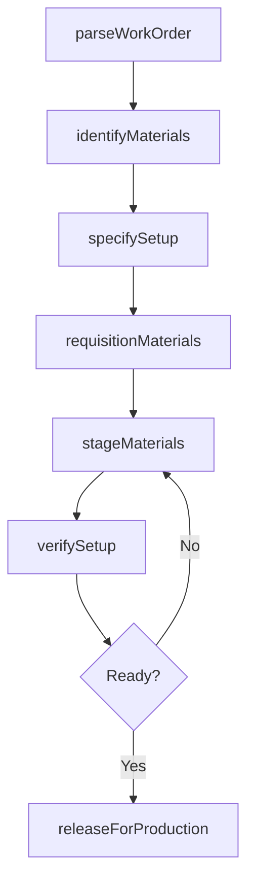
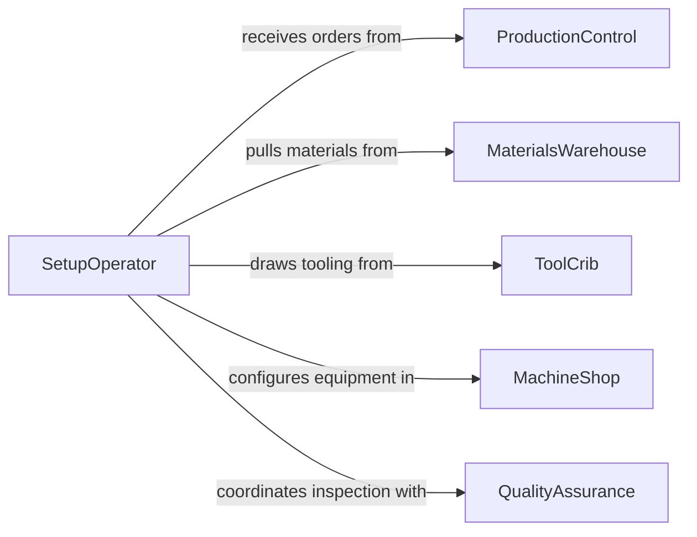

# Read Work Orders to Determine Material or Setup Requirements

> Business-as-Code definition for reading work orders to determine material or setup requirements. Models the workflow from order parsing through material identification, setup specification, and staging confirmation.

## Overview

Reading work orders to determine material or setup requirements involves parsing production orders, job tickets, and assembly instructions to identify the specific raw materials, components, tooling, machine settings, and fixture configurations needed before work can begin. This process ensures that all inputs are staged and equipment is properly configured prior to production start. This definition exposes actions for order-driven material and setup planning, events for readiness tracking, and searches for retrieving order and staging data.

## Actors

| Actor | Description |
|-------|-------------|
| ProductionControl | Issues work orders with routing and bill-of-materials references |
| MaterialsWarehouse | Stores and issues raw materials and components |
| ToolCrib | Maintains and distributes tooling and fixtures |
| MachineShop | Configures equipment based on setup requirements |
| QualityAssurance | Specifies in-process inspection requirements tied to setup |
| PurchasingDepartment | Procures materials not available in current inventory |

## Roles

| Role | Description |
|------|-------------|
| SetupOperator | Reads work orders and configures machines for production |
| MaterialHandler | Stages raw materials and components at the work center |
| ProductionScheduler | Sequences work orders and confirms material availability |
| ProcessTechnician | Verifies that setup parameters match work order specifications |

## Entities

| Entity | Description |
|--------|-------------|
| WorkOrder | A production directive with part number, quantity, and routing |
| MaterialRequisition | A request to issue specific materials from the warehouse |
| SetupSpecification | Machine parameters, tooling, and fixture configurations |
| ToolingList | The set of cutting tools, jigs, and gauges needed for setup |
| StagingChecklist | A verification form confirming all materials and tools are ready |
| MachineSetting | A specific parameter such as feed rate, speed, or temperature |
| FirstArticleRequirement | An inspection mandate for the first piece off a new setup |

## Actions

| Action | Description |
|--------|-------------|
| parseWorkOrder | Read the work order to extract part number, quantity, and routing |
| identifyMaterials | Determine raw materials and components from the bill of materials |
| specifySetup | Define machine settings, tooling, and fixture configurations |
| requisitionMaterials | Issue a request to pull materials from the warehouse |
| stageMaterials | Confirm that materials and tooling are delivered to the work center |
| verifySetup | Check that machine configuration matches the work order specs |
| releaseForProduction | Authorize the setup and materials for production start |

## Events

| Event | Description |
|-------|-------------|
| workOrderParsed | The work order has been read and key data extracted |
| materialsIdentified | Required materials and components have been determined |
| setupSpecified | Machine settings and tooling have been defined |
| materialsRequisitioned | A material pull request has been issued to the warehouse |
| materialsStaged | Materials and tooling have been delivered to the work center |
| setupVerified | Machine configuration has been confirmed against specifications |
| releasedForProduction | The work center is authorized to begin production |

## Searches

| Search | Description |
|--------|-------------|
| findWorkOrders | Search orders by part number, due date, or work center |
| getMaterialRequirements | List materials needed by work order or part number |
| getSetupSpecs | Retrieve machine settings and tooling for a work order |
| getStagingStatus | Check material and tooling delivery status by work center |
| getFirstArticleRequirements | Find inspection mandates for new setups |

## Entity Relationships



## State Diagram



## Workflow



## Actor Relationships



## Usage

### Calling Actions

```typescript
import { readWorkOrdersDetermineMaterial } from '@headlessly/read-work-orders-determine-material'

const orders = readWorkOrdersDetermineMaterial()

// Parse a new work order
const wo = await orders.parseWorkOrder({
  orderNumber: 'WO-2026-07744',
  workCenter: 'cnc-lathe-bay-2'
})

// Identify materials and specify setup
const materials = await orders.identifyMaterials({
  workOrderId: wo.id,
  billOfMaterials: wo.bomReference
})

const setup = await orders.specifySetup({
  workOrderId: wo.id,
  machineId: 'lathe-004',
  parameters: ['spindleSpeed', 'feedRate', 'chuckPressure', 'coolantType']
})

// Requisition and stage materials
await orders.requisitionMaterials({
  workOrderId: wo.id,
  materials: materials.map(m => m.id)
})
```

### Event-Driven Automation

```typescript
// Notify material handler when requisition is issued
orders.materialsRequisitioned(async ({ workOrderId, materials }) => {
  await notify({
    to: 'material-handler',
    message: `Pull ${materials.length} items for WO ${workOrderId}`
  })
})

// Auto-release when setup is verified
orders.setupVerified(async ({ workOrderId, workCenter }) => {
  await orders.releaseForProduction({ workOrderId })
})
```
