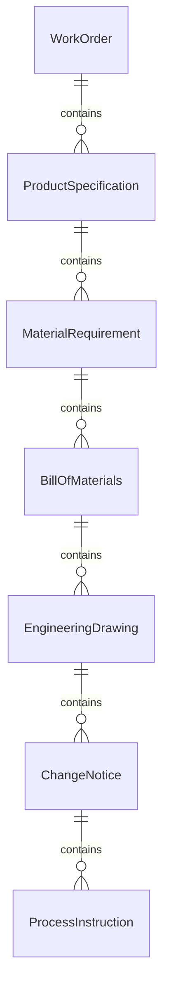
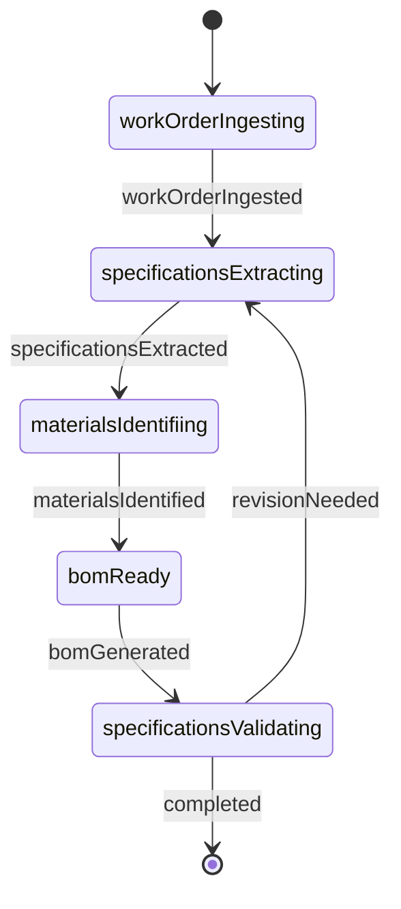
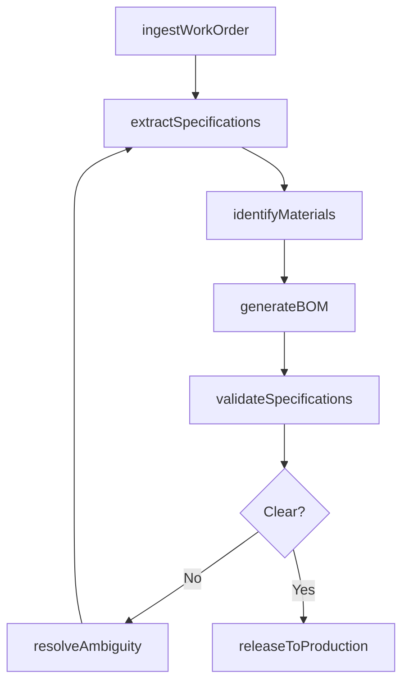
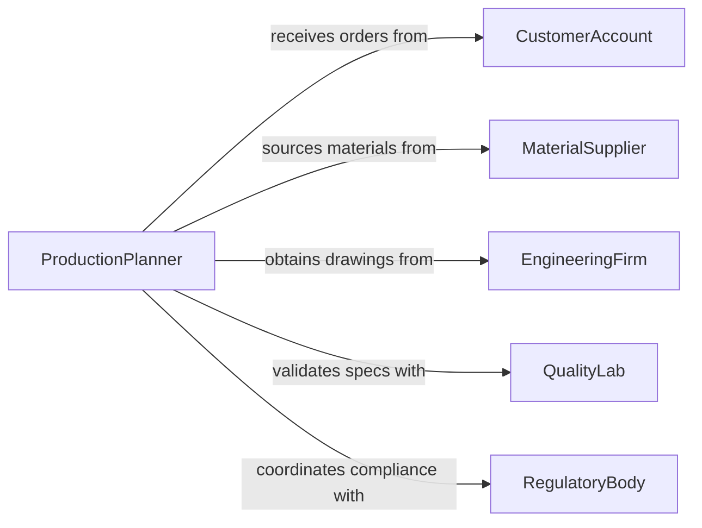

# Read Work Orders or Instructions to Determine Specifications

> Business-as-Code definition for reading work orders or instructions to determine product specifications and materials requirements. Models the workflow from order intake through specification extraction, materials identification, and production readiness.

## Overview

Reading work orders or instructions to determine product specifications and materials requirements involves parsing manufacturing orders, service tickets, engineering change notices, and assembly instructions to identify exact dimensions, tolerances, material grades, quantities, and process steps. This definition exposes actions for order interpretation, events for specification tracking, and searches for retrieving work order data.

## Actors

| Actor | Description |
|-------|-------------|
| CustomerAccount | Issues purchase orders with product specifications |
| MaterialSupplier | Provides raw materials, components, and consumables |
| EngineeringFirm | Supplies technical drawings and change orders |
| QualityLab | Certifies materials and verifies specification compliance |
| ShippingProvider | Delivers materials to the production facility |
| RegulatoryBody | Sets standards for material composition and product safety |

## Roles

| Role | Description |
|------|-------------|
| ProductionPlanner | Interprets work orders and translates them into production tasks |
| MaterialsCoordinator | Identifies and sources materials based on order specifications |
| QualityEngineer | Validates that specifications meet industry standards |
| ShopForeman | Ensures floor operations align with work order requirements |

## Entities

| Entity | Description |
|--------|-------------|
| WorkOrder | A directive specifying what to produce, in what quantity, and by when |
| ProductSpecification | Detailed requirements for dimensions, tolerances, and finish |
| MaterialRequirement | A list of raw materials, grades, and quantities needed |
| BillOfMaterials | A structured breakdown of all components for an assembly |
| EngineeringDrawing | A technical illustration with dimensions and annotations |
| ChangeNotice | A formal modification to an existing specification or order |
| ProcessInstruction | Step-by-step manufacturing or assembly directives |

## Actions

| Action | Description |
|--------|-------------|
| ingestWorkOrder | Import a work order document for parsing and analysis |
| extractSpecifications | Pull product dimensions, tolerances, and finish requirements |
| identifyMaterials | Determine the raw materials and grades required by the order |
| generateBOM | Build a bill of materials from the extracted specifications |
| validateSpecifications | Check extracted specs against engineering standards |
| resolveAmbiguity | Clarify unclear or conflicting instructions with the originator |
| releaseToProduction | Approve the interpreted work order for manufacturing |

## Events

| Event | Description |
|-------|-------------|
| workOrderIngested | A work order has been imported into the system |
| specificationsExtracted | Product specifications have been pulled from the order |
| materialsIdentified | Required materials and grades have been determined |
| bomGenerated | A bill of materials has been assembled |
| specificationsValidated | Extracted specs have been confirmed against standards |
| ambiguityResolved | Unclear instructions have been clarified |
| releasedToProduction | The work order has been approved for manufacturing |

## Searches

| Search | Description |
|--------|-------------|
| findWorkOrders | Search work orders by customer, date, or status |
| getSpecifications | Retrieve product specifications by order or part number |
| getMaterialRequirements | List materials needed by order, grade, or quantity |
| getBillOfMaterials | Retrieve the BOM for a specific assembly or product |
| getChangeNotices | Find engineering changes by part number or date range |

## Entity Relationships



## State Diagram



## Workflow



## Actor Relationships



## Usage

### Calling Actions

```typescript
import { readWorkOrdersInstructionsDetermine } from '@headlessly/read-work-orders-instructions-determine'

const orders = readWorkOrdersInstructionsDetermine()

// Ingest a new work order
const wo = await orders.ingestWorkOrder({
  orderNumber: 'WO-2026-04821',
  customer: 'acme-manufacturing',
  documentUrl: 'https://orders.example.com.ai/wo-04821.pdf'
})

// Extract product specifications
const specs = await orders.extractSpecifications({
  workOrderId: wo.id,
  elements: ['dimensions', 'tolerances', 'surfaceFinish', 'materialGrade']
})

// Generate the bill of materials
const bom = await orders.generateBOM({
  workOrderId: wo.id,
  specifications: specs
})
```

### Event-Driven Automation

```typescript
// Notify materials coordinator when requirements are identified
orders.materialsIdentified(async ({ workOrderId, materials }) => {
  await notify({
    to: 'materials-coordinator',
    message: `${materials.length} materials identified for WO ${workOrderId}`
  })
})

// Auto-release to production after validation
orders.specificationsValidated(async ({ workOrderId, valid }) => {
  if (valid) {
    await orders.releaseToProduction({ workOrderId })
  }
})
```
