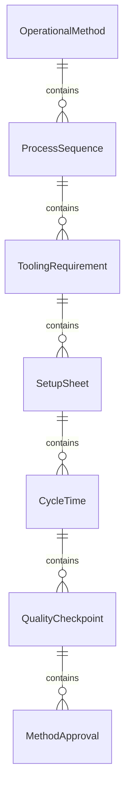
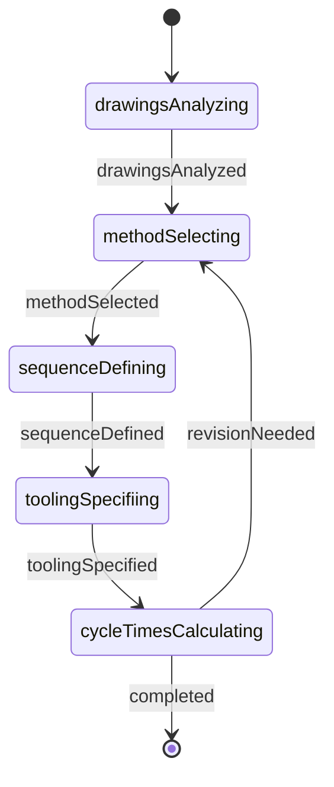
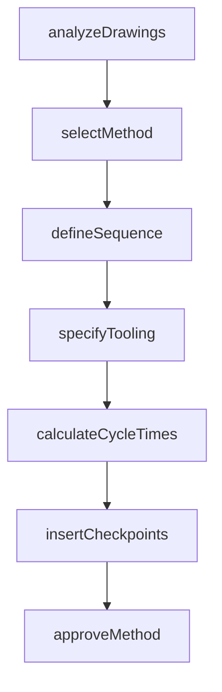
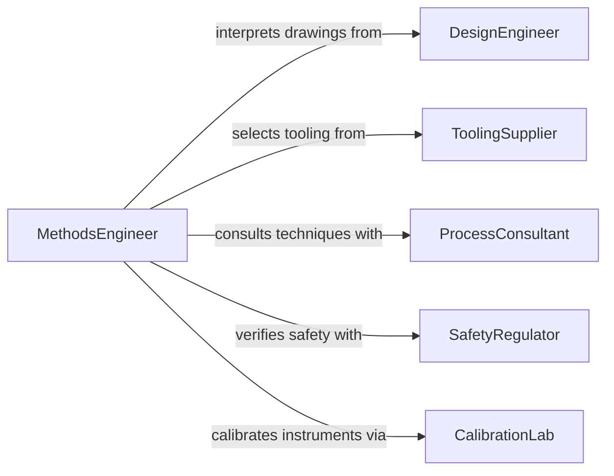

# Review Blueprints or Instructions to Determine Operational Methods

> Business-as-Code definition for reviewing blueprints or instructions to determine operational methods and sequences. Models the workflow from document analysis through method selection, sequencing, and operational procedure finalization.

## Overview

Reviewing blueprints or instructions to determine operational methods and sequences involves interpreting technical drawings, process flow diagrams, assembly instructions, and standard operating procedures to establish the correct methods, tooling, and step-by-step sequences for manufacturing, installation, or maintenance operations. This definition exposes actions for method determination, events for procedure readiness, and searches for retrieving operational sequence data.

## Actors

| Actor | Description |
|-------|-------------|
| DesignEngineer | Produces drawings that define the product or system being built |
| ToolingSupplier | Provides specialized tools and fixtures for operational methods |
| ProcessConsultant | Advises on optimal manufacturing or assembly techniques |
| SafetyRegulator | Enforces method-specific safety requirements and certifications |
| CustomerEngineer | Specifies performance requirements that constrain method selection |
| CalibrationLab | Certifies measurement instruments used during operations |

## Roles

| Role | Description |
|------|-------------|
| MethodsEngineer | Analyzes drawings to determine optimal operational methods |
| ProductionSupervisor | Implements the defined methods on the shop floor |
| QualityInspector | Verifies that operational methods produce conforming output |
| ToolingCoordinator | Selects and prepares tooling for each operational step |

## Entities

| Entity | Description |
|--------|-------------|
| OperationalMethod | A defined technique or approach for performing a task |
| ProcessSequence | An ordered series of operations to complete a work item |
| ToolingRequirement | A specification for tools or fixtures needed for an operation |
| SetupSheet | A document detailing machine settings and configurations |
| CycleTime | The expected duration of a single operational step |
| QualityCheckpoint | A point in the sequence where inspection is required |
| MethodApproval | A formal sign-off authorizing a specific operational approach |

## Actions

| Action | Description |
|--------|-------------|
| analyzeDrawings | Examine blueprints to understand geometry, tolerances, and materials |
| selectMethod | Choose the optimal operational technique for each feature or step |
| defineSequence | Establish the order of operations from raw state to finished product |
| specifyTooling | Identify the tools, fixtures, and gauges required for each step |
| calculateCycleTimes | Estimate the duration of each operational step |
| insertCheckpoints | Place quality inspection points within the operational sequence |
| approveMethod | Formally authorize the operational method for production use |

## Events

| Event | Description |
|-------|-------------|
| drawingsAnalyzed | Blueprints have been examined for method determination |
| methodSelected | An operational technique has been chosen for a step |
| sequenceDefined | The order of operations has been established |
| toolingSpecified | Required tools and fixtures have been identified |
| cycleTimesCalculated | Estimated durations have been set for each step |
| checkpointsInserted | Quality inspection points have been placed in the sequence |
| methodApproved | The operational method has been formally authorized |

## Searches

| Search | Description |
|--------|-------------|
| findMethods | Search operational methods by material, geometry, or process type |
| getSequences | Retrieve process sequences by product, part number, or revision |
| getToolingRequirements | List tooling needs by operation or work center |
| getCycleTimes | Find estimated durations by product line or process step |
| getCheckpoints | List quality inspection points by sequence or product |

## Entity Relationships



## State Diagram



## Workflow



## Actor Relationships



## Usage

### Calling Actions

```typescript
import { reviewBlueprintsInstructionsDetermineOperational } from '@headlessly/review-blueprints-instructions-determine-operational'

const methods = reviewBlueprintsInstructionsDetermineOperational()

// Analyze engineering drawings for a precision component
const analysis = await methods.analyzeDrawings({
  partNumber: 'HYD-VALVE-4200',
  drawingRevision: 'E',
  features: ['bore', 'oRingGroove', 'threadedPort', 'surfaceFinish']
})

// Define the manufacturing sequence
const sequence = await methods.defineSequence({
  partNumber: 'HYD-VALVE-4200',
  operations: [
    { step: 1, method: 'cnc-turning', workCenter: 'lathe-bay' },
    { step: 2, method: 'cnc-milling', workCenter: 'mill-bay' },
    { step: 3, method: 'honing', workCenter: 'finishing-bay' },
    { step: 4, method: 'deburring', workCenter: 'bench-area' }
  ]
})

// Calculate cycle times for capacity planning
const times = await methods.calculateCycleTimes({
  sequenceId: sequence.id
})
```

### Event-Driven Automation

```typescript
// Notify tooling coordinator when tooling is specified
methods.toolingSpecified(async ({ partNumber, tooling }) => {
  await notify({
    to: 'tooling-coordinator',
    message: `${tooling.length} tools required for ${partNumber}`
  })
})

// Auto-insert checkpoints after sequence is defined
methods.sequenceDefined(async ({ sequenceId, totalSteps }) => {
  await methods.insertCheckpoints({
    sequenceId,
    frequency: 'everyThirdStep',
    type: 'dimensional'
  })
})
```
