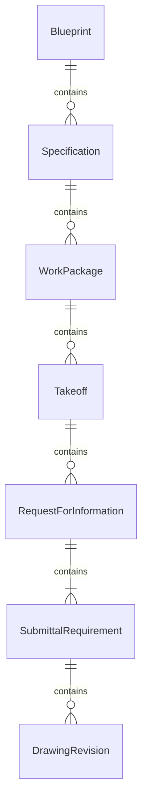
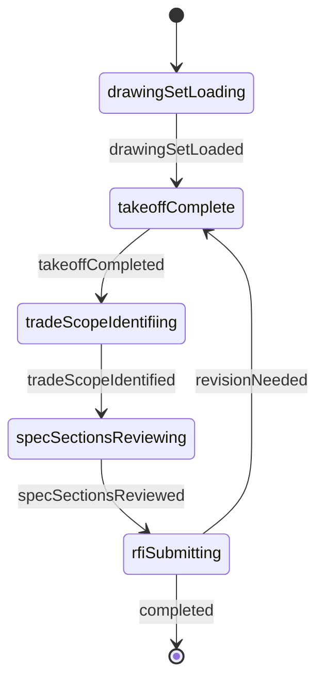
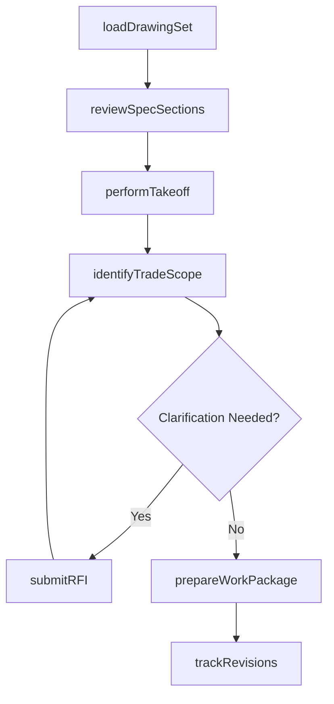
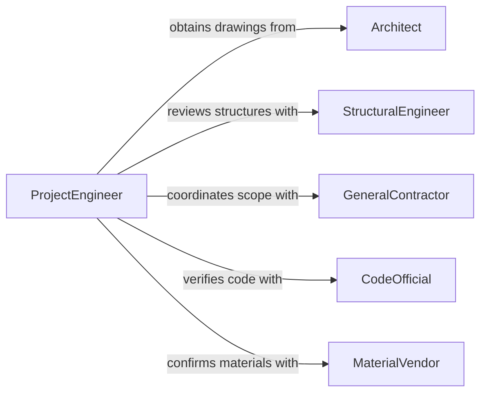

# Review Blueprints or Specifications to Determine Work Requirements

> Business-as-Code definition for reviewing blueprints or specifications to determine work requirements. Models the workflow from drawing review through scope extraction, trade coordination, and work package preparation.

## Overview

Reviewing blueprints or specifications to determine work requirements involves examining construction drawings, architectural plans, engineering specifications, and detail sheets to identify the scope, materials, methods, and labor needed to execute a project. This process converts design intent into actionable work packages for field crews and subcontractors. This definition exposes actions for blueprint interpretation, events for requirement discovery, and searches for retrieving specification data.

## Actors

| Actor | Description |
|-------|-------------|
| Architect | Produces design drawings and architectural specifications |
| StructuralEngineer | Provides structural calculations and reinforcement details |
| GeneralContractor | Coordinates all trades and manages the construction schedule |
| CodeOfficial | Enforces building codes and issues construction permits |
| MaterialVendor | Supplies construction materials per specification requirements |
| Surveyor | Provides site dimensions and elevation data |

## Roles

| Role | Description |
|------|-------------|
| Superintendent | Reviews blueprints and directs field execution of work |
| Estimator | Quantifies materials and labor from blueprint takeoffs |
| ProjectEngineer | Interprets specifications and resolves technical questions |
| TradeForeman | Translates blueprint requirements into crew assignments |

## Entities

| Entity | Description |
|--------|-------------|
| Blueprint | A scaled drawing showing dimensions, layouts, and construction details |
| Specification | A written document defining materials, methods, and quality standards |
| WorkPackage | A bundle of tasks, drawings, and specs for a specific trade or phase |
| Takeoff | A quantity measurement extracted from blueprint dimensions |
| RequestForInformation | A formal query to clarify ambiguous or missing blueprint details |
| SubmittalRequirement | A specification-mandated product data submission for approval |
| DrawingRevision | An updated version of a blueprint with tracked changes |

## Actions

| Action | Description |
|--------|-------------|
| loadDrawingSet | Import a complete set of blueprints for a project |
| performTakeoff | Measure quantities of materials from blueprint dimensions |
| identifyTradeScope | Determine the work required for each construction trade |
| reviewSpecSections | Examine specification divisions for material and method requirements |
| submitRFI | Issue a request for information to clarify blueprint details |
| prepareWorkPackage | Assemble drawings, specs, and quantities for a trade or phase |
| trackRevisions | Monitor and incorporate drawing updates into work requirements |

## Events

| Event | Description |
|-------|-------------|
| drawingSetLoaded | A complete set of blueprints has been imported |
| takeoffCompleted | Material quantities have been measured from the drawings |
| tradeScopeIdentified | Work requirements for a construction trade have been determined |
| specSectionsReviewed | Specification divisions have been examined |
| rfiSubmitted | A request for information has been issued |
| workPackagePrepared | A trade or phase work package has been assembled |
| revisionTracked | A drawing update has been incorporated into requirements |

## Searches

| Search | Description |
|--------|-------------|
| findDrawings | Search blueprints by project, discipline, or sheet number |
| getTakeoffs | Retrieve quantity measurements by trade, material, or area |
| getSpecSections | List specification divisions by project or trade |
| getRFIs | Find requests for information by status, trade, or date |
| getWorkPackages | Retrieve assembled work packages by phase or trade |

## Entity Relationships



## State Diagram



## Workflow



## Actor Relationships



## Usage

### Calling Actions

```typescript
import { reviewBlueprintsSpecificationsDetermineWork } from '@headlessly/review-blueprints-specifications-determine-work'

const blueprints = reviewBlueprintsSpecificationsDetermineWork()

// Load the full drawing set for a commercial build
const drawingSet = await blueprints.loadDrawingSet({
  projectId: 'office-tower-phase-2',
  sheets: ['A1-A24', 'S1-S12', 'M1-M8', 'E1-E10'],
  revision: 'D'
})

// Perform a material takeoff for concrete work
const takeoff = await blueprints.performTakeoff({
  projectId: 'office-tower-phase-2',
  trade: 'concrete',
  sheets: ['S1', 'S2', 'S3'],
  materials: ['readyMix', 'rebar', 'formwork']
})

// Prepare a work package for the structural trade
await blueprints.prepareWorkPackage({
  projectId: 'office-tower-phase-2',
  trade: 'structural',
  includeSheets: ['S1-S12'],
  specSections: ['03300', '03400', '05100']
})
```

### Event-Driven Automation

```typescript
// Notify estimating when takeoffs are completed
blueprints.takeoffCompleted(async ({ projectId, trade, totalItems }) => {
  await notify({
    to: 'estimating-team',
    message: `Takeoff complete for ${trade} on ${projectId}: ${totalItems} line items`
  })
})

// Alert project engineer when an RFI is needed
blueprints.tradeScopeIdentified(async ({ projectId, trade, ambiguities }) => {
  if (ambiguities.length > 0) {
    await blueprints.submitRFI({
      projectId,
      trade,
      questions: ambiguities
    })
  }
})
```
