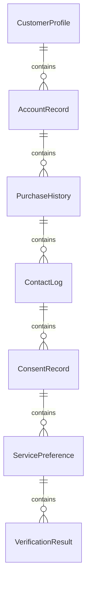
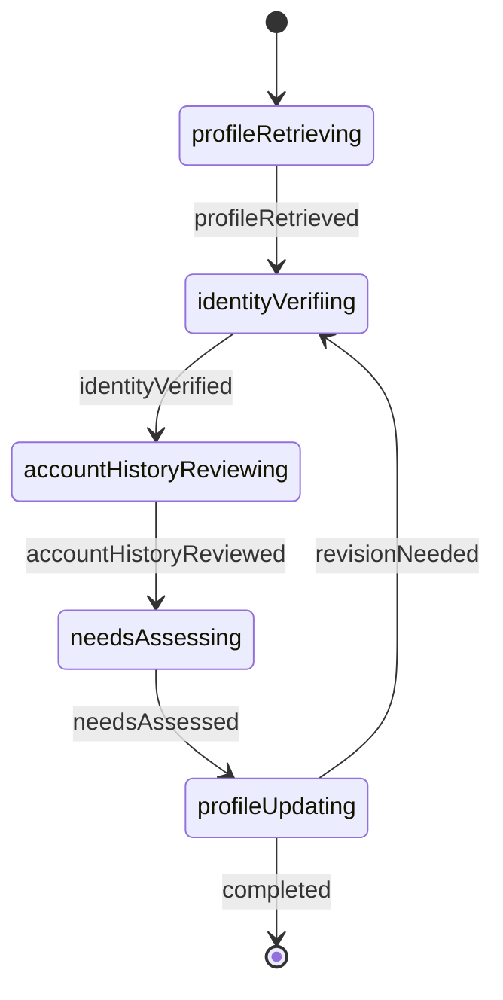
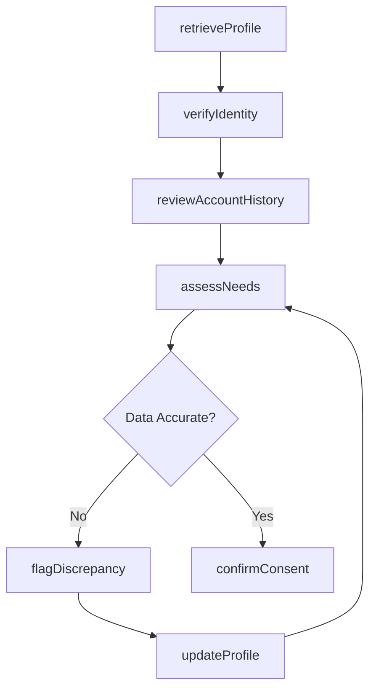
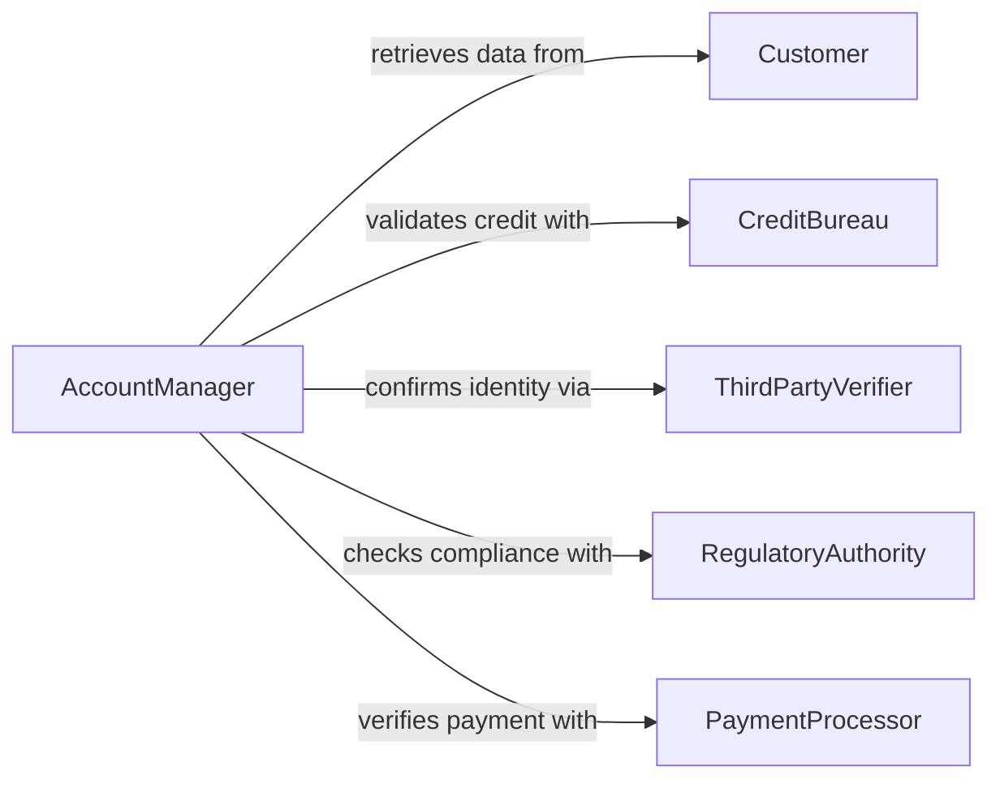

# Review Customer Information

> Business-as-Code definition for reviewing customer information. Models the workflow from data intake through profile verification, needs assessment, and service readiness.

## Overview

Reviewing customer information involves examining customer records, account details, purchase history, correspondence, and preferences to understand their current status and needs. This process supports personalized service delivery, accurate order processing, and effective relationship management. This definition exposes actions for customer data review, events for tracking information changes, and searches for retrieving customer profiles and history.

## Actors

| Actor | Description |
|-------|-------------|
| Customer | Provides personal, financial, or account information |
| CreditBureau | Supplies credit reports and financial standing data |
| ShippingCarrier | Provides delivery addresses and logistics preferences |
| PaymentProcessor | Maintains payment method and transaction history |
| RegulatoryAuthority | Enforces data privacy and consumer protection standards |
| ThirdPartyVerifier | Validates identity, address, or employment information |

## Roles

| Role | Description |
|------|-------------|
| AccountManager | Reviews and maintains customer account information |
| CustomerServiceRep | Accesses customer data to resolve inquiries or issues |
| DataSteward | Ensures accuracy and compliance of customer records |
| SalesAnalyst | Reviews customer information to identify upsell opportunities |

## Entities

| Entity | Description |
|--------|-------------|
| CustomerProfile | A comprehensive record of customer demographics and preferences |
| AccountRecord | Financial and transactional data tied to a customer account |
| PurchaseHistory | A chronological record of past orders and transactions |
| ContactLog | A record of communications between the business and customer |
| ConsentRecord | Documentation of customer permissions for data use |
| ServicePreference | Customer-specified delivery, communication, or product preferences |
| VerificationResult | The outcome of an identity or data validation check |

## Actions

| Action | Description |
|--------|-------------|
| retrieveProfile | Load a customer profile for review |
| verifyIdentity | Confirm the customer identity against authoritative sources |
| reviewAccountHistory | Examine past transactions, orders, and interactions |
| assessNeeds | Determine current customer requirements based on available data |
| updateProfile | Modify customer information after verification |
| flagDiscrepancy | Mark conflicting or outdated information for resolution |
| confirmConsent | Verify that data use complies with customer permissions |

## Events

| Event | Description |
|-------|-------------|
| profileRetrieved | A customer profile has been loaded for review |
| identityVerified | Customer identity has been confirmed |
| accountHistoryReviewed | Past transactions and interactions have been examined |
| needsAssessed | Customer requirements have been determined |
| profileUpdated | Customer information has been modified |
| discrepancyFlagged | Conflicting or outdated data has been identified |
| consentConfirmed | Data use compliance has been verified |

## Searches

| Search | Description |
|--------|-------------|
| findCustomers | Search customers by name, account number, or segment |
| getAccountHistory | Retrieve transactions and orders for a customer account |
| getContactLogs | List communications by customer, date, or channel |
| getDiscrepancies | Find flagged data issues awaiting resolution |
| searchPreferences | Retrieve customer preferences by category |

## Entity Relationships



## State Diagram



## Workflow



## Actor Relationships



## Usage

### Calling Actions

```typescript
import { reviewCustomerInformation } from '@headlessly/review-customer-information'

const customers = reviewCustomerInformation()

// Retrieve a customer profile for review
const profile = await customers.retrieveProfile({
  customerId: 'cust-88210',
  include: ['demographics', 'purchaseHistory', 'preferences']
})

// Verify the customer identity
const verification = await customers.verifyIdentity({
  customerId: profile.id,
  method: 'documentCheck',
  documents: ['driversLicense', 'utilityBill']
})

// Assess needs based on recent history
const needs = await customers.assessNeeds({
  customerId: profile.id,
  lookbackPeriod: '12m'
})
```

### Event-Driven Automation

```typescript
// Alert the data steward when discrepancies are found
customers.discrepancyFlagged(async ({ customerId, field, currentValue, expectedValue }) => {
  await notify({
    to: 'data-steward',
    message: `Data conflict on ${field} for customer ${customerId}`
  })
})

// Log consent confirmations for audit
customers.consentConfirmed(async ({ customerId, consentType, timestamp }) => {
  await auditLog.record({
    event: 'consent-confirmed',
    customerId,
    consentType,
    timestamp
  })
})
```
