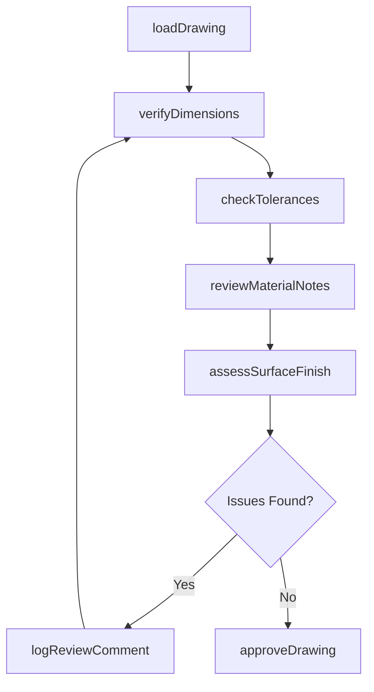
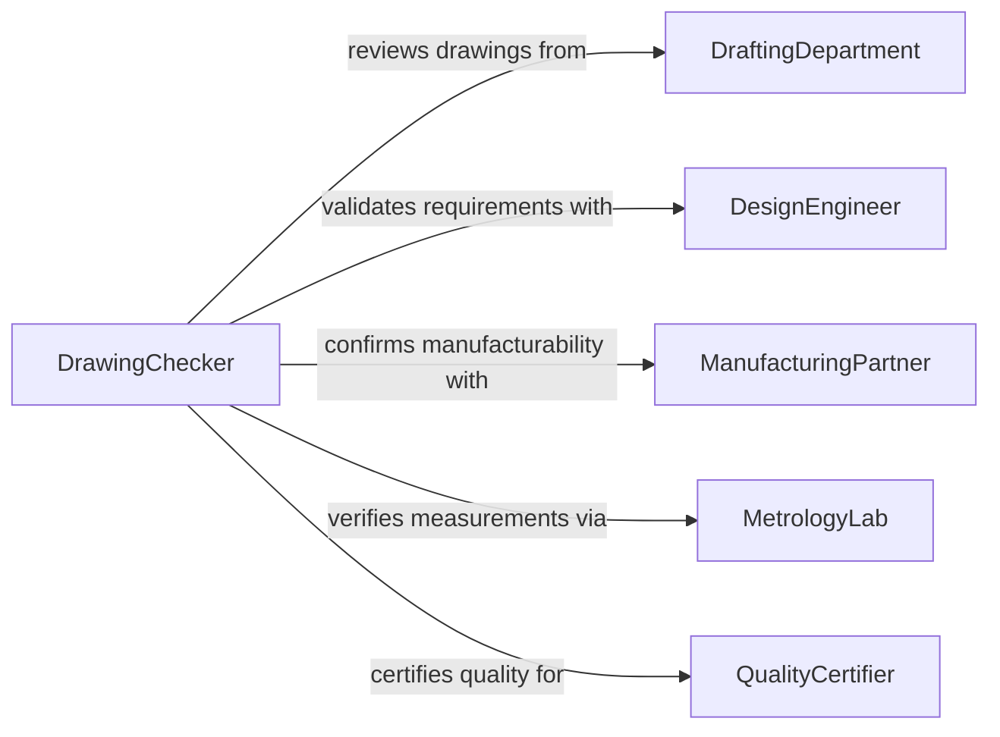

# Review Details of Technical Drawings or Specifications

> Business-as-Code definition for reviewing details of technical drawings or specifications. Models the workflow from drawing intake through detail verification, tolerance checking, and design conformance assessment.

## Overview

Reviewing details of technical drawings or specifications involves carefully examining dimensions, tolerances, geometric callouts, surface finish requirements, material notes, and assembly references to ensure completeness, accuracy, and manufacturability. This process catches errors before fabrication begins and confirms that the design intent is clearly communicated. This definition exposes actions for detail-level drawing review, events for review completion tracking, and searches for retrieving drawing and specification data.

## Actors

| Actor | Description |
|-------|-------------|
| DraftingDepartment | Produces technical drawings and revision packages |
| DesignEngineer | Specifies functional requirements and tolerances |
| ManufacturingPartner | Fabricates components based on reviewed drawings |
| MetrologyLab | Provides measurement capabilities that constrain tolerance callouts |
| QualityCertifier | Audits drawing accuracy for compliance with quality systems |
| CustomerEngineer | Reviews drawings for alignment with procurement specifications |

## Roles

| Role | Description |
|------|-------------|
| DrawingChecker | Examines technical drawings for completeness and accuracy |
| ToleranceAnalyst | Verifies that dimensional tolerances are achievable and stackup is valid |
| SpecificationReviewer | Confirms that written specs match drawing callouts |
| ConfigurationManager | Tracks drawing revisions and ensures current versions are in use |

## Entities

| Entity | Description |
|--------|-------------|
| TechnicalDrawing | A dimensioned illustration of a part, assembly, or system |
| DimensionCallout | A specific measurement with tolerance on a drawing |
| GeometricTolerance | A GD&T callout controlling form, orientation, or position |
| SurfaceFinishNote | A specification for surface roughness or texture |
| MaterialSpecification | A callout defining the required material grade or composition |
| RevisionBlock | A record of changes made to a drawing over time |
| ReviewComment | A notation identifying an error or suggestion during review |

## Actions

| Action | Description |
|--------|-------------|
| loadDrawing | Import a technical drawing for detailed review |
| verifyDimensions | Check that all dimensional callouts are present and correct |
| checkTolerances | Validate that tolerances are achievable and stackup is within limits |
| reviewMaterialNotes | Confirm material specifications match design requirements |
| assessSurfaceFinish | Verify surface finish callouts are appropriate for the application |
| logReviewComment | Record an error, question, or suggestion on the drawing |
| approveDrawing | Sign off on a drawing as complete, accurate, and ready for release |

## Events

| Event | Description |
|-------|-------------|
| drawingLoaded | A technical drawing has been imported for review |
| dimensionsVerified | All dimensional callouts have been checked |
| tolerancesChecked | Tolerance values and stackup have been validated |
| materialNotesReviewed | Material specifications have been confirmed |
| surfaceFinishAssessed | Surface finish callouts have been verified |
| reviewCommentLogged | An observation or correction has been recorded |
| drawingApproved | The drawing has been signed off for release |

## Searches

| Search | Description |
|--------|-------------|
| findDrawings | Search drawings by part number, project, or revision level |
| getDimensionCallouts | Retrieve dimensional data by drawing, feature, or tolerance class |
| getReviewComments | List comments by drawing, reviewer, or severity |
| getRevisionHistory | Trace changes to a drawing across revisions |
| searchMaterialSpecs | Find material callouts by grade, standard, or composition |

## Workflow



## Actor Relationships



## Usage

### Calling Actions

```typescript
import { reviewDetailsTechnicalDrawingsSpecifications } from '@headlessly/review-details-technical-drawings-specifications'

const reviewer = reviewDetailsTechnicalDrawingsSpecifications()

// Load a drawing for review
const drawing = await reviewer.loadDrawing({
  partNumber: 'FLANGE-A204',
  revision: 'B',
  documentUrl: 'https://drawings.example.com/flange-a204-rev-b.pdf'
})

// Verify dimensions and check tolerances
await reviewer.verifyDimensions({
  drawingId: drawing.id,
  criticalFeatures: ['boltCircle', 'boreDiameter', 'faceFinish']
})

const toleranceCheck = await reviewer.checkTolerances({
  drawingId: drawing.id,
  stackupAnalysis: true
})

// Log a review comment if issues are found
if (toleranceCheck.issues.length > 0) {
  await reviewer.logReviewComment({
    drawingId: drawing.id,
    comment: 'Bore tolerance of +/-0.001 may not be achievable with current tooling',
    severity: 'warning'
  })
}
```

### Event-Driven Automation

```typescript
// Notify drafting when review comments are logged
reviewer.reviewCommentLogged(async ({ drawingId, comment, severity }) => {
  await notify({
    to: 'drafting-department',
    message: `Review comment on drawing ${drawingId}: ${comment}`
  })
})

// Auto-release drawing after approval
reviewer.drawingApproved(async ({ drawingId, partNumber, revision }) => {
  await releaseToProduction({ partNumber, revision })
})
```
