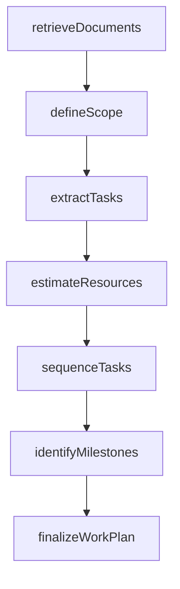
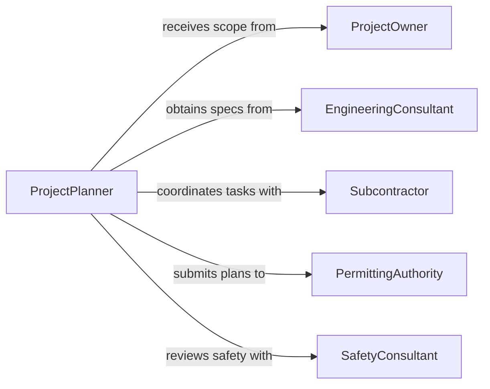

# Review Technical Documents to Plan Work

> Business-as-Code definition for reviewing technical documents to plan work. Models the workflow from document retrieval through scope definition, task sequencing, and work plan finalization.

## Overview

Reviewing technical documents to plan work involves examining engineering specifications, construction drawings, project schedules, scope statements, and technical standards to define the tasks, resources, sequencing, and constraints for an upcoming project or job. This definition exposes actions for systematic document review, events for work planning milestones, and searches for retrieving project specifications and planning data.

## Actors

| Actor | Description |
|-------|-------------|
| ProjectOwner | Commissions the work and provides scope documentation |
| EngineeringConsultant | Produces technical specifications and design documents |
| Subcontractor | Executes specialized portions of the planned work |
| PermittingAuthority | Issues permits based on submitted technical plans |
| MaterialSupplier | Provides materials aligned with documented specifications |
| SafetyConsultant | Reviews plans for occupational health and safety compliance |

## Roles

| Role | Description |
|------|-------------|
| ProjectPlanner | Reviews technical documents and builds the work plan |
| FieldSupervisor | Translates the plan into on-site task assignments |
| EstimatingEngineer | Calculates labor, material, and time estimates from documents |
| QualityManager | Ensures planned work meets specified technical standards |

## Entities

| Entity | Description |
|--------|-------------|
| TechnicalDocument | A specification, drawing, or standard used for planning |
| WorkPlan | A structured sequence of tasks with assigned resources and timelines |
| TaskDefinition | A discrete unit of work derived from technical requirements |
| ResourceEstimate | A projection of labor, materials, and equipment needed |
| Constraint | A limitation such as deadline, budget, or regulatory requirement |
| Dependency | A relationship where one task must precede another |
| Milestone | A significant checkpoint in the work plan timeline |

## Actions

| Action | Description |
|--------|-------------|
| retrieveDocuments | Gather all technical documents relevant to the planned work |
| defineScope | Establish the boundaries and deliverables of the work |
| extractTasks | Identify discrete tasks from technical requirements |
| estimateResources | Calculate labor, materials, and equipment needs per task |
| sequenceTasks | Arrange tasks in order based on dependencies and constraints |
| identifyMilestones | Mark critical checkpoints throughout the work timeline |
| finalizeWorkPlan | Approve the completed plan for execution |

## Events

| Event | Description |
|-------|-------------|
| documentsRetrieved | All relevant technical documents have been gathered |
| scopeDefined | The boundaries and deliverables of work have been established |
| tasksExtracted | Discrete tasks have been identified from the documents |
| resourcesEstimated | Labor, materials, and equipment projections have been calculated |
| tasksSequenced | Tasks have been arranged by dependency and timeline |
| milestonesIdentified | Critical checkpoints have been marked in the plan |
| workPlanFinalized | The work plan has been approved for execution |

## Searches

| Search | Description |
|--------|-------------|
| findDocuments | Search technical documents by project, revision, or discipline |
| getTasks | Retrieve task definitions by work plan, phase, or trade |
| getResourceEstimates | List resource projections by task, material, or labor type |
| getDependencies | Find task dependencies within a work plan |
| getMilestones | List milestones by project or date range |

## Workflow



## Actor Relationships



## Usage

### Calling Actions

```typescript
import { reviewTechnicalDocumentsPlanWork } from '@headlessly/review-technical-documents-plan-work'

const planner = reviewTechnicalDocumentsPlanWork()

// Retrieve all documents for a bridge rehabilitation project
const docs = await planner.retrieveDocuments({
  projectId: 'bridge-rehab-i94',
  disciplines: ['structural', 'geotechnical', 'traffic-control']
})

// Define the scope of work
const scope = await planner.defineScope({
  projectId: 'bridge-rehab-i94',
  deliverables: ['deckReplacement', 'bearingRehab', 'jointSealant'],
  exclusions: ['substructurePainting']
})

// Extract and sequence tasks
const tasks = await planner.extractTasks({ projectId: 'bridge-rehab-i94' })
await planner.sequenceTasks({
  projectId: 'bridge-rehab-i94',
  tasks: tasks.map(t => t.id),
  method: 'criticalPath'
})
```

### Event-Driven Automation

```typescript
// Notify field supervisor when the work plan is finalized
planner.workPlanFinalized(async ({ projectId, totalTasks, duration }) => {
  await notify({
    to: 'field-supervisor',
    message: `Work plan ready for ${projectId}: ${totalTasks} tasks over ${duration} days`
  })
})

// Alert estimating when scope is defined
planner.scopeDefined(async ({ projectId, deliverables }) => {
  await notify({
    to: 'estimating-engineer',
    message: `Scope locked for ${projectId}: ${deliverables.length} deliverables`
  })
})
```
